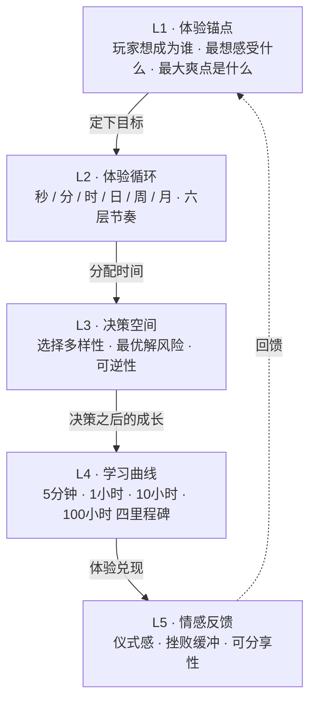
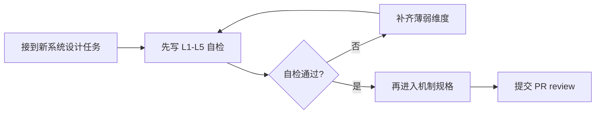

# 体验分析框架

> 在动笔写任何系统设计之前，先回答五个问题：  
> 玩家想**成为谁**、他**每时每刻得到什么**、**有什么选择**、**怎样学会**、**怎样被打动**。

**适用范围**：本框架是项目所有系统设计文档的**前置写作规范**。

**搭配使用**：

- [系统设计模板](../_模板/系统设计模板.md) — 每份新系统必须按此模板书写，模板内 L1-L5 章节依托本文档的方法论
- [项目愿景与核心设计柱](项目愿景与核心设计柱.md) — 项目级体验锚点由此锁定，本框架用于把它**下放到每个子系统**
- [世界观与题材包装](世界观与题材包装.md) — L1 的 Fantasy 叙事需要套用武侠语境

---

## 前言 · 为什么先谈体验

在挂机 RPG 赛道上有一个残酷的事实：**玩家离开游戏的瞬间，往往不是因为数值不对，而是因为"我不知道自己在做什么"或"做了也没感觉"**。

我们项目前期的设计文档偏向**功能规格** —— "几个槽位、几级品质、几条词缀、几个乘区" —— 这些回答了**系统如何运转**，但没回答**玩家为什么愿意运转它**。

体验分析框架（以下简称"框架"）的目的：

1. **方向锚点**：把"武侠挂机 RPG"这个模糊的品类标签，翻译成每个系统都能落地的**体验承诺**
2. **评审尺子**：当团队任意成员写出一份系统设计时，有统一的"这份设计考虑全了吗"的审视角度
3. **谈判工具**：在"这里是否要这样做"的设计争论中，避免滑向个人偏好，回归到"这对玩家体验意味着什么"

这不是 MDA 或 "8 Kinds of Fun" 的翻版，而是面向**本项目**（武侠题材 + 挂机 RPG + 独立团队）的**轻量工作法**。

---

## 框架总览



五维度的**顺序是有方向性的**：

- 从 L1 出发，确定**要带给玩家什么**
- 到 L2，把这个"什么"**切成可感知的节奏**
- 到 L3，让玩家**在节奏里做选择**
- 到 L4，让选择**沉淀成成长路径**
- 到 L5，每一步都给**看得见听得见的反馈**
- 最后反哺 L1 —— 玩家被打动之后，**相信了你许下的体验承诺**

---

## L1 · 体验锚点

**定义**：回答"玩家玩这个系统时，想获得什么样的体验"。

### L1 三个必答问题

#### Q1 · 核心幻想（Core Fantasy）

> 玩家在这个系统里**想成为谁**？

- 不是"玩家操作什么"，而是"玩家在脑补自己是谁"
- 幻想必须**可以被一句话说清**
- 幻想不能和项目总愿景（"武侠新弟子一路成长为一代宗师"）冲突

**示例（装备系统）**：

> "一个从破衣烂衫到一身传承的新晋弟子，每次穿上新装备就像打开一封武林前辈的馈赠。"

#### Q2 · 核心情绪（Core Emotion）

> 玩家玩这个系统时，**最希望产生什么情绪**？

- 必须是**单一主情绪**（次情绪可以有，但主情绪只有一个）
- 用**具体情绪词**，而不是"爽"、"好玩"这种无效词

**常见情绪词参考**：期待、惊喜、征服感、秩序感、收集欲、创造感、归属感、自豪、紧张、释然……

**示例（装备系统）**：

> 主情绪 = **期待**（下一波怪死后会不会掉橙字？）  
> 次情绪 = **自豪**（我的 Build 是我亲手攒出来的）

#### Q3 · 核心爽点（Core Payoff）

> 整段体验的**最高光瞬间**是什么样的？

- 必须能被**截图或视频片段化**
- 必须是**可反复经历**的（而不是一生只遇一次的彩蛋）

**示例（装备系统）**：

> 击杀怪物后金色光柱升起 → 拾取时特写慢镜头 → 打开详情页显示「绝世真意」字样 → 数值对比栏右侧 DPS 从 8,500 跳到 12,200 的瞬间。

### L1 完成标准

- 能用**三句话**把系统的 Fantasy / Emotion / Payoff 讲给一个从没玩过此类游戏的人听
- Fantasy 和项目总愿景**不冲突**
- Emotion 是**具体情绪词**而非"好玩"
- Payoff 能被具象化为一段**可重放**的画面

---

## L2 · 体验循环

**定义**：把 L1 定下的体验，在**六个时间尺度**上分配兑现节奏。

### L2 六层节奏问答清单

#### 秒循环（< 3 秒）

> 玩家每次操作 / 每次事件，**即时反馈**是什么？

- 攻击命中：震感、粒子、飞数
- 拾取：音效、物品飞入背包动画
- 怪物死亡：倒地动画、掉落弹跳

**判定标准**：关掉声音后，光看画面**还能知道发生了什么**吗？

#### 分循环（1-3 分钟）

> 每 1-3 分钟玩家**获得什么新东西**？

- 清完一波怪：资源进账、经验条变化
- 过一个节点：解锁下一节点入口
- 一次暴击：数字飞行 + 屏幕震动

**判定标准**：如果关掉通知，3 分钟内我能**数出几件新鲜事**？

#### 时循环（30-60 分钟）

> 一小时内玩家是否有**换装 / 解锁 / 过章**的大事件？

- 第一件紫装 → 穿上后 DPS 可见跃升
- 解锁百炼坊 → 首次能花资源做强化
- 过一章 Boss → 解锁下一章背景

**判定标准**：一小时后玩家是否记得住"今天我做了这件有意义的事"？

#### 日循环（一次登录周期）

> 登录后 **5 分钟**能做什么有意义的事？  
> 登录后 **20 分钟**还有事可做吗？

- 5 分钟事件：收取闭关收益、完成今日机缘主目标
- 20 分钟事件：刷一次秘境、试一个新 Build

**判定标准**：如果玩家今天只能玩 5 分钟，**明天还愿不愿意再登录**？

#### 周循环（7 天）

> 一周玩家**看得见的成长里程碑**是什么？

- 3 天：攒够第一套传承 2 件套
- 5 天：宗师解锁
- 7 天：秘境首破 10 层

**判定标准**：一周后让玩家晒图，**他想晒什么**？

#### 月循环（30 天+）

> 月尺度上玩家的**终局目标**是什么？重置 / 赛季 / 深渊？

- 30 天目标：凑齐一套 6 件传承
- 赛季目标：重入江湖达到 N 阶
- 深渊目标：秘境 50 层

**判定标准**：玩家跟朋友吹牛时，**说的是哪个数字**？

### L2 完成标准

- 六个时间尺度**至少写清 4 个**（秒 / 分 / 时 / 日 是底线，周 / 月可后续补）
- 每个尺度的事件和 L1 的 Emotion 吻合（比如主情绪是"期待"，秒循环就不能只是"收菜感"）
- 时间尺度之间**不断档**（例如不能"秒循环很热闹，但一整小时都没大事件"）

---

## L3 · 决策空间

**定义**：玩家在系统内能做**什么样的选择**、这些选择**是否有意义**。

### L3 三个审视维度

#### D1 · 有意义的选择（Meaningful Choice）

> 玩家面对的选择，**不同方向之间真的有差异**吗？

**坏例子**：

> 红蓝两种兵器，数值一模一样，外观不同。这不是选择，是偏好。

**好例子**：

> 御风刀：范围清场、单体偏弱；血劫手：单体最强、范围差。选哪个，玩的方式**完全不同**。

**判定标准**：让两个玩家分别选 A 和 B，他们的游玩体验是不是**讲得出三个以上的差异**？

#### D2 · 最优解风险（Dominant Strategy）

> 系统里是否存在一个**所有人都会选的"最强解"**，让其他选择变成摆设？

- 最优解是**可量化上限**问题：相对最弱的 Build DPS 不低于最强 Build 的 70%
- 最优解是**版本可调节**问题：每次大版本做数值微调，避免常年单选

**判定标准**：让一个新玩家读完所有词缀介绍，他能不能在 3 分钟内说"就这个最强"？**如果能，设计失败**。

#### D3 · 可逆性（Reversibility）

> 玩家选错了**能不能改、代价多大**？

| 可逆性等级 | 压力 | 适用场景 |
|-----------|------|----------|
| 完全不可逆 | 高压 | 剥夺探索感，慎用 |
| 高代价可逆 | 适中 | 适合终局深度决策 |
| 低代价可逆 | 低压 | 适合早期教学阶段 |

**判定标准**：新手**误选**了一个 Build，**5 分钟内能不能推翻重来**？如果需要 30 分钟以上，说明早期可逆性不足。

### L3 完成标准

- 至少列出 **3 个具有差异化的方向**（Build / 路径 / 策略）
- 明确**每个方向的强弱项**，避免出现万能解
- 明确**换方向的代价区间**（即刻 / 若干小时 / 需重玩）

---

## L4 · 学习曲线

**定义**：玩家从**进入到精通**，需要经历的**知识和技巧梯度**。

### L4 四个里程碑

#### M1 · 5 分钟理解

> 新玩家进入 **5 分钟内**，必须理解什么？

- 我在打什么（怪物、关卡）
- 我打怪能得到什么（资源、装备）
- 我怎么变强（基础的"拾取 → 穿戴 → 变强"链）

**判定标准**：5 分钟后关掉游戏问玩家"你刚才在做什么"，他**能答得上来**。

#### M2 · 1 小时解锁

> **1 小时内**玩家应解锁什么新机制？

- 第一次遇到紫装 → 理解品质区分
- 第一次解锁百炼坊入口 → 知道有养成系统
- 第一次看到武学诊断弹窗 → 理解有 Build 指引

**判定标准**：1 小时里玩家**主动点开了几个新面板**？

#### M3 · 10 小时深度

> 10 小时后玩家是否**开始主动构筑 Build**？

- 主动筛词缀、主动对比传奇特效、主动凑套装
- 能说出自己的 Build 方向，而不是"我随便穿"

**判定标准**：10 小时后玩家手头的装备是**随便穿的**还是**有意识挑过的**？

#### M4 · 100 小时天花板

> 100 小时后玩家**还有什么可做**？

- 终局内容：秘境深层、赛季重置、收集完成
- 差异化游玩：副 Build、挑战性玩法
- 炫耀维度：可分享的数字 / 成就

**判定标准**：100 小时的老玩家和 10 小时的新玩家，打开游戏的**期待点是否不一样**？

### L4 完成标准

- 四个里程碑都有**具体内容**（不是"慢慢学"这种模糊表述）
- 里程碑之间**难度递增平滑**（不出现 1 小时教 "A + B"、2 小时突然考 "A × B + C²"）
- 100 小时天花板**不低估玩家**（不能做完 20 小时就无事可做）

---

## L5 · 情感反馈

**定义**：L1 的情绪承诺，通过哪些**视听 / 动效 / 仪式**兑现。

### L5 三个维度

#### F1 · 仪式感清单

> 系统中哪些瞬间应该**有声有光**？

可以是仪式的时刻举例：

- 橙装掉落：光柱 + 音效 + 慢镜头
- 首次获得某传承：弹窗 + 配音 + BGM 变奏
- Boss 斩杀：画面定格 + 血溅 + 击杀提示
- Build 成型瞬间：全乘区高亮 + 专属动画

**要求**：每个系统至少列出 **3 个仪式点**，并给出**视听表现描述**（不只是"有动画"）。

#### F2 · 挫败缓冲

> 玩家失败 / 失去 / 落后时，**有没有兜底**？

挫败时刻举例：

- 穿了半天发现不是目标 Build：可以轻易萃取关键传奇（百炼坊萃取流程）
- 秘境开高了打不过：保留部分钥匙奖励
- 新手第一个 Boss 一直打不过：难度调整 / 装备保底

**要求**：设计文档要**主动思考**哪些瞬间玩家会受挫，并给出**缓冲方案**。

#### F3 · 可分享性

> 玩家**能截图 / 录屏 / 讲给朋友**的时刻有哪些？

- 一件绝世真意的详情截图
- 一段秒杀 Boss 的录屏
- 一组 Build 成型数据（"我这 Build 打出了 12 万 DPS"）

**要求**：每个系统至少有 **1 个可分享锚点**，并明确分享**形式**（截图 / 数字 / 动画）。

### L5 完成标准

- 仪式感清单 **≥ 3 条**，每条有视听描述
- 挫败缓冲 **≥ 2 条**，对应至少 2 种失败情境
- 可分享锚点 **≥ 1 条**，分享形式明确

---

## 使用流程

### 流程 A · 新系统设计（前置 L1-L5）



具体步骤：

1. **复制** [系统设计模板](../_模板/系统设计模板.md) 创建新文档
2. **先填 L1-L5**（模板里是"第 2 节 体验设计"）
3. **自检通过才继续填**第 3 节及之后的机制 / 数据 / 流程
4. **PR 提交前**，请另一成员**只看 L1-L5** 做一次专项 review

"自检通过"的判定：本文件「L1-L5 完成标准」各节列的标准**全部达成**。

### 流程 B · 既有文档 Review（诊断表格）

对存量文档做一次"体验维度审计"，产出固定格式的诊断表：

```markdown
## 文档：<路径>

| 维度 | 现状 | 缺口 | 建议 |
|------|------|-----|------|
| L1 体验锚点 | ... | ... | 补强 / 推翻 / 保留 |
| L2 体验循环 | ... | ... | ... |
| L3 决策空间 | ... | ... | ... |
| L4 学习曲线 | ... | ... | ... |
| L5 情感反馈 | ... | ... | ... |

**总体判定**：推翻重做 / 大幅补强 / 小修即可 / 保留
**优先级**：P0（立即修订）/ P1（本版本内）/ P2（下版本）
```

### 流程 C · "推翻 / 补强 / 保留" 判定标准

| 判定 | 条件 |
|------|------|
| **推翻重做** | L1 体验锚点与项目总愿景**根本冲突**；或 L2-L5 中**三项以上**完全缺失且无法在原文档骨架上补救 |
| **大幅补强** | L1 清晰，但 L2-L5 中**两项**明显缺失 |
| **小修即可** | L1-L5 基本覆盖，仅个别标准未达成 |
| **保留** | 全部达成 |

---

## 审计示范 · 对「装备·数值·Build系统」的完整诊断

下面用本框架对 [装备·数值·Build系统.md](../01_系统设计/装备·数值·Build系统.md) 做一次完整审计，作为**如何写诊断表**的参考样本。

### 诊断表

| 维度 | 现状 | 缺口 | 建议 |
|------|------|-----|------|
| L1 体验锚点 | 开头提到"不是数字大就好，而是'替换后变强了'的决策快感"，表达了 **Payoff**；但未明确 **Fantasy**（玩家穿上装备时在脑补自己是什么形象）和 **主 Emotion**（具体情绪词） | 缺 Fantasy 叙事；Emotion 未从"决策快感"具体化到情绪词 | **补强** |
| L2 体验循环 | 给出 DPS 数值示例（凡品 35 → 中期 201 → 毕业 12,294），但属于**数学节奏**，不是**玩家体验节奏**；未定义"新手第一件紫装在第几分钟"、"第一件橙装几小时内"这种节奏承诺 | 六层时间尺度中仅秒 / 分循环可从其他文档推断，时 / 日 / 周 / 月循环**空白** | **大幅补强** |
| L3 决策空间 | 明确给出**三流派 Build 方向**（御风 / 血劫 / 五雷），并列出各自强弱项；多乘区设计天然避免"单一最优解" | 未量化"至少 N 种可玩变体"；未明确"最弱流派 DPS 不低于最强的 X%"的平衡承诺；未说明**换流派代价**（传奇装备能否互转？） | **小修即可** |
| L4 学习曲线 | 规则密度高（9 槽 + 7 品质 + 7 乘区 + 38 词缀），但未安排**引入时序** —— 玩家什么时候第一次接触"bucket 概念"？武学诊断在什么时机推送？ | 四个里程碑（5min / 1h / 10h / 100h）**全部空白** | **大幅补强** |
| L5 情感反馈 | 第五节末尾一句"这种跨越式成长感正是暗黑3式系统的核心爽点"点到即止；有提及"光柱"（引用世界观文档） | 缺仪式感清单（橙装落地应该经历哪 5-7 步的音画序列？）；未设计挫败缓冲（如果玩家 10 小时没抽到橙字怎么办？）；可分享性未明确（截图哪个面板？） | **大幅补强** |

### 总体判定

**大幅补强**（非推翻）

### 推荐修订优先级

| 优先级 | 动作 |
|--------|------|
| P0 | 补 L1 Fantasy / Emotion 段落，定调"玩家穿装备时在脑补的形象" |
| P0 | 补 L2 时 / 日循环：定义第一件紫 / 橙 / 传承件的节奏承诺 |
| P1 | 补 L4 学习曲线：教学节点分布，武学诊断推送时机 |
| P1 | 补 L5 仪式感清单：橙装落地 5-7 步音画流程 |
| P2 | 量化 L3 多样性承诺："≥ 3 种可玩 Build 变体，最弱流派 DPS ≥ 最强 70%" |

### 从这份示范能看出什么

1. **现有装备文档不算差** —— L3 大部分达成，L1 部分达成。但 L2 和 L4 几乎空白。
2. **空白的共性**：凡是涉及"玩家**时间节奏**和**学习节奏**"的内容，最容易被遗漏。因为系统设计者习惯从**功能视角**写文档。
3. **这就是框架存在的价值**：把容易被遗漏的维度**显式化**，让每个人写完后都能自检。

---

## 与其他文档的关系

### 向上依赖

- [项目愿景与核心设计柱](项目愿景与核心设计柱.md)：L1 的 Fantasy / Emotion 不能与项目总愿景冲突
- [世界观与题材包装](世界观与题材包装.md)：L1 的 Fantasy 叙事要使用武侠语境

### 向下引用

- [_模板/系统设计模板](../_模板/系统设计模板.md)：新系统设计的 L1-L5 章节依托本文档定义

### 平行参考

- `01_系统设计/*.md`：本框架适用于所有系统设计文档的 review
- `03_数值设计/*.md`：数值文档主要对 L2 节奏 / L3 差异化做支撑，不直接需要 L1-L5
- `02_交互与原型/*.md`：交互原型和边界补全是 S3/S4 阶段产出，L5 的仪式时刻需要在交互层落地

### 更新约束

- 本文档是**方法论规范**，修订需团队共识
- 修订本文档时，同时更新 [变更日志](变更日志.md)

---

## 附录 A · L1-L5 自检清单（速查版）

写系统设计时把这张清单贴在 PR 描述里，打勾即可：

**L1 体验锚点**

- [ ] Fantasy 一句话描述
- [ ] Emotion 用具体情绪词（不是"好玩"）
- [ ] Payoff 能被具象为可重放画面

**L2 体验循环**

- [ ] 秒循环：有
- [ ] 分循环：有
- [ ] 时循环：有
- [ ] 日循环：有
- [ ] 周循环：有（可后续补充）
- [ ] 月循环：有（可后续补充）

**L3 决策空间**

- [ ] 至少 3 个差异化方向
- [ ] 无单一最优解风险
- [ ] 换方向代价明确

**L4 学习曲线**

- [ ] 5 分钟应理解的内容
- [ ] 1 小时应解锁的机制
- [ ] 10 小时应进入的深度
- [ ] 100 小时的天花板

**L5 情感反馈**

- [ ] 仪式感清单 ≥ 3 条（含视听描述）
- [ ] 挫败缓冲 ≥ 2 条
- [ ] 可分享锚点 ≥ 1 条

---

## 附录 B · 术语表

| 术语 | 含义 |
|------|------|
| Fantasy（核心幻想） | 玩家想象自己"成为什么样的角色" |
| Emotion（核心情绪） | 玩家在体验中产生的情绪 |
| Payoff（核心爽点） | 玩家获得的最终回报 / 高光时刻 |
| Meaningful Choice | 有意义的选择：不同方向会带来不同体验 |
| Dominant Strategy | 支配策略（最优解）：大家都选的唯一答案，设计失败信号 |
| Reversibility | 可逆性：选错之后能否改、代价多大 |
| Core Loop | 核心循环：玩家反复进行的主要行为链 |

---

*本文档最后更新：2026-03-19*
