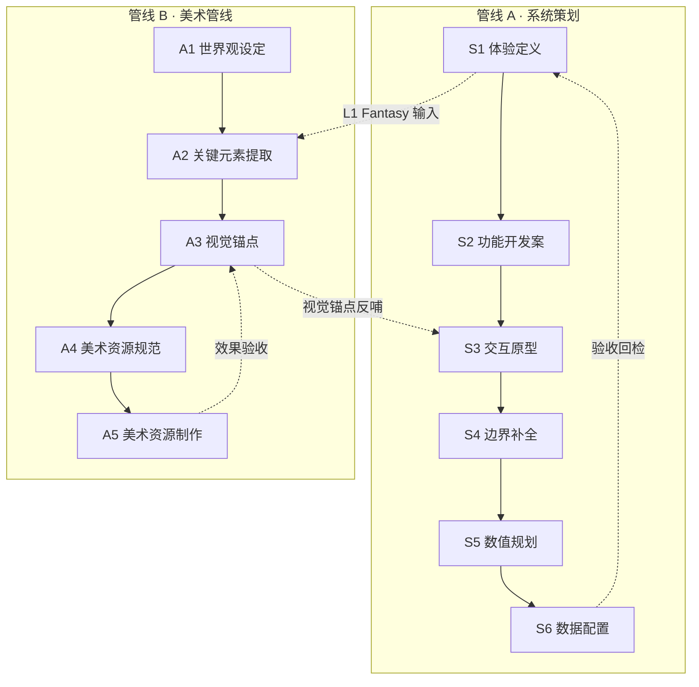
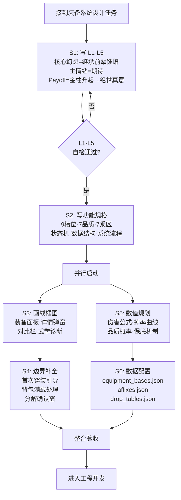

# 研发流程总览

> 定义本项目从"一个想法"到"可开发交付物"的完整管线。  
> 所有系统/功能/美术工作都应沿管线推进，每个阶段有明确的交付物和门禁。

**适用范围**：项目全员。新系统设计、既有系统重构、美术资源制作均需遵循本文档。

**搭配使用**：

- [体验分析框架](体验分析框架.md) — 管线 A 第 1 阶段的方法论
- [系统设计模板](../_模板/系统设计模板.md) — S1+S2 阶段的文档载体
- [交互设计规范](../02_交互与原型/交互设计规范.md) — S3+S4 阶段的规范
- [数值框架](../03_数值设计/数值框架.md) — S5 阶段的全局约束

---

## 一、总览 · 两条管线

本项目的研发流程分为两条并行管线：

**关键原则**：

1. **管线 A 和管线 B 可并行**，但在标注的交叉点需要同步
2. **每个阶段都有门禁**，未通过门禁不进入下一阶段
3. **阶段交付物即文档**，无文档视为未完成

---

## 二、管线 A · 系统策划管线（6 阶段）

### S1 · 体验定义

| 项目 | 内容 |
|------|------|
| **目标** | 在写任何机制规格前，确定"玩家要什么体验" |
| **方法论** | [体验分析框架](体验分析框架.md) L1-L5 五维度 |
| **输入物** | 项目愿景、世界观、已有系统关联 |
| **交付物** | 系统设计文档 §2（L1-L5 全部填写） |
| **文档位置** | `01_系统设计/[系统名].md` §2 |
| **门禁** | L1-L5 自检清单全部打勾；至少一人专项 review |

**S1 要回答的核心问题**：

- L1：玩家想成为谁？想感受什么情绪？最高光的瞬间长什么样？
- L2：秒/分/时/日/周/月每个尺度上玩家得到什么？
- L3：玩家有什么有意义的选择？有没有唯一最优解？选错了代价多大？
- L4：5分钟/1小时/10小时/100小时各该掌握什么？
- L5：哪些瞬间该有声有光？挫败时怎么兜底？玩家能分享什么？

---

### S2 · 功能开发案

| 项目 | 内容 |
|------|------|
| **目标** | 把体验承诺翻译为可实现的功能规格 |
| **输入物** | S1 交付物（体验定义） |
| **交付物** | 系统设计文档 §3-§8（设计目标、核心机制、数据结构、系统流程、UI/UX 需求、系统关联） |
| **文档位置** | `01_系统设计/[系统名].md` §3-§8 |
| **门禁** | 核心机制有 mermaid 状态机或流程图；数据结构有 JSON schema；UI/UX 需求呼应 L5 仪式感清单 |

**S2 要回答的核心问题**：

- 这个系统有几种状态？状态之间怎么转换？
- 核心数据结构是什么？哪些字段需要持久化？
- 主要流程的完整路径是什么？（正常流 + 异常流）
- 需要哪些 UI 面板？信息层级怎么排列？
- 与其他系统的数据依赖和调用关系是什么？

---

### S3 · 交互原型

| 项目 | 内容 |
|------|------|
| **目标** | 从玩家视角走通所有操作链路，产出线框图 |
| **输入物** | S2 交付物（功能规格） |
| **交付物** | 交互原型文档（线框图 + 操作流 + 状态枚举） |
| **文档位置** | `02_交互与原型/[系统名]_交互原型.md` |
| **门禁** | 每个面板有线框图；操作链路从入口到结束无断点；所有可交互元素有状态枚举 |

**S3 要回答的核心问题**：

- 玩家从哪个入口进入这个系统？操作几步到达核心功能？
- 每个面板上有哪些可交互元素？点击后发生什么？
- 面板之间怎么跳转？返回路径是什么？
- 信息密度是否合理？一屏能看清关键数据吗？

**线框图规范**：

- 使用 ASCII/Markdown 表格或 mermaid 都可以，不强制要求设计工具
- 每个线框图必须标注：面板名称、可交互区域、信息层级
- 状态枚举必须覆盖：默认态、选中态、禁用态、加载态、空态

---

### S4 · 边界补全

| 项目 | 内容 |
|------|------|
| **目标** | 识别并处理所有异常路径、边界条件、容错机制 |
| **输入物** | S3 交付物（交互原型） |
| **交付物** | 边界补全检查单（8 类边界逐条确认） |
| **文档位置** | 嵌入 `01_系统设计/[系统名].md` §9（边界补全）或独立文档 |
| **门禁** | 8 类标准边界至少覆盖 6 类 |

**8 类标准边界**：

| # | 边界类型 | 典型问题 |
|---|---------|---------|
| 1 | **首次使用** | 新玩家第一次打开这个系统，看到什么？有没有引导？ |
| 2 | **空状态** | 没有数据时（零装备/零技能/零资源）界面怎么显示？ |
| 3 | **满载状态** | 背包满了/槽位满了/等级到顶了怎么办？ |
| 4 | **错误与异常** | 网络断了/数据异常/配置缺失怎么处理？ |
| 5 | **中断恢复** | 操作中途退出再回来，状态是否正确恢复？ |
| 6 | **跨系统跳转** | 从系统 A 跳到系统 B，再返回 A 时状态对吗？ |
| 7 | **红点策略** | 什么条件下亮红点？消除条件是什么？红点优先级？ |
| 8 | **新手引导** | 引导触发条件？引导步骤？跳过后如何？ |

---

### S5 · 数值规划

| 项目 | 内容 |
|------|------|
| **目标** | 把功能设计转化为可计算的数值模型 |
| **输入物** | S2 功能规格 + S1 体验循环（L2 节奏承诺） |
| **交付物** | 数值文档（公式 + 曲线 + 参数表 + 模拟验证） |
| **文档位置** | `03_数值设计/[系统名]_数值规划.md` 或嵌入系统设计文档 |
| **门禁** | 核心公式有推导过程；关键参数有可调范围；有至少 1 组模拟/测试用例验证节奏承诺 |

**S5 要回答的核心问题**：

- 核心公式是什么？（伤害/掉落/成长/经济）
- 关键参数的取值范围和调节空间？
- 玩家成长曲线是什么形状？（线性/对数/S型/分段）
- 数值设计是否支撑 L2 节奏承诺？（用模拟数据验证）
- 与全局数值框架（[数值框架.md](../03_数值设计/数值框架.md)）的衔接关系？

---

### S6 · 数据配置

| 项目 | 内容 |
|------|------|
| **目标** | 把数值方案落地为可被引擎加载的配置数据 |
| **输入物** | S5 数值规划 |
| **交付物** | JSON schema + 配置表 + 校验规则 + 配置示例 |
| **文档位置** | `03_数值设计/配置表字段说明.md` + `data/` 目录下实际 JSON |
| **门禁** | 配置与数值文档一致；校验规则覆盖必填字段/值域/外键引用；有异常数据测试用例 |

**S6 要回答的核心问题**：

- JSON 文件路径和命名规则？
- 每个字段的类型、必填性、默认值、值域？
- 枚举字段的所有合法值？
- 外键引用哪张表的哪个字段？
- 配置加载失败时的兜底策略？

---

### 管线 A 阶段依赖与并行规则

```mermaid
gantt
    title 管线 A 阶段依赖
    dateFormat X
    axisFormat %s

    section 串行
    S1_体验定义     :s1, 0, 1
    S2_功能开发案   :s2, after s1, 1

    section 可并行
    S3_交互原型     :s3, after s2, 1
    S5_数值规划     :s5, after s2, 1

    section 串行
    S4_边界补全     :s4, after s3, 1
    S6_数据配置     :s6, after s5, 1
```

- **S1 → S2 必须串行**：体验定义是功能规格的前提
- **S3 和 S5 可并行**：交互原型和数值规划都依赖 S2，但彼此不依赖
- **S4 依赖 S3**：边界补全需要交互原型作为输入
- **S6 依赖 S5**：数据配置需要数值规划作为输入
- **S4 和 S6 可并行**：但最终验收时需要交叉检查

---

## 三、管线 B · 美术管线（5 阶段）

### A1 · 世界观设定

| 项目 | 内容 |
|------|------|
| **目标** | 确定美术表现的叙事基础 |
| **交付物** | [世界观与题材包装](世界观与题材包装.md)（已有） |
| **文档位置** | `00_项目总纲/世界观与题材包装.md` |
| **门禁** | 题材方向明确；至少 5 个章节场景有文字描述；流派差异有叙事包装 |

---

### A2 · 关键元素提取

| 项目 | 内容 |
|------|------|
| **目标** | 从世界观中萃取可视觉化的核心元素 |
| **输入物** | A1 世界观 + 管线 A 的 L1 Fantasy |
| **交付物** | 关键元素清单（角色原型 / 标志性物件 / 典型场景 / 图腾符号各 ≥ 3 条） |
| **文档位置** | `04_美术管线/关键元素与视觉锚点.md` 上半部分 |
| **门禁** | 4 类元素各 ≥ 3 条；每条有文字描述 + 参考方向 |

**4 类关键元素**：

| 类型 | 说明 | 示例 |
|------|------|------|
| **角色原型** | 玩家/NPC/Boss 的视觉原型 | 青年侠客、铁面虬髯客、枯骨剑客 |
| **标志性物件** | 代表系统/功能的图标级物品 | 传承卷轴、百炼炉、秘境钥匙、宗师令牌 |
| **典型场景** | 每个章节的场景基调 | 青云山门、落雁废墟、铁锁镇集市 |
| **图腾符号** | 反复出现的视觉符号 | 青云门山纹、三流派图腾、品质光效色系 |

---

### A3 · 视觉锚点

| 项目 | 内容 |
|------|------|
| **目标** | 把关键元素转化为可执行的视觉规范 |
| **输入物** | A2 关键元素 + 管线 A 的 L5 仪式感清单 |
| **交付物** | 视觉锚点文档（配色板 + 关键帧参考 + 视觉层级规则） |
| **文档位置** | `04_美术管线/关键元素与视觉锚点.md` 下半部分 |
| **门禁** | 每个关键元素有对应配色方案；与 L1 体验锚点有显式对齐；有 Mood Board 参考方向 |

---

### A4 · 美术资源规范

| 项目 | 内容 |
|------|------|
| **目标** | 确定美术资源的技术规格和制作标准 |
| **输入物** | A3 视觉锚点 |
| **交付物** | [美术风格规范](../04_美术管线/美术风格规范.md)（已有，持续更新） |
| **文档位置** | `04_美术管线/美术风格规范.md` |
| **门禁** | 角色比例/场景构图/UI材质/特效规范/颜色规范/图标规范/禁止项全部明确 |

**A4 必须覆盖的技术规格**（2D 横版挂机特有）：

| 规格项 | 要求 |
|--------|------|
| 角色帧动画 | 尺寸、帧数、帧率、文件格式 |
| 场景分层 | far/mid/near 三层尺寸、透明度规则、视差系数 |
| UI 切图 | 九宫格切割规则、最小尺寸、格式（PNG-24/WebP） |
| 图标 | 尺寸标准（32/48/64/96）、风格统一性 |
| 特效 | 帧数上限、透明底、导出格式 |

---

### A5 · 美术资源制作

| 项目 | 内容 |
|------|------|
| **目标** | 按规范产出成品资源并集成到项目 |
| **输入物** | A4 美术资源规范 + 美术需求单 |
| **交付物** | 成品资源文件 + 资源清单更新 |
| **文档位置** | `04_美术管线/美术资源清单.md`（状态追踪） |
| **门禁** | 资源符合 A4 规范；命名符合规则；在引擎中验证效果 |

**AI 辅助生图的定位**：

- AI 生图用于辅助 **A3（视觉锚点验证）** 和 **A5（量产辅助）**
- AI 生图**不替代** A2（关键元素提取）和 A4（规范制定），这两个阶段需要人工决策
- AI 提示词维护在 `04_美术管线/AI提示词清单.md`

---

## 四、管线交叉点

两条管线在以下节点需要同步：

| 交叉点 | 管线 A 阶段 | 管线 B 阶段 | 同步内容 |
|--------|-----------|-----------|---------|
| **Fantasy → 元素** | S1（L1 Fantasy） | A2（关键元素） | L1 的核心幻想决定角色原型和标志性物件的方向 |
| **仪式 → 锚点** | S1（L5 仪式感） | A3（视觉锚点） | L5 的仪式清单提供视觉锚点的设计目标 |
| **原型 ← 锚点** | S3（交互原型） | A3（视觉锚点） | 交互原型的视觉表现需要参考视觉锚点 |
| **配置 → 资源** | S6（数据配置） | A5（资源制作） | 配置中的资源路径决定美术资源的命名和目录 |

---

## 五、阶段交付物总表

| 阶段 | 交付物 | 文档位置 | 模板 |
|------|--------|---------|------|
| S1 | L1-L5 体验设计 | `01_系统设计/[系统名].md` §2 | [系统设计模板](../_模板/系统设计模板.md) |
| S2 | 功能规格（机制+流程+数据+UI） | `01_系统设计/[系统名].md` §3-§8 | 同上 |
| S3 | 交互原型（线框图+操作流） | `02_交互与原型/[系统名]_交互原型.md` | [交互原型模板](../_模板/交互原型模板.md) |
| S4 | 边界补全检查单 | `01_系统设计/[系统名].md` §9 或独立文档 | [边界补全检查单模板](../_模板/边界补全检查单模板.md) |
| S5 | 数值规划（公式+曲线+模拟） | `03_数值设计/[系统名]_数值规划.md` | [数值规划模板](../_模板/数值规划模板.md) |
| S6 | 数据配置（JSON+校验+示例） | `03_数值设计/配置表字段说明.md` | [数据配置模板](../_模板/数据配置模板.md) |
| A1 | 世界观设定 | `00_项目总纲/世界观与题材包装.md` | — |
| A2 | 关键元素清单 | `04_美术管线/关键元素与视觉锚点.md` 上半 | [美术需求单模板](../_模板/美术需求单模板.md) |
| A3 | 视觉锚点 | `04_美术管线/关键元素与视觉锚点.md` 下半 | 同上 |
| A4 | 美术资源规范 | `04_美术管线/美术风格规范.md` | — |
| A5 | 成品资源+资源清单 | `04_美术管线/美术资源清单.md` | [美术资源清单模板](../_模板/美术资源清单模板.md) |

---

## 六、新系统完整走查示例

以「装备系统」为例，展示一个系统从 0 到可开发的完整路径：

---

## 七、与项目已有方法论的关系

| 已有方法论 | 在本管线中的位置 | 关系 |
|-----------|---------------|------|
| 体验分析框架（L1-L5） | S1 阶段的执行方法 | L1-L5 是 S1 的"怎么做"；本文档定义的是"做完后去哪" |
| 系统设计模板 | S1+S2+S4 的文档载体 | 模板覆盖 S1（§2）+ S2（§3-§8）+ S4（§9 边界） |
| 项目愿景与核心设计柱 | 管线 A/B 的共同上游约束 | 所有 L1 Fantasy 不得与愿景冲突 |
| 世界观与题材包装 | A1 阶段的既有交付物 | 管线 B 从这里出发 |
| 美术风格规范 | A4 阶段的既有交付物 | 管线 B 到这里确定技术规格 |

---

## 八、协作约束

1. **阶段门禁是硬约束**：S1 自检未通过不写 S2；S2 无流程图不进 S3
2. **文档即交付物**：没有对应文档的阶段视为未完成，不计入里程碑
3. **跨管线同步点**：A2 必须在至少一个系统的 S1 完成后才能启动（需要 L1 Fantasy 作为输入）
4. **变更回溯**：如果 S5 数值验证发现 L2 节奏承诺不可行，需要回到 S1 修订 L2，并记录变更原因
5. **模板优先**：新建文档必须从 `_模板/` 复制对应模板

---

*本文档最后更新：2026-03-19*
