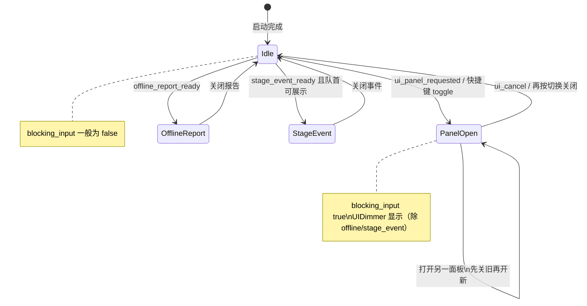
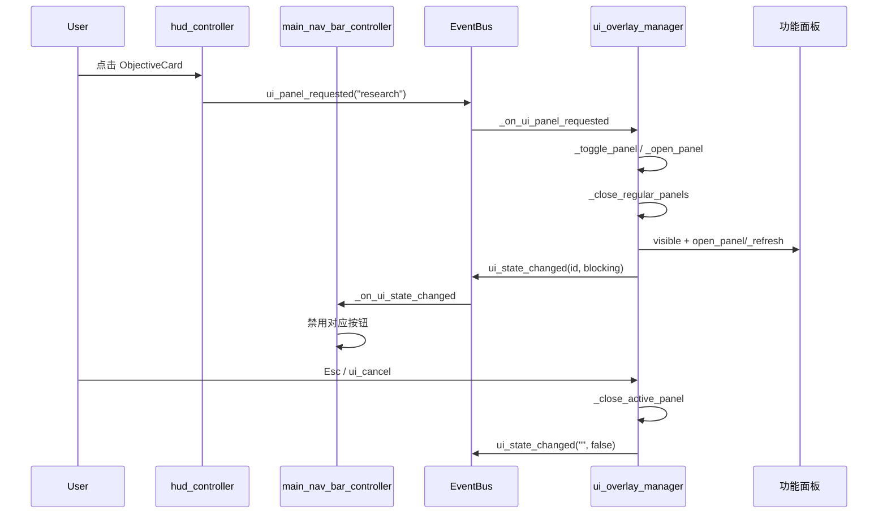
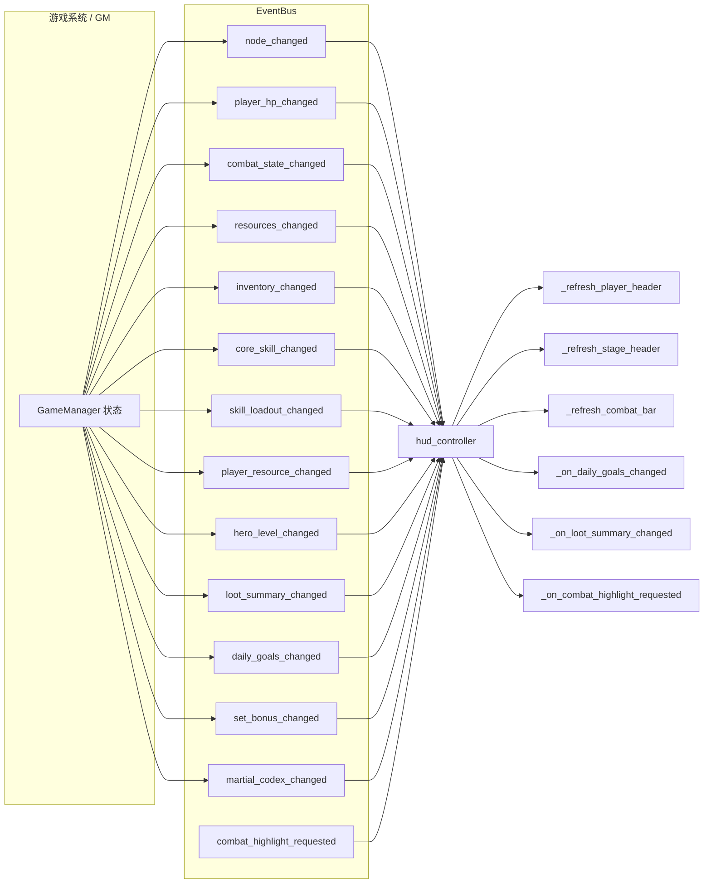
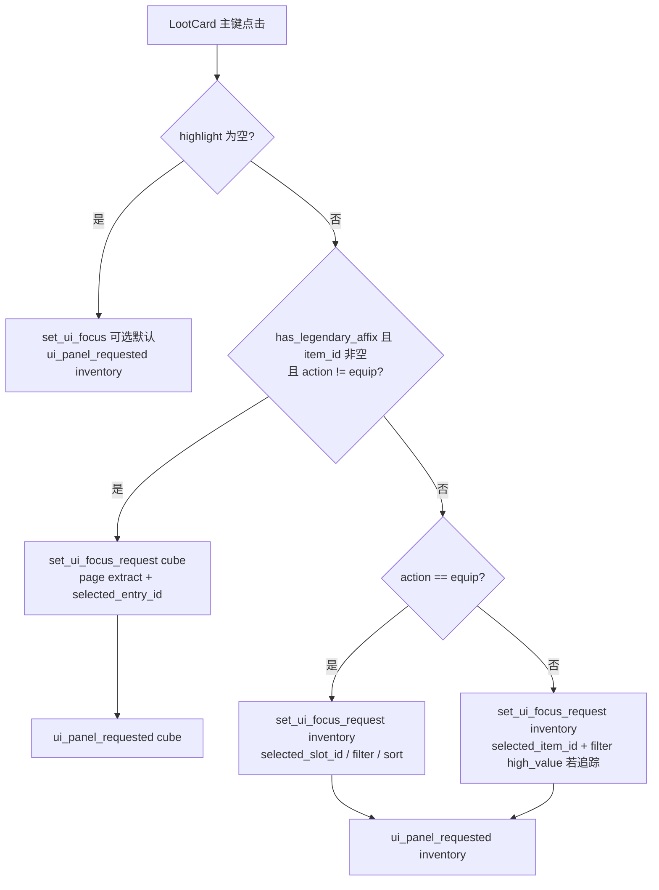

# 主界面与导航系统 — 开发需求案

> 面向实现：Godot 4 + GDScript。主界面由 `game_root.tscn` 的 `UILayer`（脚本 `ui_overlay_manager.gd`）承载：**HUD**、**收集特效**、**遮罩**、**功能面板**、**主导航栏**、**GM 面板**、**启动菜单**。HUD 与导航栏主脚本：`hud_controller.gd`、`main_nav_bar_controller.gd`。

---

## §1 文档目的与读者

**目的**：为其他 AI 或工程师提供一份**可逐条实现与验收**的主界面与导航系统规格，覆盖布局、数据契约、事件流、边界行为与测试要点。

**读者**：负责 UI、输入路由、`GameManager` 汇总状态、掉落与战斗高光的系统作者。

**非本文职责**：具体战斗数值、掉落表配置、各面板内部业务逻辑（仅约定打开方式与焦点请求）。

---

## §2 项目背景、技术栈与体验层级（L1–L5）

### 2.1 背景与技术栈

- 武侠挂机 RPG，2D 横版，**Godot 4**，**GDScript**。
- **主界面** = `UILayer` 上的 HUD + 主导航栏 + `UIOverlayManager` 所管理的面板/遮罩/弹窗队列。
- 主脚本路径：
  - `res://scripts/ui/hud_controller.gd`
  - `res://scripts/ui/main_nav_bar_controller.gd`
  - `res://scripts/ui/ui_overlay_manager.gd`
- `UILayer` 在 `game_root.tscn` 上挂载 `ui_overlay_manager.gd`，子节点顺序见 **§4.3**。

### 2.2 体验层级（L1–L5，需在设计中贯彻）

| 层级 | 名称 | 设计陈述 |
|------|------|----------|
| **L1 Fantasy** | 修行全景 | 「俯瞰修行全景的掌门视角，一切尽在掌握」—— HUD 是信息指挥台，而非单纯血条。 |
| **L1 Emotion** | 情绪主次 | 主情绪：**掌控感**（关键进度、目标、掉落一眼可见）；次情绪：**沉浸**（战斗画面与 HUD 对比度、动效克制，不抢戏）。 |
| **L1 Payoff** | 首屏回报链 | 进入游戏 → HUD 各区块就位 → 左上角色与资源、右上章节、底部战斗条稳定呈现 → **高价值掉落 Toast** 适时弹出 → **任意系统一键可达**（导航栏/快捷键）。 |
| **L2** | 时间尺度 | **秒级**：HUD 订阅的核心信号变化须即时反映；**分级**：Toast 类短时反馈约 2 秒量级；**时级**：跨面板打开/关闭、焦点跳转流畅、无卡顿叠层。 |
| **L3** | 系统覆盖 | 导航栏 **7 入口**（+ 调试 GM）覆盖背包、技能、百炼坊、成长中心、异闻录、推演/秘境、设置。 |
| **L5** | 显著反馈 | **战斗高光横幅**（精英/Boss 等，`combat_highlight_requested`）；**掉落 Toast**（位移动画 + 淡出，高价值条件见 **§9**）。 |

---

## §3 术语与面板 ID

| 术语 | 含义 |
|------|------|
| `panel_id` | 字符串面板标识，与 `EventBus.ui_panel_requested`、Overlay 内部 `active_panel_id` 一致。 |
| 常规面板 | `inventory` / `skills` / `cube` / `research` / `codex` / `drop_stats` / `settings` /（调试）`gm`。 |
| 特殊覆盖 | `offline_report`（离线报告）、`stage_event`（阶段事件弹窗），由 Overlay 队列驱动，**不**与常规面板同屏堆叠（见 **§10**）。 |
| `blocking_input` | `EventBus.ui_blocking_input`：有模态占用时，战斗/世界输入是否应被抑制（与 `ui_state_changed` 同步）。 |

---

## §4 信息架构、导航映射、互斥与 UI 状态机

### 4.1 HUD 信息架构（七个区域）

以下坐标与尺寸以 **`hud_controller.gd` 中 `_apply_hud_layout()`** 为权威实现参考；`viewport_size` 为当前视口大小。

| # | 区域（节点名） | 位置（锚点逻辑） | 尺寸 | 职责与控件 |
|---|----------------|------------------|------|------------|
| **1** | **PlayerHeader** | `(18, 18)` | **436×122** | **立绘环** `PortraitRing/PortraitTexture`；**NameLabel**；**ArchetypeLabel**（流派，来自核心武学）；**PlayerHpLabel**；**ResourceLabel**（香火钱等，`resource_text` 优先）。 |
| **2** | **StageHeader** | `(viewport.x - 338, 18)` | **320×90** | **StageTitleLabel**（如「第一章·桃溪外渡」）；**StageProgressLabel**；**StageRunLabel**（如「击杀0\|清图0」）；**StageDotsLabel**（如「●○○○○」，由战斗状态文案解析波次）。 |
| **3** | **CombatHighlightPanel** | 水平居中，`y = 86` | 场景内约 **420×66**（宽度以节点 `size` 为准，代码只设 `y` 与水平居中） | **CombatHighlightTitle / Subtitle / Detail**：精英/Boss 等击杀高光；**可见时长约 1.4s 核心区 + 渐入渐出**（见实现 tween）。 |
| **4** | **ObjectiveCard** | `(viewport.x - 338, 148)` | **320×122** | 每日/主目标摘要：**标题、目标、进度与奖励、下一步**；**点击** → 请求打开 **`research`**（成长中心）。 |
| **5** | **LootCard** | `(18, 244)` | **304×114** | 掉落高光行 + 多行摘要；**点击** → **智能跳转** `inventory` 或 `cube`（**§9**）；`GameManager.set_ui_focus_request` 传入焦点上下文。 |
| **6** | **BattleSafeFrame**（`combat_bar`） | 底部水平居中，`y = viewport.y - 168 - 10` | **600×168** | **CombatPlateTexture** + **LeftOrb**（生命百分比）+ **RightOrb**（真气当前/上限）+ **BuffStrip**（3 行文案：核心技名、循环状态、套装摘要）+ **SkillStrip**（**前 4 槽**为技能位 + 第 5 槽 UI 存在性以场景为准，逻辑上展示 `slot_entries`）。 |
| **7** | **DropToast** | 顶区水平居中，基准 **`y = 72`** | 场景约 **400×54** | 高价值掉落即时通知；**上移 + 淡出** tween，总可视约 **2s 量级**（实现为短移动 + 停留 + 淡出）。 |

**HUD 常驻**：上述区域除高光与 Toast 外默认常驻；**交互**：`ObjectiveCard`、`LootCard` 使用 `MOUSE_FILTER_STOP` 与主键点击判定。

### 4.2 主导航栏（`main_nav_bar_controller.gd`）

- **布局**：屏幕 **右下竖条**（具体 offset 以场景 `MainNavBar` 为准）。
- **`active_panel_id`**：监听 `EventBus.ui_state_changed`；与当前打开面板 **相同 ID** 的按钮 **`disabled = true`**，避免重复打开。
- **HintLabel** 文案（与实现对齐）：  
  `I 背包   K 技能   B 百炼坊   U 成长中心   O 异闻录   P 推演/秘境   Esc 关闭`

#### 导航栏按钮映射表

| 按钮文案（示例） | 快捷键（Input Action） | `panel_id` | 说明 |
|------------------|------------------------|------------|------|
| 背包 I | `ui_inventory` | `inventory` | |
| 技能 K | `ui_skills` | `skills` | Overlay 内对应 `SkillPanel` |
| 百炼坊 B | `ui_cube` | `cube` | |
| 成长中心 U | `ui_research` | `research` | |
| 异闻录 O | `ui_codex` | `codex` | |
| 推演/秘境 P | `ui_drop_stats` | `drop_stats` | |
| 设置 | （项目内设置动作，与 Overlay 一致） | `settings` | 无字母快捷键时以项目 `project.godot` 为准 |

按钮 `pressed` → `EventBus.ui_panel_requested.emit(panel_id)`。

### 4.3 `game_root.tscn` — `UILayer` 子节点顺序（绘制与逻辑参考）

自上而下（**同 CanvasLayer 内后者可盖住前者**）：

1. **HUD**  
2. **CollectEffects**  
3. **UIDimmer**  
4. **InventoryPanel**  
5. **OfflineReportPopup**（与阶段事件共用载体之一，见 Overlay）  
6. **CubePanel** → **ResearchPanel** → **SkillPanel** → **CodexPanel** → **DropStatsPanel** → **SettingsPanel**  
7. **MainNavBar**  
8. **GMPanel**  
9. **LaunchMenu**  

**说明**：与口头「HUD → … → 各面板 → MainNavBar → …」一致；**OfflineReportPopup** 插在面板链前段，由 `ui_overlay_manager` 显隐控制，不单独占 `panel_id` 分支树外逻辑。

### 4.4 面板互斥规则（`ui_overlay_manager.gd`）

- **同时只打开 1 个常规面板**：`_open_panel` 前调用 `_close_regular_panels()`，再显示目标面板。
- **`Esc` / `ui_cancel`**：优先关闭离线报告；否则关闭 `stage_event`；再否则清空常规 `active_panel_id` 并隐藏各面板。
- **离线报告** `_show_offline_report`：关闭常规面板，`active_panel_id = "offline_report"`，**不显示 UIDimmer**（与代码一致）。
- **阶段事件队列** `stage_event_queue`：仅当 `active_panel_id == ""` 且离线报告未显示时弹出下一则；关闭后 `EventBus.stage_event_closed.emit()` 并继续队列。
- **与 LaunchMenu**：当启动菜单可见时，Overlay 将 **`main_nav_bar` 与 `collect_effects` 隐藏**，避免误触（与 `_emit_ui_state` 逻辑一致）。

### 4.5 UI 状态机（概念）

**状态变量**（Overlay 权威）：`active_panel_id: String`，以及 `offline_report_popup.visible`、`launch_menu.visible`、`EventBus.ui_blocking_input`。



**`EventBus.ui_state_changed(panel_id, blocking_input)`**：任何 `active_panel_id` 或阻塞相关显隐变化后应发射，供导航栏、HUD 侧栏状态等同步。

---

## §5 数据契约：`GameManager.get_main_hud_state()`

HUD **禁止**在 `_refresh_*` 中散落硬编码业务规则，**应**从 `GameManager.get_main_hud_state()` 取结构化摘要（当前实现已部分如此；扩展时保持键名稳定）。

### 5.1 顶层结构

```gdscript
{
  "objective_summary": { ... },
  "loot_feed": { ... },
  "player_header": { ... },
  "stage_header": { ... },
  "combat_bar": { ... },
}
```

### 5.2 各子字典字段（约定 / 建议补齐）

#### `player_header`

| 键 | 类型 | 说明 |
|----|------|------|
| `name` | String | 角色名 |
| `archetype` | String | 流派展示行，如「流派: xxx」 |
| `resource_text` | String | **建议**由 GM 汇总香火钱等（HUD 现用 `summary.get("resource_text", "香火钱 0")`） |
| `portrait_path` | String | 立绘资源路径（HUD 默认有 fallback） |

#### `stage_header`

| 键 | 类型 | 说明 |
|----|------|------|
| `title` | String | 章节·节点名 |
| `subtitle` | String | 辅助说明（如节点推进） |
| `run_text` | String | 「击杀 n \| 清图 m」 |

#### `combat_bar`

| 键 | 类型 | 说明 |
|----|------|------|
| `core_skill_name` | String | BuffStrip 第一行 |
| `focus_text` | String | 第二行（循环/状态） |
| `set_summary_text` | String | 第三行（传承/套装摘要） |
| `active_slots` | Array | 技能槽 VM 列表；空则 HUD 可用 `skill_loadout_changed` 缓存的 `slot_entries` |

#### `objective_summary`

| 键 | 类型 | 说明 |
|----|------|------|
| `title` | String | 卡片标题，如「每日修行」 |
| `goal_text` | String | 主目标 |
| `progress_text` | String | 进度 |
| `cta_text` | String | 建议行动 |
| `next_step_text` | String | 下一步 |

#### `loot_feed`

| 键 | 类型 | 说明 |
|----|------|------|
| `lines` | Array[String] | 至多 N 行摘要（如 5 行），供 LootCard 与高光解析 |

---

## §6 流程图（Mermaid）

### 6.1 面板打开 / 关闭（含 HUD 点击）



### 6.2 HUD 刷新信号链（节选）



**读档/批量更新**：多个信号短时连发时，HUD 侧应 **防抖合并** 或 **帧末统一刷新**（见 **§10.4**）。

---

## §7 线框图（ASCII）

**图例**：`#` 外框；`-`/`|` 边界；数字为与代码一致的 **相对 viewport** 的锚点逻辑（宽×高）。

### 7.1 全 HUD 总览（含 7 区编号）

**边界补全**：视口变窄时，左右固定边距 **18px** 与右上 **338px 左边距** 可能导致 **PlayerHeader 与 StageHeader 视觉接近**；若重叠，应 **压缩标题截断**（已有 `_truncate_ui_text`）或 **提高 Z 序不改变** 而依赖布局缩进，**禁止**静默裁切点击热区而不调整位置。

```
0,v.y
 +--------------------------------------------------------------------------------+
 | [1] PlayerHeader        436x122 @ (18,18)          [2] StageHeader 320x90     |
 |  +------------------+                      +---------------------------+       |
 |  |(环)| Name        |                      | StageTitle               |       |
 |  |    | 流派/HP/钱 |                      | Progress | Run | Dots   |       |
 |  +------------------+                      +---------------------------+       |
 |                                                                                |
 |              [3] CombatHighlightPanel (center x, y=86) 约 420x66               |
 |              +------------------------------------------+                    |
 |              | Title / Subtitle / Detail                |                    |
 |              +------------------------------------------+                    |
 |                                                                                |
 | [5] LootCard 304x114 @ (18,244)              [4] ObjectiveCard 320x122         |
 | +---------------------------+              @ (v.x-338, 148)                  |
 | | 掉落标题 | 高光行         |              +---------------------------+     |
 | | 摘要多行                 |              | 目标/进度/奖励/下一步      |     |
 | +---------------------------+              +---------------------------+     |
 |                                                                                |
 |              [7] DropToast (center x, base y=72) 约 400x54 弹出层                |
 |              +----------------------------------+                            |
 |              | Icon | 标题 / 内容               |                            |
 |              +----------------------------------+                            |
 |                                                                                |
 |                                                                                |
 |              [6] BattleSafeFrame 600x168 bottom center (gap 10)                |
 |              +------------------------------------------------+              |
 |              | (左orb 生命%)  底板+Buff条+Skill条  (右orb 真气) |              |
 |              +------------------------------------------------+              |
 +--------------------------------------------------------------------------------+
 v.x, v.y
```

### 7.2 主导航栏（右下竖条）线框

**边界补全**：竖条 **`Panel`** 右下锚定；小分辨率下须保证 **不遮挡战斗条关键按键提示**；若重叠，导航栏 **整体上移** 或 **战斗条安全区内缩**（二选一，产品定夺，须写入场景 anchor 调整）。

```
                    +----------------------+
                    | [背包  I]            |
                    | [技能  K]            |
                    | [百炼坊 B]           |
                    | [成长中心 U]         |
                    | [异闻录 O]           |
                    | [推演/秘境 P]        |
                    | [设置]               |
                    +----------------------+
                    | HintLabel (多快捷键) |
                    +----------------------+
```

---

## §8 EventBus 与 HUD 订阅清单

| 信号 | HUD 行为概要 |
|------|----------------|
| `node_changed` | 刷新 player / stage / combat_bar |
| `player_hp_changed` | player_header HP、左 orb |
| `combat_state_changed` | stage 副标题拼接、`stage_dots` |
| `resources_changed` | player_header、stage_header |
| `inventory_changed` | player_header |
| `core_skill_changed` | player_header、combat_bar |
| `skill_loadout_changed` | 缓存槽位 + 刷新 |
| `player_resource_changed` | 右 orb |
| `hero_level_changed` | player_header、combat_bar |
| `loot_summary_changed` | LootCard 文案、图标、Toast |
| `daily_goals_changed` | ObjectiveCard |
| `set_bonus_changed` | combat_bar Buff 第三行 |
| `martial_codex_changed` | combat_bar（与 Build 相关摘要） |
| `combat_highlight_requested` | 顶部高光横幅 tween |

Overlay：**`ui_panel_requested`**、**`ui_close_requested`**；发射 **`ui_state_changed`**、维护 **`ui_blocking_input`**。

---

## §9 LootCard 智能跳转流程

**数据来源**：`GameManager.get_loot_highlight()`（字典，可能为空）。



**与 Toast**：`_on_loot_summary_changed` 内根据 `get_loot_highlight()` 与稀有度、`action == equip` 等决定是否展示 **DropToast**；Toast 使用与 LootCard 一致的图标源之一（实现为共享 `loot_icon`）。

---

## §10 边界情况与工程策略

### 10.1 多面板叠加

- **设计**：常规游戏面板 **不叠加**；特殊弹窗（离线、阶段事件）走 **独立 `active_panel_id`** 与 **无 UIDimmer** 策略，避免与 dimmed 模态冲突。
- **实现要点**：任何新「顶层弹窗」须明确：是否参与 `blocking_input`、是否关闭导航栏、是否入队。

### 10.2 战斗中 UI 限制

- **有阻塞面板时**：`EventBus.ui_blocking_input == true`，由全局输入层决定是否拦截战斗操作；HUD **仍可显示**（当前设计 HUD 不隐藏）。
- **LaunchMenu 打开时**：隐藏主导航栏与收集特效，**防止误开面板**。

### 10.3 Viewport resize 适配

- **`get_viewport().size_changed` → `_apply_hud_layout()`**：重算所有依赖 `viewport_size` 的 **position**（右上、居中、底部）。
- **Toast**：更新 `drop_toast_base_position`；若不可见则同步 `position`，避免尺寸变化后 Toast 卡在旧坐标。

### 10.4 信号风暴（读档 / 批量同步）

- **问题**：读档时连续 `emit` 十余个信号，HUD 可能同一帧内多次调用 `get_main_hud_state()`。
- **方案 1（推荐）**：在 `hud_controller` 内 **`call_deferred` 合并刷新** 或 **`await get_tree().process_frame` 防抖**，每帧最多全量刷新一次。
- **方案 2**：`GameManager` 在批量加载结束后发 **`hud_refresh_requested`** 单一信号（若引入需全工程约定）。

---

## §11 实现映射表（文件 / 节点）

| 职责 | 资源 |
|------|------|
| HUD 场景 | `res://scenes/ui/hud.tscn` |
| HUD 逻辑 | `res://scripts/ui/hud_controller.gd` |
| 导航栏 | `res://scripts/ui/main_nav_bar_controller.gd` + 对应场景实例 |
| Overlay | `res://scripts/ui/ui_overlay_manager.gd`（挂于 `UILayer`） |
| 根场景 | `res://scenes/main/game_root.tscn` |
| HUD 状态汇总 | `res://scripts/autoload/game_manager.gd` → `get_main_hud_state()` |
| 掉落高光 | `GameManager.get_loot_highlight()` / `set_ui_focus_request()` |

---

## §12 验收标准（测试清单）

### 12.1 HUD 各区域显示正确性

- **PlayerHeader**：换节点、换血、换钱、换库存后，姓名/流派/HP/资源文案与立绘一致且无越界（截断生效）。
- **StageHeader**：章节节点标题、`run_text`、战斗状态与 **五圆点** 一致。
- **CombatHighlight**：收到 `combat_highlight_requested` 后 **可见 → 自动消失**，不阻挡永久布局中心。
- **ObjectiveCard**：`daily_goals_changed` 后四行文案正确；点击仅打开 **research**。
- **LootCard**：`loot_summary_changed` 后摘要与图标颜色合理；**点击跳转**符合 **§9** 分支。
- **BattleSafeFrame**：真气与生命变化实时；技能槽与 `slot_entries` 解锁状态一致。
- **DropToast**：仅在 **高价值条件** 出现；动画结束后 **`visible = false`** 且 alpha 复位。

### 12.2 导航栏状态互斥

- 打开 **inventory** 时 **背包按钮 disabled**，关闭后恢复；七种面板逐一验证。
- **`HintLabel`** 与快捷键提示与 `project.godot` 中 action 绑定一致。

### 12.3 快捷键响应

- `I/K/B/U/O/P` 与 **Esc** 在 **非离线报告** 下可关闭当前面板；**离线报告** 优先关闭自身。
- **调试 GM**：仅当 `DemoManager.is_debug_tools_enabled()` 为真时 **`ui_gm_panel`** 可打开 GM。

---

## §13 未来扩展（预留）

- **HUD 可配置密度**：低分辨率「紧凑模式」减少行数。
- **自定义快捷键显示**：从配置生成 `HintLabel`。
- **多语言**：截断长度按 locale 调整。

---

## §14 风险与依赖

- **`get_main_hud_state()` 与 HUD 控件键名不一致** 会导致静默默认值（如 `resource_text`）；扩展字段须 **同时改 GM 与文档**。
- **阶段事件与离线报告** 共用节点方法（`show_report` / `show_stage_event`）时，须避免状态残留。
- **焦点请求** `set_ui_focus_request` 若面板未消费，可能造成「打开了面板但选中项不对」—— 各面板须在 `open_panel` 时读取队列。

---

## §15 附录

### 15.1 与需求描述的时间参数对齐

| 项 | 规格 |
|----|------|
| 战斗高光横幅 | 渐入后 **约 1.4s** 展示窗口再淡出（以 `hud_controller` tween 为准）。 |
| 掉落 Toast | **约 2s 量级** 用户感知（代码为短上移 + 1.8s 间隔 + 淡出）。 |

### 15.2 关键 API 一览

- `GameManager.get_main_hud_state() -> Dictionary`
- `GameManager.get_loot_highlight() -> Dictionary`
- `GameManager.set_ui_focus_request(panel_id: String, data: Dictionary)`
- `EventBus.ui_panel_requested.emit(panel_id: String)`
- `EventBus.ui_close_requested.emit()`（若使用）
- `EventBus.ui_state_changed.emit(panel_id: String, blocking: bool)`

---

*文档版本：与仓库脚本 `hud_controller.gd`、`main_nav_bar_controller.gd`、`ui_overlay_manager.gd`、`game_manager.gd#get_main_hud_state` 同步编写；若实现变更，请同步更新 §5、§7、§12。*
