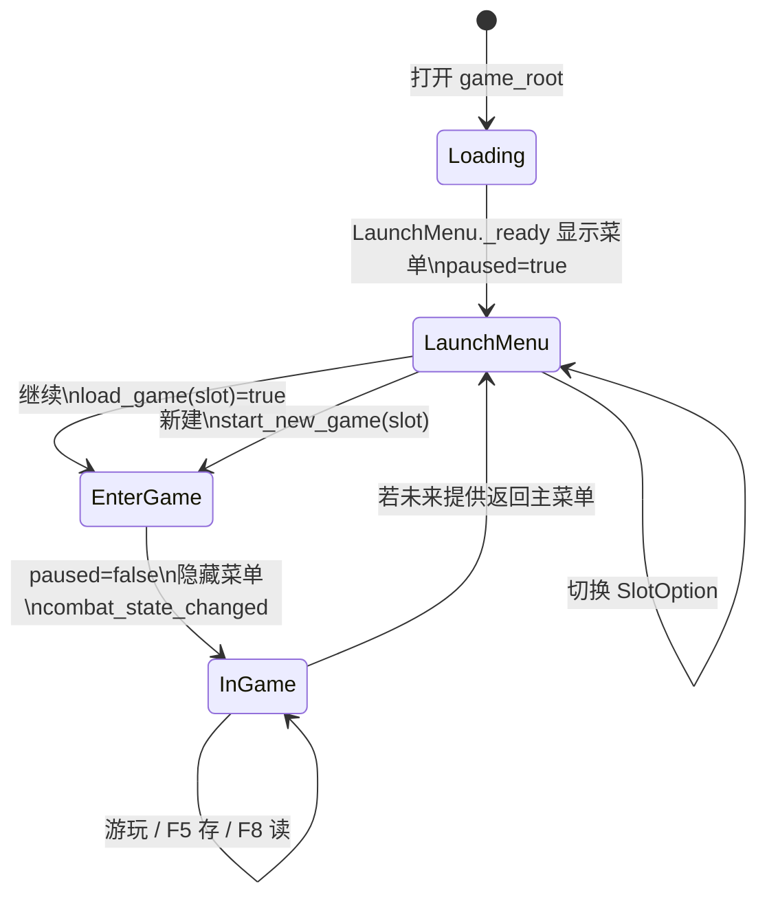

# 主菜单与存档系统

> 武侠挂机 RPG（2D 横版，Godot 4，GDScript）。本文档为 **§1–§15 完整开发需求案**，供实现与联调时直接对照代码路径与数据契约。

---

## §1 文档目的与读者

**目的**：统一「启动 → LaunchMenu → 选档/设置 → 进入游戏」的体验目标、状态机、存档 JSON 契约、与 GameManager / 各 Autoload 的协作方式，并覆盖异常、性能与验收要点。

**读者**：负责 UI、SaveManager、Demo 设置与版本迭代的开发者或其他 AI 代理。

**不在本文展开**：具体战斗数值、关卡配置表结构（仅标注与 `current_node_id` 等字段的衔接关系）。

---

## §2 范围与非目标

**范围内**

- 启动即进入 `scenes/main/game_root.tscn`，主菜单为叠在 UILayer 上的 `LaunchMenu`（`launch_menu.tscn` + `scripts/ui/launch_menu_controller.gd`）。
- 三槽位 JSON 存档（`SaveManager`）、试玩设置 CFG（`DemoManager`）、游戏内嵌 `SettingsPanel`（`settings_panel_controller.gd`）。
- 与 `GameManager`、`EventBus`、`OfflineSystem` 及参与 `build_save_data` / `load_save_data` 的子系统的读写边界。

**范围外（非目标）**

- 云存档、加密、Steam 成就。
- 将 `should_show_quick_start()` 接入 UI 的强制引导流程（当前 API 存在但可留作后续）；需求上允许后续接 LaunchMenu 或独立弹层。

---

## §3 术语与关键路径

| 术语 | 说明 |
|------|------|
| 档位 / Slot | 存档槽位，整数 **1..SAVE_SLOT_COUNT**（当前为 3），对应文件 `user://desktop_idle_save_%d.json`。 |
| Active Slot | `SaveManager` 内部 `_active_slot`，在 LaunchMenu `_refresh` 时随 UI 选中档位 `set_active_save_slot` 同步。 |
| Payload | `save_game` 写入磁盘的顶层 JSON 对象（字典序列化）。 |
| 硬版本迁移 | `save_version` 低于 `CURRENT_SAVE_VERSION` 时 **整档删除**（`_wipe_save`），不保留旧数据。 |

**关键脚本路径**

- `scripts/autoload/save_manager.gd`
- `scripts/ui/launch_menu_controller.gd`
- `scripts/autoload/demo_manager.gd`
- `scripts/ui/settings_panel_controller.gd`

---

## §4 架构要点

### 4.1 启动流程状态机

主场景已加载、脚本开始跑之后，逻辑上可分为四态（可与实际节点生命周期对照实现）：

| 状态 | 含义 | 典型行为 |
|------|------|----------|
| **Loading** | 引擎加载 `game_root`，Autoload `_ready` 执行 | `SaveManager` `call_deferred("load_game", DEFAULT_SAVE_SLOT)` 在首帧后尝试读默认档。 |
| **LaunchMenu** | 主菜单可见，游戏树暂停 | `get_tree().paused = true`，LaunchMenu `visible = true`，`process_mode = WHEN_PAUSED` 保证菜单可交互。 |
| **EnterGame** | 用户确认继续/新建后的过渡 | `paused = false`，关设置面板，LaunchMenu `visible = false`，发出 `EventBus.combat_state_changed`。 |
| **InGame** | 正常游玩 | HUD/战斗更新；`SaveManager` 响应 F5/F8、窗口关闭写档等。 |

**约定**：从 **LaunchMenu** 到 **InGame** 必须解除暂停，避免世界逻辑与输入卡在菜单态。

### 4.2 多槽位管理规则

1. 槽位编号 **1..SAVE_SLOT_COUNT**，非法槽位所有 API 应快速失败（返回 `false` 或占位 summary）。
2. **继续游戏**：对 **UI 当前选中槽位** 调用 `load_game(selected_slot)`；成功后 `set_active_save_slot` 已在 `_refresh` 中与选中一致。
3. **新建游戏**：`start_new_game(slot)` = 删除该槽文件 + `_active_slot = slot`（不自动写入新 JSON，直至后续 `save_game` 或游戏内逻辑落盘）。
4. **删档**：`delete_save_slot(slot)` 仅删文件，不改变 `_active_slot` 语义时需注意 UI 刷新（LaunchMenu 在删档后 `_refresh`）。
5. **设置面板内 Save/Load/Reset**：使用 `SaveManager.get_active_save_slot()`，故 **进入游戏前** 必须在 LaunchMenu 选档后通过 `_refresh` 同步 active slot。

**实现注意（契约对齐）**：`get_save_slot_summary` 当前返回键包含 `exists`、`label`、`chapter_id`、`kills`、`save_version`；`launch_menu_controller.gd` 的 `_refresh` 若仍读取 `has_save`、`title`、`subtitle`、`saved_unix_time` 等键，会与 SaveManager 不一致，**应在实现阶段统一**：要么扩展 `get_save_slot_summary` 输出 UI 所需别名，要么改 UI 使用 `exists`/`label` 并在 summary 中增加 `saved_unix_time`（从 payload 读取）等。

### 4.3 版本迁移策略

- `CURRENT_SAVE_VERSION`（当前 **3**）为存档兼容门槛。
- `load_game`：`saved_version < CURRENT_SAVE_VERSION` → 打警告 → `_wipe_save(slot)` → 返回 `false`（**不**做字段级迁移）。
- 未来若需软迁移：在 `_wipe_save` 之前分支，按版本链转换字典后再写入新 `save_version`；本文档当前需求仍以「试玩版硬门槛」为基线。

### 4.4 设置项清单

| 来源 | 键/分组 | 内容 | 持久化 |
|------|---------|------|--------|
| DemoManager CFG | `audio` | `master` / `music` / `sfx` 归一化 0..1 | `user://public_demo_settings.cfg` |
| DemoManager CFG | `ui` | `has_seen_quick_start` | 同上 |
| DemoManager 常量 | — | `PUBLIC_DEMO_VERSION`、反馈/仓库 URL、总线名 Master/Music/SFX | 代码 |
| SaveManager | 每槽 JSON | 见 §5 | `user://desktop_idle_save_%d.json` |
| SettingsPanel | — | 三音量滑条、存/读/重置、反馈/仓库、关闭、Debug（仅 debug build） | 音量与 DemoManager 同步即写 CFG |

---

## §5 存档 JSON Payload 完整字段说明

以下顶层键由 `save_game` 组装：`save_game` 先构造 `payload` 字典，再 `merge` 各系统 `build_save_data()`（后者键若与前者冲突，**以后 merge 为准**，当前设计应避免键名冲突）。

### 5.1 SaveManager 直接写入的顶层字段

| 字段 | 类型 | 说明 |
|------|------|------|
| `save_version` | int | 固定为 `CURRENT_SAVE_VERSION`。 |
| `current_chapter_id` | String | `GameManager` 当前章节。 |
| `current_node_id` | String | 当前节点（战斗/推进）。 |
| `stable_node_id` | String | 稳定节点锚点（用于展示或安全回退，语义以 GameManager 为准）。 |
| `selected_core_skill_id` | String | 当前核心技能。 |
| `current_run_kills` | int | 本轮击杀统计。 |
| `current_run_clears` | int | 本轮通关/清场类统计。 |
| `inventory` | Variant | 背包结构（通常 Dictionary，与 GameManager 一致）。 |
| `equipped_items` | Dictionary | 按 `GameManager.EQUIPMENT_SLOT_ORDER` 键保存各槽装备数据。 |
| `auto_salvage_below_rarity` | String | 自动分解稀有度阈值。 |
| `last_loot_summary` | String | 最近掉落摘要文案。 |
| `last_loot_highlight` | Variant | 高亮用掉落信息（结构随 GM 定义）。 |
| `paragon_state` | Dictionary | 深拷贝 `GameManager.paragon_state`；读档时经 `ParagonSystem.sanitize_state`。 |
| `season_state` | Dictionary | 深拷贝；读档经 `SeasonSystem.sanitize_state`。 |
| `rift_state` | Dictionary | 深拷贝；读档经 `RiftSystem.sanitize_state`。 |
| `gem_state` | Dictionary | 深拷贝；读档经 `GemSystem.sanitize_state`。 |
| `martial_codex_state` | Dictionary | 深拷贝；读档经 `MartialCodexSystem.sanitize_state`。 |
| `hero_state` | Dictionary | 深拷贝；读档经 `HeroProgressionSystem.sanitize_state`。 |
| `saved_unix_time` | float/int | `Time.get_unix_time_from_system()`，供离线结算。 |

### 5.2 MetaProgressionSystem.build_save_data()

| 字段 | 类型 | 说明 |
|------|------|------|
| `gold` | int | |
| `scrap` | int | |
| `core` | int | |
| `legend_shard` | int | |
| `research_levels` | Dictionary | 研究等级表。 |

### 5.3 LootCodexSystem.build_save_data()

| 字段 | 类型 | 说明 |
|------|------|------|
| `discovered_base_ids` | Array[String] | 已发现基底 ID。 |
| `discovered_affix_ids` | Array[String] | 已发现词缀 ID。 |
| `discovered_legendary_affix_ids` | Array[String] | 已发现传奇词缀 ID。 |
| `tracked_legendary_affix_id` | String | 追踪目标传奇词缀。 |
| `node_drop_stats` | Dictionary | 分节点掉落统计。 |
| `recent_drop_records` | Array | 最近掉落记录（有上限，如 24 条）。 |

### 5.4 DailyGoalSystem.build_save_data()

| 字段 | 类型 | 说明 |
|------|------|------|
| `daily_goal_state` | Dictionary | 内含 `primary_goal`、`side_goals`。 |
| `daily_goal_last_refresh_date` | String | 上次刷新日期串。 |
| `daily_goal_progress_snapshot` | Dictionary | 推荐/进度快照。 |

### 5.5 StageEventSystem.build_save_data()

| 字段 | 类型 | 说明 |
|------|------|------|
| `stage_event_state` | Dictionary | 内含 `cleared_boss_node_ids`、`unlocked_chapter_ids`、`celebrated_research_keys`、`celebrated_legendary_ids`、`tracked_target_completed_ids`（均为数组语义，存盘为 JSON 数组）。 |

### 5.6 load_game 恢复顺序（实现依赖）

1. 校验 JSON → 版本检查 → 赋值 `GameManager` 标量与 `inventory`。
2. 合并装备字典到 `equipped_items` 各槽。
3. 对各 `*_state` 调用对应 `sanitize_state` 写回 `GameManager`。
4. `MetaProgressionSystem`、`LootCodexSystem`、`DailyGoalSystem`、`StageEventSystem` 的 `load_save_data(payload)`。
5. 剩余 GM 字段（`auto_salvage_below_rarity`、`last_loot_*`）。
6. 批量 `EventBus` 信号（节点、技能、资源、装备、掉落摘要、背包、研究、图鉴、掉落目标、每日目标等）。
7. `OfflineSystem.process_saved_timestamp(saved_unix_time)`。

---

## §6 流程图（Mermaid）

### 6.1 启动 → 选档 → 读档 → 进入游戏



**边界说明**：`Loading` 阶段 `SaveManager` 对已 deferred 的 `load_game(DEFAULT_SAVE_SLOT)`：若默认槽无文件或版本不兼容，加载失败不阻塞显示菜单；玩家仍可通过选档继续。

---

## §7 线框图（ASCII）

### 7.1 LaunchMenu（主菜单）

**方案**：全屏半透明 `Dimmer` + 居中 `Panel`；标题区上置，槽位与摘要中部，主操作按钮横向分组，底部为 RichText 引导与试玩说明。

```
+------------------------------------------------------------------+
|  [Dimmer 暗色遮罩]                                                |
|   +------------------------------------------------------------+ |
|   |  AFK-RPG 公开试玩版                    (TitleLabel)        | |
|   |  Public Demo x.x.x | 应用名            (SubtitleLabel)     | |
|   |------------------------------------------------------------| |
|   |  档位 [ 1 v ]                         (SlotOption)         | |
|   |  档位 1 | 章节 xxx | 击杀 nnn         (SlotSummaryLabel)   | |
|   |  副标题 / 最近保存时间                (SlotMetaLabel)       | |
|   |  状态提示                             (StatusLabel)        | |
|   |------------------------------------------------------------| |
|   | [继续-绿] [新建-金] [重置-红] [设置-蓝] [反馈-蓝]          | |
|   |------------------------------------------------------------| |
|   |  2分钟上手（RichText 列表）           (GuideText)          | |
|   |  试玩说明（RichText）                 (KnownIssuesText)    | |
|   +------------------------------------------------------------+ |
|   [ SettingsPanel 同层子节点，打开时叠在上方 ]                  |
+------------------------------------------------------------------+
```

**方案补充**：继续/重置在无档或损坏档时应禁用或点击后仅提示状态；新建始终可用。

### 7.2 SettingsPanel（设置面板）

**方案**：独立 `Panel`，打开时 `visible=true`；关闭发 `panel_closed`（LaunchMenu 可接 `_refresh`）。音量三轨实时写 DemoManager 并持久化 CFG。

```
+---------------------------+
|  试玩版设置    (Title)     |
|  版本行        (Version)  |
|---------------------------|
|  Master  [====|---]  92%  |
|  Music   [===|----]  70%  |
|  SFX     [====|--]  84%  |
|---------------------------|
|  当前档位 / F5 F8 提示     |
|  短引导 RichText          |
|---------------------------|
| [保存] [读取] [重置档位]   |
| [反馈] [仓库] [关闭]       |
| [Debug] (仅 debug build)   |
|---------------------------|
| 状态行                     |
+---------------------------+
```

**方案补充**：Debug 按钮仅在 `DemoManager.is_debug_tools_enabled()` 为真时可用，按下关闭面板并 `EventBus.ui_panel_requested.emit("gm")`。

---

## §8 与核心模块的关联

| 模块 | 关联方式 |
|------|----------|
| **GameManager** | 存档核心快照来源与恢复目标；`inventory`、`equipped_items`、各 `*_state`、节点与技能 ID 等均来自 GM。 |
| **EventBus** | `load_game` 末尾集中发射，驱动 HUD、背包、研究、图鉴、每日目标等 UI 刷新；`LaunchMenu._enter_game` 发射 `combat_state_changed`；设置内 Debug 请求 `ui_panel_requested`。 |
| **OfflineSystem** | 读档后 `process_saved_timestamp(saved_unix_time)`，衔接离线收益与弹窗逻辑。 |
| **MetaProgressionSystem** | `gold`/`scrap`/研究等经济与 meta 进度。 |
| **LootCodexSystem** | 图鉴发现、节点统计、最近掉落。 |
| **DailyGoalSystem** | 每日目标状态与快照。 |
| **StageEventSystem** | 章节解锁、Boss 首通等阶段事件标记。 |
| **ParagonSystem / SeasonSystem / RiftSystem / GemSystem / MartialCodexSystem / HeroProgressionSystem** | 仅通过 GM 上对应 `*_state` 与 sanitize 参与存档，不单独再写一份顶层文件。 |
| **DemoManager** | 音量与 `has_seen_quick_start`；版本文案；外链打开。 |

---

## §9 四条完整操作流

### 9.1 继续游戏

1. 启动进入 `game_root`，LaunchMenu 显示，`paused=true`。
2. 在 `SlotOption` 选择有档槽位；`Continue` 可用。
3. 点击继续 → `SaveManager.load_game(selected_slot)`。
4. 若返回 `false`：Status 提示无档/损坏/版本 wiped；停留菜单。
5. 若返回 `true`：`DemoManager.mark_quick_start_seen()` → `_enter_game`：`paused=false`，关设置面板，隐藏 LaunchMenu，`EventBus.combat_state_changed.emit("继续试玩")`。

### 9.2 新建游戏

1. 选中目标槽位 → 点击新建。
2. `SaveManager.start_new_game(selected_slot)`（删该槽文件，设 active）。
3. `mark_quick_start_seen()` → `_enter_game("开始试玩")`。
4. 游戏以默认开局状态运行（具体初始值由 GameManager / 系统初始化保证）；直至首次 `save_game` 才产生新 JSON。

### 9.3 删档（重置档位）

1. 选中槽位 → 点击重置。
2. `SaveManager.delete_save_slot(selected_slot)`。
3. `_refresh()`：摘要更新，继续/重置按钮随无档禁用；Status 显示已清空提示。

### 9.4 设置

1. 主菜单或游戏中（若菜单可再次打开则同逻辑）点击设置 → `settings_panel.open_panel()`。
2. 拖音量 → `DemoManager.set_volume` → CFG 保存。
3. 保存/读取/重置 → 调用 `SaveManager` 的 **当前 active 槽**；与 LaunchMenu 选档通过 `set_active_save_slot` 对齐。
4. 关闭面板 → `panel_closed` → LaunchMenu `_refresh`（若已连接）。

---

## §10 风险与边界场景

| 场景 | 处理策略 |
|------|----------|
| **存档损坏** | JSON 无法解析或非 Dictionary → `load_game` false；`get_save_slot_summary` 可返回「数据损坏」类 label。 |
| **版本不兼容** | 低于 `CURRENT_SAVE_VERSION` → 删档并 false；提示玩家重新开档。 |
| **多槽位切换** | UI 每次 `_refresh` 调用 `set_active_save_slot`；设置内操作跟 active。 |
| **退出时落盘** | `NOTIFICATION_WM_CLOSE_REQUEST` 调用 `save_game(DEFAULT_SAVE_SLOT)`：**始终写槽 1**，与 active slot 可能不一致——若产品要求「关窗存当前档」，应改为 `save_game(get_active_save_slot())` 并纳入改造项。 |
| **窗口关闭信号** | 依赖 Godot 窗口关闭通知；Web/无窗口平台行为需单独验证。 |
| **快捷键冲突** | F5/F8 在 `SaveManager._input` 全局响应，且 **固定 DEFAULT_SAVE_SLOT**；与设置面板文案「当前档位」可能冲突。**建议**：快捷存读改为 `get_active_save_slot()`，或文档化「快捷存读仅槽 1」并在 UI 标明。 |
| **首帧 deferred load** | 默认槽自动读档失败时不应阻断菜单；避免双重加载竞态（若后续加「跳过菜单」需单独状态）。 |

---

## §11 存档大小与读写性能

**大小估算**：单槽 JSON 文本通常几十 KB 量级；随 `inventory`、`node_drop_stats`、`recent_drop_records`、各 `*_state` 增长而上升。极端 Build 下可能达数百 KB，仍远低于现代文件系统页大小瓶颈。

**性能**：每次 `save_game` 全量 `JSON.stringify` 写盘；读档全量解析 + 多次 sanitize + 一串 EventBus。试玩规模下可接受。**优化方向**（非当前必须）：异步写盘、节流自动存、分块压缩。

---

## §12 功能清单（验收勾选）

- [ ] **存档创建**：首次 `save_game` 或游戏内逻辑触发写文件；路径符合模板。
- [ ] **存档读取**：`load_game` 完整恢复 GM + 四系统 + 信号 + 离线戳。
- [ ] **存档删除**：`delete_save_slot` / `start_new_game` 前置 wipe 生效。
- [ ] **版本迁移**：低版本触发 wipe 与警告，不半残读入。
- [ ] **快捷存读**：F5/F8 行为与文档/产品一致（明确槽位规则）。
- [ ] **窗口关闭自动存档**：收到关闭通知时写档成功（或失败可记录）。

---

## §13 L1–L5 体验设计（实现指导）

### L1 Fantasy

「推开门派大门，选择踏上哪段修行之路」：LaunchMenu 文案与视觉（遮罩、面板层次）应传达「山门之前择路」，避免冷冰冰的「数据库选择」。

### L1 Emotion

主情绪 **安心**（有档可继续、时间与章节摘要可见）；次情绪 **期待**（新建金按钮、引导 RichText 预告成长）。

### L1 Payoff

选档 → 继续 → 暂停解除 → 战斗/HUD 立刻响应 `combat_state_changed` 与各类 EventBus → 玩家感知「回来了」。

### L2 时间尺度

- **秒**：按钮与 Option 切换无卡顿。
- **分**：读档在约 3 秒内完成进入可玩（目标值，依设备微调）。
- **日**：每次启动必经 LaunchMenu（当前架构），形成习惯锚点。

### L5 仪式感

- **新游戏**：可叠加短淡出/淡入或首场景加载条（需求级；当前代码以立即 `_enter_game` 为基线）。
- **继续游戏**：Dimmer 渐隐或并行加载占位，减少「硬切黑屏」感（可与美术迭代）。

---

## §14 测试建议（面向 QA / 自动化）

1. 三槽分别写入不同 `current_chapter_id` / `kills`，重启后摘要正确。
2. 手动损坏 JSON（截断）→ 继续不可用或错误提示。
3. 将 `save_version` 改为 0 再读 → 文件删除且提示链完整。
4. F5 后立即杀进程 → 再启动数据是否落盘（关窗路径另测）。
5. 设置面板改音量 → 重启 CFG 仍生效；`has_seen_quick_start` 在继续/新建后为 true。

---

## §15 常量与文件一览（实现速查）

| 常量/项 | 值/说明 |
|---------|---------|
| `SAVE_SLOT_COUNT` | 3 |
| `DEFAULT_SAVE_SLOT` | 1 |
| `SAVE_PATH_TEMPLATE` | `user://desktop_idle_save_%d.json` |
| `CURRENT_SAVE_VERSION` | 3 |
| Demo CFG | `user://public_demo_settings.cfg` |

**相关场景**：`scenes/main/game_root.tscn`（UILayer 挂载 LaunchMenu、Settings 等）、`scenes/ui/launch_menu.tscn`、`scenes/ui/settings_panel.tscn`。

---

*文档版本：与仓库内 `SaveManager` / `LaunchMenuController` / `DemoManager` / `SettingsPanelController` 同步编写；若代码契约变更，请同步更新 §4、§5、§10。*
