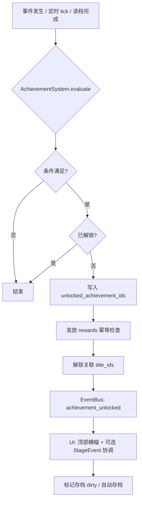
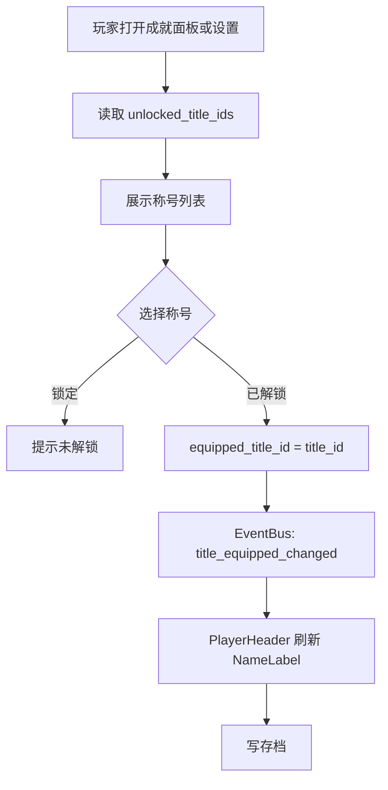

# 成就与称号系统 — 开发需求案

> 读者：实现本系统的 AI / 程序；引擎：Godot 4 + GDScript。  
> 本文档为独立需求说明，可与 `StageEventSystem`、`LootCodexSystem`、重入江湖、GameManager 等模块对照实现。

---

## §1 文档概述

### §1.1 背景

武侠题材 2D 横版挂机 RPG。当前已有分散的「里程碑式」反馈（首诛 Boss、章节解锁、研究里程碑、异宝现世等）与图鉴收集追踪，但缺少**统一的成就进度、解锁记录、奖励发放与称号展示**。本系统将这些能力收口为单一子系统，并与现有 EventBus、存档结构对齐。

### §1.2 设计目标（L1–L5 对齐）

| 层级 | 要点 |
|------|------|
| **L1 Fantasy** | 行走江湖留下的足迹与名号，是修行者的荣耀。 |
| **L1 Emotion** | 主：成就感 / 荣耀；次：收集欲（全成就、全称号）。 |
| **L1 Payoff** | 条件达成 → 顶部成就横幅 → 文案如「江湖见闻：首诛精英」→ 可解锁称号 → 装备后在名字旁展示。 |
| **L2** | 秒：即时通知；分：成就面板看进度；时：游玩中持续解锁；日：与每日目标挂钩；周：里程碑类；月：图鉴向终局。 |
| **L3** | 五大成就分类，覆盖战斗 / 收集 / 探索 / 轮回 / 里程碑。 |
| **L4** | 约 5 min 首个成就（如击杀 10 敌人）；约 1 h 战斗向；约 10 h 收集向；50 h+ 终局与全收集。 |
| **L5** | 横幅自顶滑入 + 金色光效 + 约 2 s 淡出；全分类完成可触发庆典；称号切换时有明确反馈。 |

### §1.3 术语

- **成就（Achievement）**：满足条件后永久解锁的一条记录，可带货币 / 道具 / 称号等奖励。  
- **称号（Title）**：一种可装备的装饰性名号；玩家同时仅佩戴 **1** 个；显示在 HUD `PlayerHeader` 的 `NameLabel` 旁。  
- **追溯解锁**：旧存档在升级后首次加载时，根据当前统计与图鉴状态补发应得成就与奖励（幂等、不重复发奖）。

---

## §2 目标与非目标

### §2.1 目标

1. 提供**可数据驱动**的成就与称号配置（JSON 或 Resource），便于策划扩表。  
2. 与 **StageEventSystem** 里程碑弹窗**复用叙事与事件源**，避免两套互斥的「首通」逻辑。  
3. 与 **LootCodexSystem** 共享收集进度，不重复维护图鉴完成度。  
4. **轮回成就**跨周目不重置；与重入江湖次数、专属外观解锁条件一致。  
5. 支持 **EventBus 信号驱动 + 定时/帧后检查 + 登录（读档）检查** 三种触发路径，保证在线、挂机、离线回归一致。

### §2.2 非目标（本版不做或弱约束）

- 不强制实现服务端校验（单机为主）；若未来联机，需另案。  
- 不替代 StageEventSystem 的 UI 弹窗职责：首诛等**强叙事**可仍由 StageEvent 展示；成就系统负责**进度条、列表、奖励与称号**。二者通过同一事实源或明确优先级避免重复弹窗（见 §8）。  
- 社交排行榜、全球首杀等不在本文档范围。

### §2.3 成功指标（实现后可自测）

- 任意条件在三种触发路径下解锁结果一致。  
- 读档后追溯解锁不重复发奖、不丢进度。  
- 称号切换后 HUD 立即刷新，存档可恢复。

---

## §3 范围清单

| 模块 | 包含 |
|------|------|
| 数据 | 成就定义、称号定义、玩家成就运行时状态、与存档字段 |
| 逻辑 | 条件评估、解锁、发奖、去重、与 EventBus 通知 |
| UI | 成就面板（分类 Tab + 列表 + 详情）、称号选择弹窗、顶部解锁横幅 |
| 集成 | StageEventSystem、LootCodexSystem、重入江湖、GameManager（击杀等）、每日目标、EventBus |

---

## §4 系统规则与机制

### §4.1 五大成就分类（规则）

| 分类 ID | 中文名 | 玩法侧重 | 典型条件来源 |
|---------|--------|----------|--------------|
| `combat` | 战斗 | 击杀、Boss、精英 | GameManager / 战斗统计 |
| `collection` | 收集 | 真意、套装、图鉴 | LootCodexSystem、背包 / 装备状态 |
| `exploration` | 探索 | 章节、秘境层数 | 章节进度、秘境系统 |
| `rebirth` | 轮回 | 重入江湖次数 | 重入江湖存档字段 |
| `milestone` | 里程碑 | 首次行为、七日全勤等 | 各子系统首次标记、每日目标模块 |

**规则：**

1. 每条成就**唯一** `achievement_id`，且归属**一个**主分类（用于 Tab 与统计「分类完成度」）。  
2. 分类完成度 = 该分类下「已解锁数 / 可解锁总数（本版本配置内）」。全部分类均 100% 时可触发 **L5 全分类完成庆典**（一次性标记 `celebrated_all_categories`，避免每次登录重复播放）。  
3. **轮回类**成就一旦解锁，**跨轮回永久保留**（见 §10）。

### §4.2 条件触发机制（必须三种并存）

1. **监听 EventBus 信号（主推）**  
   - 订阅如：`stage_event_ready`、战斗结算、装备变更、重入完成、每日目标状态变更、图鉴 `discovered_*` 更新等（具体信号名以项目 EventBus 为准）。  
   - 信号携带足够上下文时做**定向**成就检查（只扫相关 `achievement_id` 或分类），避免全表遍历每帧。

2. **定时或低频检查（补漏）**  
   - 例如每 5–30 s（或场景 `idle` 时）对「易漏」条件跑一轮轻量检查：图鉴计数、累计击杀与服务器时间无关的统计。  
   - 用于：信号遗漏、异步写入顺序、读档后中间状态未发信号等情况。

3. **登录 / 读档后检查（追溯与合并）**  
   - `GameManager` 或统一 `SaveLoad` 完成玩家状态还原后，调用 `AchievementSystem.validate_all_on_load()`：  
     - 对比「当前统计 / 图鉴 / 章节 / 重入次数」与「已解锁集合」；  
     - 补解锁、补发奖（幂等）、写回存档。  
   - **离线期间**：不强制实时解锁；在**下次登录读档**时通过本路径一次性结算（见 §10）。

### §4.3 称号装备规则

1. 玩家同时**仅佩戴 1 个**称号；未装备时称号槽为空，HUD 仅显示姓名。  
2. 显示格式：`[称号文本] 角色名`，例如 `[万夫莫敌] 无名侠客`。方括号是否显示可由策划配置；默认显示。  
3. **部分称号带品质色**（与装备品质色板一致）：在称号 Resource / JSON 中配置 `title_rarity` 或 `title_color_token`，UI 映射为主题色。  
4. 称号**获得**与**装备**分离：解锁成就可能授予称号「解锁」；玩家需在成就面板或设置中**手动装备**（避免自动覆盖玩家偏好）；可选配置项 `auto_equip_on_first_unlock` 默认 `false`。  
5. 未解锁的称号在选择列表中显示为锁定态，不可装备。

### §4.4 进度追踪方式

| 追踪类型 | 实现建议 |
|----------|----------|
| 布尔（是否达成） | `unlocked_achievement_ids: Array` 或 `Dictionary` |
| 数值进度（如 37/100 击杀） | 从**单一事实源**读取：`GameManager` 累计击杀、`LootCodexSystem` 发现集合长度等；成就不重复存冗余计数，仅缓存「上次展示用」可选 |
| 复合条件 | 成就定义中 `condition` 为结构化描述（见 §5），运行时统一求值 |
| 去重发奖 | `claimed_reward_achievement_ids` 或与 `unlocked_` 合并为带时间戳结构，发奖前检查 |

---

## §5 数据结构

### §5.1 成就定义 JSON Schema（逻辑示意）

实现可用 `Dictionary` 校验或 Godot `Resource` 导出字段，以下为逻辑 Schema：

```json
{
  "$schema": "https://json-schema.org/draft/2020-12/schema",
  "title": "AchievementDef",
  "type": "object",
  "required": ["achievement_id", "category", "name", "description", "condition", "rewards"],
  "properties": {
    "achievement_id": { "type": "string", "pattern": "^[a-z0-9_]+$" },
    "category": {
      "type": "string",
      "enum": ["combat", "collection", "exploration", "rebirth", "milestone"]
    },
    "name": { "type": "string" },
    "description": { "type": "string" },
    "hidden": { "type": "boolean", "default": false },
    "condition": {
      "type": "object",
      "description": "由 AchievementSystem 解释的运行时条件 DSL",
      "properties": {
        "type": {
          "type": "string",
          "enum": [
            "stat_gte",
            "first_boss_clear",
            "chapter_cleared",
            "rift_floor_gte",
            "rebirth_count_gte",
            "codex_discovered_count_gte",
            "codex_full",
            "set_complete_any_6",
            "first_legendary_equip",
            "elite_kills_gte",
            "daily_streak_gte",
            "first_equip",
            "first_cube_use",
            "paragon_point_gte",
            "composite_all"
          ]
        },
        "params": { "type": "object" }
      }
    },
    "rewards": {
      "type": "array",
      "items": {
        "type": "object",
        "required": ["kind"],
        "properties": {
          "kind": {
            "type": "string",
            "enum": ["currency", "item", "title_unlock", "cosmetic_unlock", "guaranteed_drop_table"]
          },
          "id": { "type": "string" },
          "amount": { "type": "integer" }
        }
      }
    },
    "stage_event_mirror": {
      "type": "string",
      "description": "可选：与 StageEventSystem 事件类型对齐，用于去重或复用文案"
    }
  }
}
```

**本版本策划表（与需求一致，实现时填入 `achievements.json`）：**

**战斗 `combat`**

| achievement_id | 名称 | 条件 | 奖励 |
|------------------|------|------|------|
| combat_kill_100 | 初窥门径 | 累计击杀 100 | 称号「初窥门径」 |
| combat_kill_1000 | 杀伐果断 | 累计击杀 1000 | 碎银 ×5000 |
| combat_kill_10000 | 万夫莫敌 | 累计击杀 10000 | 称号「万夫莫敌」 |
| combat_boss_first | 首诛 | 首次击败 Boss | 精铁 ×100 |
| combat_elite_100 | 精英猎手 | 击杀 100 精英 | 称号「精英猎手」 |

**收集 `collection`**

| achievement_id | 名称 | 条件 | 奖励 |
|------------------|------|------|------|
| collect_legendary_1 | 初见真意 | 首次获得真意装备 | 碎银 ×2000 |
| collect_set_complete | 传承圆满 | 任意一套 6 件传承凑齐 | 称号「传承者」 |
| collect_codex_50 | 异闻博览 | 图鉴发现 ≥50 种 | 秘卷残页 ×20 |
| collect_codex_all | 万物皆知 | 图鉴全收集 | 称号「万物皆知」 |

**探索 `exploration`**

| achievement_id | 名称 | 条件 | 奖励 |
|------------------|------|------|------|
| explore_ch01 | 山外初行 | 通关第一章 | 粗铁钥石 ×3 |
| explore_ch02 | 谷中问剑 | 通关第二章 | 精钢钥石 ×2 |
| explore_rift_10 | 秘境探索者 | 秘境通关 10 层 | 称号「秘境探索者」 |
| explore_rift_50 | 秘境征服者 | 秘境通关 50 层 | 称号「秘境征服者」 |

**轮回 `rebirth`**

| achievement_id | 名称 | 条件 | 奖励 |
|------------------|------|------|------|
| rebirth_1 | 轮回者 | 首次重入江湖 | 称号「轮回者」 |
| rebirth_3 | 三世人 | 3 次重入 | 称号「三世人」+ 专属外观 |
| rebirth_10 | 不灭道心 | 10 次重入 | 称号「不灭道心」 |

**里程碑 `milestone`**

| achievement_id | 名称 | 条件 | 奖励 |
|------------------|------|------|------|
| milestone_first_equip | 初次着甲 | 首次装备一件装备 | 碎银 ×500 |
| milestone_first_cube | 百炼初火 | 首次使用百炼坊 | 精铁 ×50 |
| milestone_paragon_1 | 宗师初悟 | 获得首个宗师修为点 | 碎银 ×3000 |
| milestone_daily_7 | 七日全勤 | 连续 7 天完成全部每日目标 | 真意装备保底 ×1 |

> **L4 补充**：文档 L4 提到「约 5 min 首个成就：击杀 10 个敌人」。若与上表 `combat_kill_100` 间隔过大，建议**新增**低门槛成就（如 `combat_kill_10`「锋芒初试」）或将 `combat_kill_100` 拆阶；实现时以 `achievements.json` 为准，本表为当前需求基线。

### §5.2 运行时状态（建议存档字段）

```gdscript
# 逻辑结构示意 — 实际可为 Dictionary 序列化
class_name AchievementSaveState

var unlocked_achievement_ids: Array[StringName] = []
var claimed_reward_ids: Array[StringName] = []  # 若发奖与解锁原子合并可省略
var equipped_title_id: StringName = &""
var unlocked_title_ids: Array[StringName] = []   # 显式解锁集合，便于未成就来源称号扩展
var celebrated_all_categories: bool = false
var last_daily_streak_for_milestone: int = 0     # 按需
var save_schema_version: int = 1
```

### §5.3 称号列表 JSON Schema

```json
{
  "titles": [
    {
      "title_id": "title_combat_kill_100",
      "display_text": "初窥门径",
      "rarity": "blue",
      "source_achievement_id": "combat_kill_100",
      "sort_order": 100
    }
  ]
}
```

**字段说明：**

- `title_id`：全局唯一。  
- `display_text`：HUD 与列表展示用。  
- `rarity`：映射主题色；无则默认中性色。  
- `source_achievement_id`：可选，用于从成就跳转与解锁溯源。  
- `cosmetic_unlock` 类奖励（如「三世人」外观）可与 `Title` 并列记录在成就 `rewards` 中，由外观系统消费。

---

## §6 流程图（Mermaid）

### §6.1 成就解锁流程



### §6.2 称号切换流程



---

## §7 界面线框（ASCII）

### §7.1 成就面板（主界面）

边界补全说明：**左侧**为固定宽度分类栏，点击切换仅刷新中间与右侧数据源；**中间**列表支持滚动，每项显示图标占位、名称、一行进度摘要；**右侧**为当前选中成就详情与奖励领取状态（若奖励与解锁分离则显示领取按钮，否则显示「已获得」）。

```
+----------------------------------------------------------------------------------+
|  [江湖成就]                              [筛选: 全部▼]              [X 关闭]    |
+----------+----------------------------+------------------------------------------+
| [战斗]   |  > 初窥门径                |  初窥门径                                |
| [收集]   |    进度 ████░░ 60/100     |  --------------------------------------  |
| [探索]   |  > 杀伐果断                |  行走江湖，累计斩敌百人，略窥武道门径。   |
| [轮回]   |    进度 █░░░░ 200/1000    |                                          |
| [里程碑] |  > 万夫莫敌 (未解锁)       |  进度: 击杀敌人  3724 / 10000             |
|          |    进度 ██████░░ ...      |  [=================-------]              |
|          |                            |  奖励:                                   |
|          |  (列表可滚动)              |   · 称号「万夫莫敌」(解锁后可穿戴)       |
|          |                            |                                          |
|          |                            |  [前往相关玩法] (可选)                   |
+----------+----------------------------+------------------------------------------+
| 底部: 总完成度 12/28   分类完成: 战斗 3/5  收集 2/4 ...                            |
+----------------------------------------------------------------------------------+
```

### §7.2 称号选择弹窗

边界补全说明：弹窗从**底部或中央**滑入；列表项左侧为色条（rarity），右侧为装备勾选；确认后关闭并写存档。与成就面板可通过「称号」入口共用同一组件。

```
+---------------------------+
|     选择称号        [X]   |
+---------------------------+
| [搜索框...............]   |
+---------------------------+
| | 初窥门径          (装备)|
| | 万夫莫敌          ( )   |
| | 轮回者 [锁]            |
+---------------------------+
| [取消]          [确定]    |
+---------------------------+
```

### §7.3 成就解锁横幅（HUD 顶部）

边界补全说明：横幅**自顶向下滑入**，宽度约 60–80% 屏宽居中；**金色粒子 / 光效**沿边框 brief 播放；**约 2 s** 后向上滑出或淡出；队列：多条解锁时**串行**播放以免重叠。

```
              (屏幕顶部)
    ~~~~~~~~~~~~~~~~~~~~~~~~~~~~~~~~~~~~~~~~
    ~  [江湖见闻]  首诛精英                 ~  <- 金色描边 + 微光
    ~  击败首领，扬名立万。                 ~
    ~~~~~~~~~~~~~~~~~~~~~~~~~~~~~~~~~~~~~~~~
```

---

## §8 与现有系统的关联

| 系统 | 关联方式 |
|------|----------|
| **StageEventSystem** | 成就 `combat_boss_first` 等与 `boss_first_clear` 事实一致：推荐 **单一事实源**（如 Boss 首杀在战斗结算写标志），StageEvent 负责弹窗叙事，AchievementSystem 监听同一信号或读同一标志做解锁；`stage_event_mirror` 字段便于对齐。章节解锁、研究里程碑、异宝发现同理，避免两套去重数组长期漂移。 |
| **LootCodexSystem** | `collect_codex_*` 使用 `discovered_base_ids` / `discovered_affix_ids` / `discovered_legendary_affix_ids` 聚合计数与「全收集」判定；`collect_legendary_1` 监听首次真意进包或图鉴首次登记；不重复存储图鉴集合。 |
| **重入江湖** | `rebirth_*` 绑定重入计数器（存档级、跨周目不递减）；`rebirth_3` 的专属外观由外观系统监听成就解锁或称号解锁发放。 |
| **GameManager** | 累计击杀、精英击杀、章节通关、秘境层数、首次装备等**统计入口**统一由此或战斗结算模块写入，AchievementSystem 只读接口评估。 |
| **EventBus** | 定义 `achievement_unlocked`、`title_equipped_changed`、`achievement_progress`（可选）等信号；UI、音效、存档订阅。 |

---

## §9 玩家体验完整链路

1. **自然游玩**：推图 / 挂机 / 重入 / 开箱 / 点百炼坊。  
2. **条件达成**：事实写入 GameManager 或子系统。  
3. **解锁**：信号或定时或读档检查 → `evaluate` → 解锁 + 发奖。  
4. **感知**：顶部横幅（L5 动效）+ 可选音效；成就面板红点提示。  
5. **查看**：打开成就面板 → 分类 Tab → 列表进度条 → 右侧详情。  
6. **装备称号**：成就面板或设置 → 称号弹窗 → 选择已解锁称号 → HUD `NameLabel` 旁显示 `[称号] 姓名`。  

---

## §10 存档、跨轮回、追溯与迁移

### §10.1 跨轮回永久

- `unlocked_achievement_ids`、`unlocked_title_ids`、`claimed_reward_ids`、`celebrated_all_categories` 等字段存放在**账号级 / 元存档**（与重入江湖设计一致），轮回重置**不清空**。  
- 当周目内仅进度相关数值可重置；成就不随周目清空。

### §10.2 追溯解锁（旧存档）

- 读档后执行 `validate_all_on_load()`：按 §5 表逐项求值；已满足且未记录的成就**补解锁**；奖励通过 `claimed_reward_ids` 保证**只发一次**。  
- 与 StageEventSystem 已弹过窗无冲突：若历史无成就系统，仅补数据与可选横幅队列，不强制重复 StageEvent 全屏弹窗（可配置）。

### §10.3 离线期间

- 不保证离线实时横幅；**下次启动读档**时合并结算。  
- 依赖「自然日」的成就（如七日全勤）以游戏内记录的**登录 streak** 或每日目标模块为准，而非纯 OS 时间篡改防护（单机另案防作弊）。

### §10.4 成就数据迁移

- `save_schema_version` 递增；缺失字段默认空集。  
- 旧版本仅有 StageEvent 去重数组时，可提供一次性 `migrate_from_legacy_flags()`：把 `cleared_boss_node_ids` 等映射为等价成就解锁（不写重复奖励若已发过）。  
- 迁移在 `validate_all_on_load` 之前或之中执行，且只运行一次（`migration_achievement_v1_done` 标志）。

---

## §11 性能、扩展与边界

- **评估成本**：信号路径只评估相关子集；全量扫描仅在读档与手动「修复存档」调试命令中执行。  
- **配置扩展**：新增成就仅加 JSON + 条件类型注册表；无需改核心求值框架。  
- **本地化**：`name` / `description` / 横幅文案走翻译表或 `tr()` key。  
- **与首成就 5 min 对齐**：新增 `combat_kill_10` 或降低首阶阈值时，注意横幅冷却与教程冲突。

---

## §12 验收测试（QA）

| 编号 | 场景 | 期望 |
|------|------|------|
| T1 | 各类成就条件在编辑器中手动触达 | 解锁正确、分类统计 +1 |
| T2 | 称号装备 / 卸下 | HUD 文案与色条正确 |
| T3 | 旧存档：已击杀 10000 但未有成就在首次加载 | 追溯解锁 `combat_kill_10000`，奖励只发一次 |
| T4 | 轮回后 | 已解锁成就与称号仍保留；装备称号保持或按设计重置装备槽（默认**保持装备**） |
| T5 | 快速连续解锁 5 条 | 横幅队列顺序正确，无叠字 |
| T6 | 全部分类 100% | 庆典只触发一次 |
| T7 | 断网 / 强关再开 | 无重复发奖、无丢失解锁 |

---

## §13 风险与对策

| 风险 | 对策 |
|------|------|
| StageEvent 与成就双重弹窗 | 统一事实源 + 配置 `suppress_banner_if_stage_event` |
| 图鉴计数与「种」定义不一致 | 与 `get_codex_summary_text()` 使用同一计数函数 |
| 全表扫描卡顿 | 子集评估 + 读档全量仅一次 |

---

## §14 开放问题（实现前确认）

1. 「图鉴发现 50 种」是否包含传奇词缀独立计数，与 `get_codex_entries()` 展示规则一致？  
2. 「任意一套 6 件传承」套装 ID 数据源是否为固定表？  
3. `combat_kill_10` 是否正式纳入第一版配置？  
4. 七日全勤的「天」是否必须连续自然日？

---

## §15 附录

### §15.1 EventBus 建议信号（命名供实现参考）

- `achievement_unlocked(achievement_id, rewards_snapshot)`  
- `title_equipped_changed(title_id)`  
- `achievement_all_categories_complete()`  

### §15.2 HUD 字符串拼接伪代码

```
display = ""
if equipped_title_id != "":
    display += "[" + title_display_text + "] "
display += player_name
NameLabel.text = display
```

### §15.3 文档修订

| 版本 | 日期 | 说明 |
|------|------|------|
| 1.0 | 2026-04-18 | 初版需求案 |

---

*本文档结束。*
