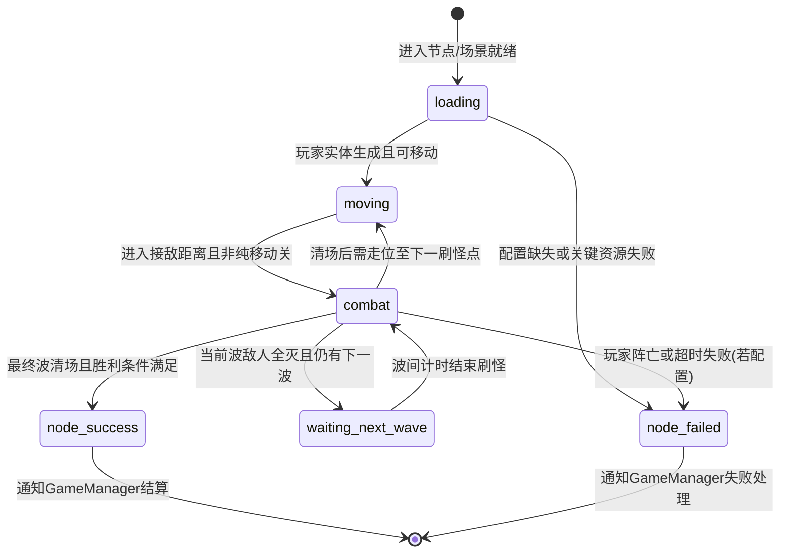
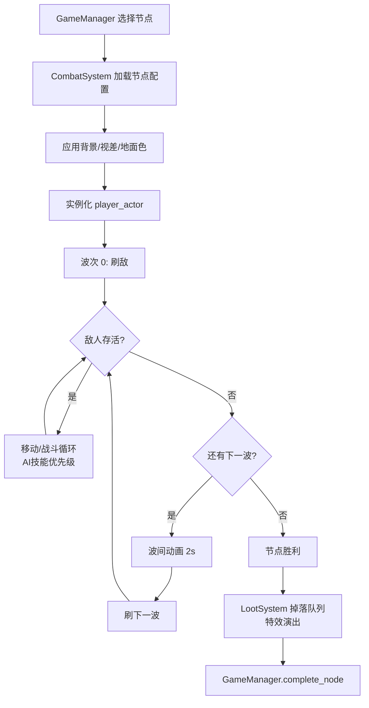
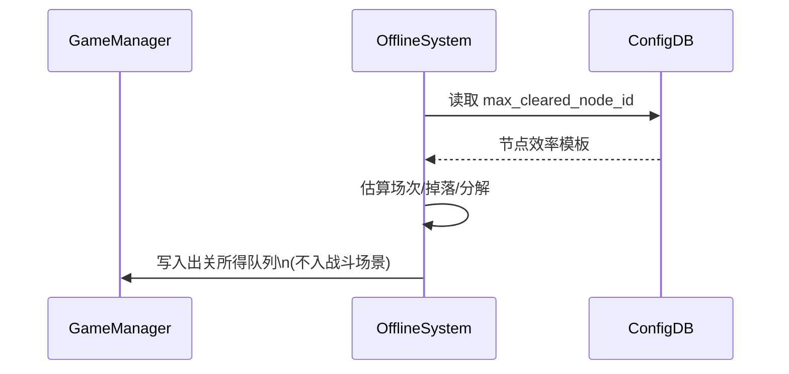

# 战斗系统

> 作者：（待填写）  
> 创建日期：2026-04-18  
> 最后更新：2026-04-18  
> 状态：评审中  
> 主实现：`res://scripts/systems/combat_system.gd` · 关联 Autoload：`GameManager`（`res://scripts/autoload/game_manager.gd`）

---

## §1 概述

本战斗系统是武侠题材 2D 横版挂机 RPG 的**全自动战斗演出与结算中枢**。玩家不直接操控出招与走位，但必须能通过画面与 HUD **稳定读懂**当前 Build（装备、套装、传奇特效、流派武技）在战场上的兑现效果；战斗节奏按节点类型（普通 / 精英 / Boss）分层，以支撑推图效率、掉落期待与视听仪式感。

系统职责边界为：**波次生成 → 敌我实体生命周期 → AI 技能优先级与命中表现 → 胜负判定 → 与掉落/章节进度/离线快照的对接**。非本系统职责（但需契约对齐）包括：离线收益的完整经济规则（见《离线收益系统》）、装备词条生成细节（见《装备·数值·Build系统》与数值框架）、秘境与日常等外围玩法入口。

技术栈为 **Godot 4 + GDScript**。当前工程已挂载 `CombatSystem` 于主场景并驱动 `battle_state` 状态机；本需求案用于将体验目标、数据结构、UI 反馈与边界行为一次性对齐，供其他 AI 或工程师直接按章节实现与验收。

---

## §2 体验设计 L1-L5

### L1 · 体验锚点

| 维度 | 内容 |
|------|------|
| **Fantasy** | 「见证自己的修行成形」——玩家把自己投射为不断变强的江湖行者，战斗画面是修为与装备的外显。 |
| **Emotion（主）** | **掌控感**：Build 凑齐后，战场节奏明显向玩家倾斜，技能释放顺序可预期。 |
| **Emotion（次）** | **期待**：波次将尽、Boss 阶段将切换、套装/传奇特效即将触发时的悬念与兑现。 |
| **Payoff** | 传承 **6 件套**触发 → 约 **3 秒**清场级爆发 → **金色光柱**高品质掉落表演 → **绝世真意**（或同档叙事品质）入账 → **DPS 跳字**峰值刷屏；该链条需在战斗中可截图、可复述、可重复追求。 |

### L2 · 体验循环（时间尺度）

| 时间尺度 | 玩家在战斗侧获得什么 | 与战斗节奏的对齐说明 |
|---------|---------------------|----------------------|
| **秒循环（小于 3 秒）** | 命中硬直、跳字、小技能起手与收招提示 | 定义 **音画时序轴 7 类事件**：①普攻/技能命中 ②暴击放大变色 ③武技施放（起手环/残影）④击杀（击飞或消散）⑤掉落物弹出 ⑥受击/濒死边缘泛红 ⑦套装或传奇特效触发条/全屏闪的前摇；每类事件有独立音效槽位与防叠音优先级。 |
| **分循环（90–240s）** | 完成一个**推图节点**的完整战斗（含波间） | 普通节点单波 **5–10s** ×3 波 + 波间 **2s** 换波动画；与「效率与掉落数量」目标一致。精英 **15–20s** 强调机制与 DOT 叠层可读；Boss **30–60s** 展示阶段与全特效。 |
| **时循环（30–60min）** | 首次或重复**通关章节 Boss**，解锁下一章或节点 | Boss 战内嵌阶段切换与分段血条，战后触发章节完成与保底掉落（与数值框架首章 Boss 保底对齐）。 |
| **日循环** | **约 5 分钟**感知今日成长（小目标战斗场次），**约 20 分钟**有效推图 | 战斗不强行拖长；通过节点类型与倍速配置保证「短登录也有战斗反馈」。 |
| **周循环** | **秘境 10 层**等周常压力测试 Build | 战斗 AI 与特效预算需支持「高密度怪 + 长战斗」的可读性模式（镜头震动幅度上限、同屏特效数量池）。 |
| **月循环** | **14 天级**目标凑齐 **传承 6 件套** | 套装触发为战斗内高光，需与掉落表演、图鉴（Loot Codex）解锁联动。 |

### L3 · 决策空间（三流派差异化）

玩家在战斗外构筑 Build，战斗内由 AI 释放 **三大流派核心武技**，形成可读差异化：

| 流派武技 | ID（建议） | 战场角色 | 至少三项可读差异 |
|---------|------------|---------|-----------------|
| 御风刀 | `core_whirlwind` | 范围清场 | ①旋风 AOE 范围指示 ②多目标同时命中跳字密度 ③清场后短暂「风痕」地面残效 |
| 血劫手 | `core_deep_wound` | 单体 DOT + 处决 | ①流血层数挂在目标血条旁 ②高层时模型/描边色变 ③处决阈值到达时独立处决动画与静音区（突出一击） |
| 五雷掌 | `core_chain_lightning` | 连锁弹射雷击 | ①闪电链折线轨迹 ②每次弹射音效音高递增 ③弹射上限与终点爆炸可读标记 |

**最优解风险**：单一 DPS 最优不可避免时，以**场景词缀**（多体 / 单体桩 / 高抗类型）轮换迫使 AOE、DOT、连锁各有高光波次；Boss 阶段可阶段性提高某类抗性，避免一套武技通吃。

**可逆性**：流派切换发生在装备与技能装配层，战斗内不临时切换；玩家改配后下一场战斗生效，避免中途规则复杂化。

### L4 · 学习曲线里程碑

| 时长 | 目标 |
|------|------|
| **5 分钟** | 理解「全自动 + 武技自动释放 + 跳字与血条即反馈」；完成至少 1 个普通节点。 |
| **1 小时** | 打败**首章 Boss（铁面虬髯客）**，理解 Boss 血条分段与基础阶段技。 |
| **10 小时** | 选定主力流派并凑出**可感知的传承件数**（至少 2–4 件），能在战斗中认出套装接近触发时的 UI 提示。 |
| **100 小时** | 秘境 **30+ 层**仍可读：特效分级（低/中/高）可配置，Boss 与精英模板复用不模糊。 |

### L5 · 情感反馈

**仪式感清单（视听描述）**

1. **传承 6 件触发**：全屏短暂压暗 → 套装纹章展开 → 角色周身罡气 → 全屏闪光 + **大号书法体或篆刻体提示文案**（避免与已有 UI 字重冲突）→ 爆发技能自动插队释放。  
2. **橙字 / 真意掉落**：地面金色光柱 + 慢镜 0.2–0.4s（可开关）+ 独立拾取音效层。  
3. **Boss 斩杀**：最后一段血条碎裂特效 + 处决镜头轻微推近 + 鼓点收束。  
4. **暴击**：跳字 **放大 + 颜色变化**（与普通命中对比度 ≥ WCAG 思路的相对亮度差，不仅依赖色相）。  
5. **濒死反转**：玩家生命低于阈值时 **屏幕边缘泛红** 脉冲，同时 AI 提高防御型 buff 技能权重（若已装备）。  
6. **秒杀精英**：快速清屏表演（白闪/线框断裂/残影回收三选一风格化），并 **100% 玄品以上掉落**（与精英节点契约一致）。  

**挫败缓冲（P2 前草案，实现时可微调）**

| 挫败情境 | 缓冲方案 |
|---------|---------|
| Boss 长时间刮痧 | 软狂暴仅加**可读提示**（Boss 周身红雾 + UI 文案），数值增幅控制在数值框架允许的全局倍率内；同时记录「推荐战力」供 HUD 展示。 |
| 连续战斗无高品质掉落 | 与全局保底（坏运气保护、每日保底）对齐，战斗结束弹出**小结条**提示距离保底还差几场（数据来自 Meta / Daily 系统，战斗侧只负责展示槽位）。 |

**可分享锚点**

- **零工程成本、系统级截图**：套装触发全屏提示帧、真意光柱落地帧、Boss 阶段切换条、单次战斗 DPS 统计峰值条。  
- 依赖游戏内原生截图与统计面板，不强制分享 SDK。

### L1-L5 自检（战斗系统范围）

- [x] L1 Fantasy / Emotion / Payoff 已填  
- [x] L2 六层时间尺度已填  
- [x] L3 三流派 + 最优解规避 + 可逆性  
- [x] L4 四里程碑  
- [x] L5 仪式感 ≥3 + 挫败缓冲 ≥2 + 可分享锚点 ≥1  

---

## §3 设计目标

1. **全自动可读**：不操作的前提下，玩家 10 秒内能判断「谁在打谁、我方是否优势、当前波次进度」。  
2. **Build 外显**：套装、传奇特效、流派武技必须在**动画 / 粒子 / UI 条 / 音效**中至少占两项通道，避免「数值变了但画面没变」。  
3. **节奏分层**：普通 / 精英 / Boss 三类节点时长与特效预算符合 §2 表格，且可通过配置热调。  
4. **状态机可验收**：加载、移动、战斗、波间、胜利、失败路径单一明确，无静默卡死；所有转移打点可日志化（Debug 开关）。  
5. **系统契约稳定**：与 `GameManager` 的节点完成/失败、与 `LootSystem` 的掉落、与 `OfflineSystem` 的「当前最高效率节点」引用一致，避免双写进度源。

---

## §4 核心机制

### 4.1 战斗角色分工

| 角色 | 建议节点名 | 职责 |
|------|-------------|------|
| `player_actor` | `Player`（`player.tscn` 实例） | 自动移动、索敌、按优先级释放武技与普攻；接收 Buff/濒死/套装触发信号。 |
| `enemy_actor` | `Enemy`（`enemy.tscn` 实例） | 按波次刷新；分喽啰 / 精英 / Boss 模板；死亡向战斗系统上报位置供掉落可视化。 |

### 4.2 节点类型与速度控制

| 节点类型 | 目标总时长（战斗内） | 侧重 |
|---------|---------------------|------|
| 普通 | **5–10s / 波** | 效率与掉落数量 |
| 精英 | **15–20s** | 多特效、机制词缀、DOT 叠层展示 |
| Boss | **30–60s** | 分段血条、阶段切换、高品质掉落表演 |

### 4.3 波次结构

- **普通节点**：固定 **3 波**；每波 **5–10s**（由刷怪数量、血量、移速推导，配置可调）；波与波之间 **2s**「换波」过渡（镜头微移、字幕「来者不善」类可选、纯 UI 亦可）。  
- **精英节点**：精英登场 **特写**（0.8–1.5s 可跳过）；战斗中 **DOT 层数**与词缀图标常驻 HUD；击杀后触发 **100% 玄品及以上**掉落（与掉落表契约，见 §8）。  
- **Boss 节点**：**血条分段**（建议每 25% 或按技能表切阶段）；每阶段切换播放 **阶段技动画 + 台词板**；击败后进入 **高品质掉落表演**时间轴（与 `LootSystem` 队列一致）。

### 4.4 武技 AI（优先级规则）

实现一个**可数据驱动**的优先级队列（每 0.25s 或每帧末尾重算一次，取较轻方案）：

1. **处决窗口**：目标流血层数 ≥ 配置阈值且武技 `core_deep_wound` 不在 CD → 优先处决招式。  
2. **套装 / 传奇大技能触发**：EventBus 或内部信号标记「本帧必须插队展示」→ 冻结其他低优先级技能 0.2s（不冻结移动与受击反馈）。  
3. **AOE 密度**：场上存活敌人 ≥ N 且 `core_whirlwind` 可用 → 优先旋风。  
4. **连锁收益**：存活 ≥2 且单位间距在链距离内 → `core_chain_lightning`。  
5. **默认**：普攻填充；若能量类资源存在，按资源曲线插入中武技。

同优先级时按 **固定 ID 字典序** 打破平局，保证录像可复现。

### 4.5 战斗可读性反馈（事件 → 表现）

| 触发事件 | 视觉反馈 |
|---------|---------|
| 套装特效触发 | **全屏闪光**（亮度曲线限制防癫痫友好选项）+ **文字提示** |
| 暴击 | 跳字 **放大 + 颜色变化** |
| 传奇特效触发 | **专属动画** + **专属音效** |
| 濒死触发 | **屏幕边缘泛红**（与 L5 一致） |
| 秒杀 | **快速清屏表演**（精英模板可配） |

### 4.6 敌人模板

| 类型 | ID 建议 | 特征 |
|------|---------|------|
| 喽啰 | `cannon_fodder` | 低血低攻，数量密集，用于普通波次填充 |
| 精英 | `elite` | 高血，**机制词缀**（护盾、分裂、反伤等数据驱动） |
| Boss | `boss` | **分阶段血条**，**专属技能**表，较长演出窗口 |

### 4.7 章节节点（前两章示例）

| 章节 | 叙事地名 | 节点组成 |
|------|---------|---------|
| 第一章 | 青云山外 | **5 普通 + 1 精英 + 1 Boss**；Boss：**铁面虬髯客** |
| 第二章 | 落雁谷 | **5 普通 + 2 精英 + 1 Boss**；Boss：**枯骨剑客** |

### 4.8 离线战斗规则（摘要）

与《离线收益系统》全文对齐；战斗系统侧只保证：

- 离线结算以玩家**当前最高通关节点**（或配置字段 `offline_efficiency_node_id`）的**效率模型**估算场次与掉落。  
- **低品质自动分解**、高品质进入 **「出关所得」队列** 的规则由离线模块执行；在线战斗掉落仍走实时表现 + `LootSystem`。

### 4.9 状态机（战斗内）

**状态枚举**（字符串与现有代码对齐，可扩展但须迁移保存）：`loading` → `moving` ↔ `combat` → `waiting_next_wave` →（最后一波结束）`node_success` 或 `node_failed`。

**转移条件摘要**：



---

## §5 数据结构（JSON Schema）

以下 Schema 用于配置驱动；实际文件可拆分为 `chapter_nodes.json`、`enemy_archetypes.json`、`skill_defs.json` 或多表，但**合并视图**应满足同一逻辑模型。

### 5.1 节点与波次

```json
{
  "$schema": "https://json-schema.org/draft/2020-12/schema",
  "$id": "https://example.com/schemas/battle_node.schema.json",
  "title": "BattleNode",
  "type": "object",
  "required": ["id", "chapter_id", "node_type", "waves"],
  "properties": {
    "id": { "type": "string", "pattern": "^[a-z0-9_]+$" },
    "chapter_id": { "type": "string" },
    "node_type": { "type": "string", "enum": ["normal", "elite", "boss"] },
    "target_seconds_per_wave": { "type": "number", "minimum": 3, "maximum": 120 },
    "inter_wave_seconds": { "type": "number", "minimum": 0, "maximum": 10, "default": 2 },
    "elite_drop_min_tier": { "type": "string", "enum": ["mystic", "true_meaning", "heritage", "ancient", "peerless"], "description": "精英击杀最低品质，默认 mystic=玄品" },
    "waves": {
      "type": "array",
      "minItems": 1,
      "items": {
        "type": "object",
        "required": ["wave_index", "spawns"],
        "properties": {
          "wave_index": { "type": "integer", "minimum": 0 },
          "spawns": {
            "type": "array",
            "items": {
              "type": "object",
              "required": ["enemy_id", "count"],
              "properties": {
                "enemy_id": { "type": "string" },
                "count": { "type": "integer", "minimum": 1, "maximum": 50 },
                "spawn_pattern": { "type": "string", "enum": ["line", "arc", "v", "random_band"], "default": "line" }
              }
            }
          },
          "environment_mods": {
            "type": "array",
            "items": { "type": "string" },
            "description": "如毒雾、落雷区，供可读特效绑定"
          }
        }
      }
    },
    "boss_phases": {
      "type": "array",
      "description": "仅 boss 节点",
      "items": {
        "type": "object",
        "required": ["hp_pct_threshold", "skill_loadout_id"],
        "properties": {
          "hp_pct_threshold": { "type": "number", "minimum": 0, "maximum": 100 },
          "skill_loadout_id": { "type": "string" },
          "camera_shake_scale": { "type": "number", "minimum": 0, "maximum": 1 }
        }
      }
    }
  }
}
```

### 5.2 敌人原型

```json
{
  "$id": "https://example.com/schemas/enemy_archetype.schema.json",
  "title": "EnemyArchetype",
  "type": "object",
  "required": ["id", "archetype", "base_hp", "base_atk", "move_speed"],
  "properties": {
    "id": { "type": "string" },
    "archetype": { "type": "string", "enum": ["cannon_fodder", "elite", "boss"] },
    "display_name": { "type": "string" },
    "base_hp": { "type": "number", "minimum": 1 },
    "base_atk": { "type": "number", "minimum": 0 },
    "move_speed": { "type": "number", "minimum": 0 },
    "resistance_profile_id": { "type": "string" },
    "affixes": {
      "type": "array",
      "items": {
        "type": "object",
        "required": ["affix_id"],
        "properties": {
          "affix_id": { "type": "string" },
          "stacks": { "type": "integer", "minimum": 1, "default": 1 }
        }
      }
    },
    "boss_ui": {
      "type": "object",
      "properties": {
        "show_segmented_bar": { "type": "boolean", "default": true },
        "intro_camera_duration": { "type": "number", "minimum": 0 }
      }
    }
  }
}
```

### 5.3 武技定义（三核心 + 扩展）

```json
{
  "$id": "https://example.com/schemas/skill_def.schema.json",
  "title": "SkillDef",
  "type": "object",
  "required": ["id", "kind", "cooldown", "priority_weight"],
  "properties": {
    "id": { "type": "string", "enum": ["core_whirlwind", "core_deep_wound", "core_chain_lightning"] },
    "kind": { "type": "string", "enum": ["aoe", "dot_execute", "chain_lightning", "passive_visual"] },
    "cooldown": { "type": "number", "minimum": 0 },
    "priority_weight": { "type": "integer", "description": "越大越倾向提前释放" },
    "vfx_id": { "type": "string" },
    "sfx_id": { "type": "string" },
    "dot": {
      "type": "object",
      "properties": {
        "stack_max": { "type": "integer" },
        "execute_threshold_stacks": { "type": "integer" }
      }
    },
    "chain": {
      "type": "object",
      "properties": {
        "max_targets": { "type": "integer" },
        "range_px": { "type": "number" }
      }
    }
  }
}
```

### 5.4 运行时快照（持久化建议）

| 字段 | 类型 | 说明 |
|------|------|------|
| `current_node_id` | string | 与 `GameManager` 对齐 |
| `current_wave_index` | int | 断线重进可恢复 |
| `battle_state` | string | 仅调试或存档扩展用 |
| `rng_seed` | int | 可选，用于可复现战斗 QA |

---

## §6 系统流程

### 6.1 在线战斗主流程



### 6.2 与离线结算的衔接（只读契约）



---

## §7 UI/UX 需求

### 7.1 战斗 HUD（常驻）

**面板名**：战斗 HUD  
**层级**：`UILayer/HUD`（与 `combat_system.gd` 中 `@onready var hud` 对齐）  
**入口**：进入推图主界面且当前节点需要战斗演出时自动显示。  
**可交互元素**：设置（战斗倍速、伤害跳字密度、闪光防癫痫）、暂停（若项目允许）、跳过已通关 Boss _intro（可选）。  
**状态枚举**：`hidden` / `active` / `boss_intro` / `paused` / `screen_flash_overlay`。

```
┌────────────────────────────────────────────────────────────────┐
│  [章节名] 青云山外          节点: 普通·丙              [≡ 设置] │
├────────────────────────────────────────────────────────────────┤
│  战力推荐: 12,480    当前倍速: x1    [波次 2/3]  ≈ 8s~本波结束   │
├───────────────────────────────┬────────────────────────────────┤
│  玩家                         │  目标列表(简)                  │
│  ████████░░ 气血 82%          │  · 喽啰 x4                     │
│  罡气 ████░░░░                │  · 精英·铁卫 x1  [词缀图标]    │
│  [套装: 传承 (4/6)] 接近触发  │                                │
│  [流血层数: 对精英 5/8]       │                                │
├───────────────────────────────┴────────────────────────────────┤
│  武技队列预览:  [旋风▶] [雷链] [血手处决·就绪]                   │
│  DPS:  last3s 42.1k   peak 118k    暴击率 28%                   │
└────────────────────────────────────────────────────────────────┘
```

### 7.2 波次进度条（可合并入 HUD）

**面板名**：波次进度  
**层级**：HUD 子控件 `WaveProgressBar`  
**入口**：非 Boss intro 状态下常驻。  
**可交互元素**：点击展开「本波目标与剩余时间估算」（只读）。  
**状态枚举**：`inter_wave` / `in_combat` / `completed`。

```
┌──────────────────────────────────┐
│  波次  ■■■□□□  2 / 3              │
│  ───●──────────  波内清怪进度      │
│  [换波] 2.0s 后可进入第 3 波       │
└──────────────────────────────────┘
```

### 7.3 Boss 分段血条

**面板名**：Boss 战横幅  
**层级**：HUD 上层或独立 `CanvasLayer`（保证不被普通怪血条遮挡）  
**入口**：`node_type == boss` 且 Boss 实体锁定为当前主目标时显示。  
**可交互元素**：长按显示阶段技能名列表（只读）；设置里可关「阶段台词」。  
**状态枚举**：`hidden` / `phase_1` / `phase_2` / `phase_3` / `phase_4` / `death_sequence`。

```
┌────────────────────────────────────────────────────────────────┐
│  Boss  铁面虬髯客                         阶段 II  「狂风诀」   │
├────────────────────────────────────────────────────────────────┤
│  ████████████░░░░░░░░  62%   [分段刻度 | | |]                  │
│  下阶段阈值: 50%  预计触发: 旋风对轴 + 红圈预警                 │
└────────────────────────────────────────────────────────────────┘
```

### 7.4 套装 / 传奇触发全屏层

**面板名**：高光提示层  
**层级**：最高 `CanvasLayer`（短时）  
**入口**：由 `EventBus` 或战斗系统内部信号触发。  
**可交互元素**：单击提前关闭文字（特效可播完）。  
**状态枚举**：`idle` / `set_bonus` / `legendary_proc` / `lethal_execute`。

---

## §8 系统关联

| 关联系统 | 关系说明 | Godot 脚本/场景路径（`res://`） |
|---------|---------|----------------------------------|
| 游戏进度与节点切换 | 节点开始/完成/失败、章节解锁 | `scripts/autoload/game_manager.gd` |
| 掉落与拾取表现 | 击杀点生成掉落物、品质表演 | `scripts/systems/loot_system.gd`、`scenes/effects/loot_drop_visual.tscn` |
| 全局事件 | 配置加载、节点变更、特效触发广播 | `scripts/autoload/event_bus.gd` |
| 配置数据 | 章节节点、敌人、背景定义 | `scripts/autoload/config_db.gd`；数据目录 `data/` 下各 JSON |
| 离线收益 | 效率节点、分解、出关所得队列 | `scripts/autoload/offline_system.gd`、`scripts/ui/offline_report_popup_controller.gd` |
| 装备生成 | 掉落物具体词条与品质 | `scripts/systems/equipment_generator_system.gd` |
| 图鉴 / Codex | 新装备解锁提示可与战斗掉落同步 | `scripts/autoload/loot_codex_system.gd` |
| 主场景装配 | 战斗世界层、UI 层 | `scenes/main/game_root.tscn`、`scenes/ui/hud.tscn` |
| 实体 | 玩家与敌人模板 | `scenes/entities/player.tscn`、`scenes/entities/enemy.tscn` |
| 战斗核心（本系统） | 波次、状态机、视差、拾取 | `scripts/systems/combat_system.gd` |
| 导航栏 | 推图入口与页签切换 | `scripts/ui/main_nav_bar_controller.gd` |

---

## §9 交互原型摘要

### 9.1 面板列表

| 面板 | 用途 |
|------|------|
| 战斗 HUD | 信息总览、套装与 DOT 可读条 |
| 波次进度 | 当前波次与换波倒计时 |
| Boss 横幅 | 分段血条与阶段技预告 |
| 高光提示层 | 套装/传奇/处决全屏反馈 |
| 战斗设置抽屉 | 倍速、跳字、无障碍选项 |
| 战斗小结条 | 本场 DPS、掉落高光、保底进度（数据外读） |

### 9.2 关键操作流

1. **进入节点**：主界面导航 → `GameManager` 设置当前节点 → `CombatSystem` 收 `EventBus.node_changed` → 加载波次 0。  
2. **观战中**：玩家无操作；可打开设置调倍速（上限由 `DemoManager` 或 `GameManager` 约束若存在）。  
3. **换波**：全灭 → `waiting_next_wave` → 2s → 下一波。  
4. **胜利**：最终波清空 → 掉落演出 → `GameManager.complete_node`。  
5. **失败**：玩家 HP=0 或失败条件 → `node_failed` → 弹出失败原因与推荐战力（可复用 HUD 数据）。

---

## §10 边界补全检查单

- [x] **空状态**：当前无可挑战节点（配置为空或未解锁）时，战斗区显示 **「修炼中…」** 循环动画（云雾吐纳），并在 **1.5s 内自动回退**到 `GameManager` 记录的**已通关最高节点**或主城安全界面，同时写一条 Debug 日志说明回退原因。  
- [x] **加载失败**：`player.tscn` 或 `enemy.tscn` 预加载失败时，`battle_state` 直接进入 `node_failed`，HUD 显示 **「资源缺失」** 错误码（短码如 `E_RES_01`），并禁止反复重试刷爆日志（冷却 5s 单次重试按钮）。  
- [x] **并发与重复触发**：套装全屏闪与传奇动画队列采用 **非重入队列**；若同帧双触发，第二个入队延迟 0.3s 播放，音效按优先级截断低优先级层。  
- [x] **性能降级**：同屏粒子数超阈值时自动切换 **LOD**：远程怪仅显示简化受击闪光，保留 Boss 与精英完整特效。  
- [x] **断线/切后台**：若项目启用存档，战斗中断在「波间」则恢复 `wave_index`；若在 `combat` 中则本波重来并重新随机小怪站位（Boss 战不重置阶段已损血量，除非配置为硬核重置）。  
- [x] **数值异常**：伤害为 NaN/Inf 时钳制为 0 并打错误日志，本击跳过暴击倍率，避免跳字炸 UI。  
- [x] **本地化与安全字**：Boss 名、套装名走翻译表；玩家自定义名若未来存在，战斗 HUD 必须经过滤与长度截断。  
- [x] **无障碍**：提供「减弱闪光」「屏幕震动幅度 0–100%」；默认开启震动但首次 Boss 战前弹一次说明。  

---

## §11 数值映射

### 11.1 与全局 DPS 公式对齐

战斗内每次结算伤害须调用与《数值框架》《装备·数值·Build系统》一致的乘区顺序（禁止战斗侧私自插入未文档化乘区）：

\[
\text{最终伤害} = \text{基础攻击} \times (1+\text{技能}) \times (1+\text{暴击项}) \times (1+\text{装备}) \times (1+\text{套装}) \times (1+\text{宗师}) \times \text{抗性系数}
\]

（与 `文档/03_数值设计/数值框架.md` 第四节一致；实现时抽 `DamageCalculator` 单例或 `GameManager` 下属工具类，**`combat_system.gd` 不复制公式**。）

### 11.2 乘区职责表（战斗侧只读）

| 乘区 | 来源 | 战斗系统责任 |
|------|------|----------------|
| A 基础攻击 | 等级 + 武器 | 读聚合属性 |
| B 技能 | 武技表 + CD 实际覆盖率 | AI 决定覆盖率上限，上报给数值统计 |
| C 暴击 | 暴击率、暴伤 | 触发时走 §7 跳字样式 |
| D 装备 | 随机词条 | 只展示，不生成 |
| E 套装 | 件数阈值 | 监听件数变化 → 触发 §4 / §7 高光 |
| F 宗师 | 元系统 | 读最终加成 |
| G 抗性 | 敌人 `resistance_profile_id` | 按表映射 |

### 11.3 L2 节奏对齐参数（可调）

| 节点类型 | `target_seconds_per_wave` 初始建议 | 与 L2「分循环」关系 |
|---------|-------------------------------------|---------------------|
| 普通 | 7s（中位）×3 + 2×2 ≈ 25s 纯战斗 + 换波 | 单节点落在 **90s 内多场** 的推图节奏中 |
| 精英 | 18s | 单场略长但不透支 Boss 耐心 |
| Boss | 45s（中位） | 满足 **30–60s** 窗口，并留 5–10s 掉落表演 |

---

## §12 测试用例

| ID | 类型 | 前置条件 | 步骤 | 期望结果 |
|----|------|---------|------|---------|
| TC-F-01 | 功能 | 已解锁第一章普通节点 | 进入节点观战至清完 3 波 | `battle_state` 经 `waiting_next_wave` 两次后进入 `node_success`；`GameManager.complete_node` 被调用且参数为当前节点 id。 |
| TC-B-01 | 边界 | 配置 `waves` 仅 1 波且 1 只喽啰 | 击杀该敌人 | 不进入第二次 `waiting_next_wave`；直接 `node_success`；无除零或数组越界。 |
| TC-X-01 | 体验 | 穿戴 6/6 传承且 VFX 全开 | 触发套装技能插队 | 在 0.5s 内出现全屏闪 + 文案；AI 在插队窗口释放 `core_whirlwind` 或配置绑定大招；帧时间不超过项目预算（如 16ms 平均、尖峰 33ms 可偶发）。 |
| TC-E-01 | 异常 | 人为将敌人 `base_hp` 设为 0 | 开始战斗 | 敌人立即死亡或刷怪逻辑拒绝生成并记 `E_SPAWN`；不卡死在 `combat` 无敌人状态超过 2s。 |

---

## §13 待讨论 / 开放问题

1. **Boss 超时失败**是否纳入正式规则：若纳入，超时阈值是否与战力推荐挂钩；若不纳入，需明确「软狂暴」仅表现不改写胜负。  
2. **战斗倍速**上限（x2/x3）与物理步长、AI 重算频率是否线性缩放，需与性能测试一并封板。  
3. **弹射类技能**在怪物体积重叠时的目标选择：按距离、按仇恨表、还是按随机种子——需统一以保障录像复现。  
4. **「秒杀」**是否对 Boss 生效：若否，需在技能表单独 `can_execute_boss: false`。  
5. **P2 挫败缓冲**与 `daily_goal_system` 的耦合深度：战斗小结条是否必须 MVP 上线，或可占位为 Phase2。  

---

## §14 管线进度追踪（S1–S6）

| 阶段 | 交付物 | 状态 | 备注 |
|------|--------|------|------|
| S1 体验定义 | 本文 §2 | 已定稿（随评审可改文案） | 与体验分析框架对齐 |
| S2 功能开发案 | §3–§8、§11 | 已定稿 | 含状态机与 Schema |
| S3 交互原型 | §7、§9 线框与操作流 | 进行中 | 需在 Godot HUD 场景落地对齐像素 |
| S4 边界补全 | §10 | 已定稿 | 开发中逐项验收 |
| S5 数值规划 | §11 与数值表 | 进行中 | 敌人血量由数值表回填，不在此文档写死 |
| S6 数据配置 | `data/` 下节点/敌人/技能 JSON | 进行中 | 与 `ConfigDB` 加载路径一致 |

---

## §15 变更记录

| 日期 | 版本 | 作者 | 摘要 |
|------|------|------|------|
| 2026-04-18 | v0.1 | （初始化） | 首版：从归档需求整理 §1–§15，对齐现有 `combat_system.gd` 状态字符串与工程路径；开放问题与管线状态供后续迭代。 |

---

**参考文档**：`文档/00_项目总纲/体验分析框架.md`、`文档/00_项目总纲/研发流程总览.md`、`文档/03_数值设计/数值框架.md`、`文档/01_系统设计/_归档/核心战斗与系统循环.md`、`文档/01_系统设计/_归档/装备·数值·Build系统.md`（路径以仓库实际文件名为准）。
