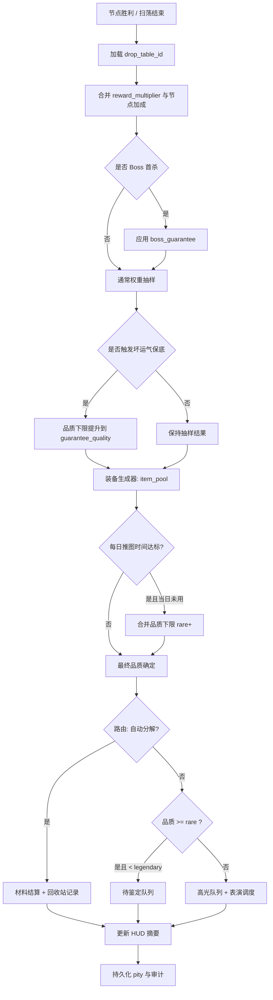

# 掉落系统设计文档

> 作者：系统设计（AI 起草）  
> 创建日期：2026-04-18  
> 最后更新：2026-04-18  
> 状态：评审中  
> 工程锚点：`scripts/systems/loot_system.gd`、`data/drops/drop_tables.json`、ConfigDB autoload

---

## §1 概述

本系统负责把「击杀 / 通关 / 离线结算」转化为**可感知、可记忆、可分享**的收获体验，是武侠挂机 RPG 的**多巴胺引擎**：玩家不直接操作战斗，但必须通过掉落与品质表演，持续感到「下一只怪可能改变命运」。

掉落与装备生成、背包、图鉴（Loot Codex）、主界面 HUD 摘要强耦合；数值入口以 `drop_tables.json`（或经 ConfigDB 聚合后的等价结构）为权威，运行时由 `LootSystem` 调度随机、保底、队列入库与摘要输出。

本文档面向后续 AI / 工程实现：**先兑现 L1–L5 体验承诺，再落地数据结构、边界与测试门禁**，避免「只有概率表没有表演」或「只有特效没有兜底」的半成品。

---

## §2 体验设计（L1–L5，先于机制规格）

### 2.1 体验锚点（L1）

#### 2.1.1 核心幻想（Fantasy）

玩家是**「每次击杀都可能开出宝藏的寻宝者」**：江湖路远，机缘不在话术里，而在尸体上亮起的那一道光柱与慢镜里凝聚的名字里。

#### 2.1.2 核心情绪（Emotion）

- **主情绪：期待**（下一只怪会掉什么？保底还有几步？套装差一件时每一波都像在拆礼物）  
- **次情绪：惊喜**（跨品质跳变、传奇特效首次成套、离线回放里突然出现真意以上）

#### 2.1.3 核心爽点（Payoff）

可被截图/片段化、可反复经历的代表性序列：

1. Boss 倒地（战斗节奏瞬间收束）  
2. **金色大光柱**升起约 1.5s（屏幕亮度与音效同步抬升）  
3. 光柱凝聚为悬浮物（材质读出「真意」级别）  
4. 拾取触发**短慢镜**（时间缩放 + 镜头微推）  
5. 中央弹出「**绝世真意**」品质字样（字体/描边/粒子与品质绑定）  
6. 装备对比栏 **DPS 跳字**（旧 → 新，带一次「确认感」顿挫音效）

### 2.2 体验循环（L2）

| 时间尺度 | 玩家在这个尺度上获得什么（承诺口径） |
|---------|--------------------------------------|
| **秒（<3s）** | 每次有效击杀都有**轻量反馈**（灰白直接化为材料飞字；蓝有小光柱/小抛物线），不打断挂机节奏。 |
| **分（1–3min）** | 平均 **1–3 分钟至少 1 件精良（蓝）** 或等价「蓝色体验」的分解收益峰值（以 HUD 飞字与材料暴点呈现，避免无声吞没）。 |
| **时（90–150min）** | 在第一章正常推图强度下，**首章 Boss（铁面虬髯客）击杀保底**触发：至少 **1 件真意（橙）+ 1 条传奇特效**（与 §4.3 Boss 保底一致）。 |
| **日（单次登录周期）** | **每日首次登录**后，累计**推图活跃 ≥30 分钟**（仅统计「在线且处于可掉落战斗」时间）至少 **1 件玄品（黄）**；另建议 **20 分钟档**作为「软提示里程碑」（UI 提示而非额外硬保底，避免与 30 分钟保底叠床架屋）。 |
| **周（7 天）** | **约 3 天**可凑齐 **2 件套**（含掉落 + 可预期的材料转化/任务补片）；套装差 1 件时有**可理解的概率抬升**（见 §4.4）。 |
| **月（30 天）** | **约 14 天**可凑满 **6 件套**的「主玩套装骨架」（允许含秘境补片、商店补位，但主力来源仍是掉落节奏）。 |

### 2.3 决策空间（L3）

#### 2.3.1 有意义的选择（至少 3 方向）

- **方向 A：自动分解阈值**（品质阈值、部位白名单、套装锁定词缀）→ 影响背包压力与材料结构。  
- **方向 B：推图 vs 回刷**（节点 `drop_table_id` 不同）→ 影响「分循环蓝装频率」与「时循环橙装窗口」。  
- **方向 C：待鉴定队列处理节奏**（立即鉴定 / 攒一波 / 优先武器）→ 影响玄品吞吐与「黄装惊喜」密度。

每方向至少 3 个差异点：  
A：阈值档位、排除传奇底材、是否允许「自动分解但保留异色孔」；  
B：普通节点权重、精英保底、Boss 独立 `boss_guarantee`；  
C：批量鉴定消耗、排序规则、是否自动上锁「带套装 tag」。

#### 2.3.2 最优解风险

风险：全员统一「只存橙、全分解」导致体验趋同。  
规避：套装件、传奇特效池、职业/武器池在 `item_pool` 层做**场景分化**；自动分解默认**保守**（多进待鉴定），高级自动化需玩家显式开启。

#### 2.3.3 可逆性

| 选择 | 可逆性 | 改变代价 |
|------|--------|---------|
| 自动分解规则 | 高 | 即时生效；误分解走回收站（§10.4） |
| 待鉴定批量鉴定 | 中 | 鉴定后不可回退；鉴定前可出售/锁定 |
| Boss 首杀保底领取 | 低 | 一次性；仅防作弊回档，不做玩家侧回滚 |

### 2.4 学习曲线（L4）

| 里程碑 | 玩家应理解 / 掌握 / 解锁什么 |
|--------|------------------------------|
| **5 分钟** | 击杀 → 材料飞字 / 小光柱；理解「蓝以下基本不打扰」。 |
| **1 小时** | 第一次看到 **玄品进待鉴定**；打开自动分解面板的基础三项（阈值、套装保护、回收站）。 |
| **10 小时** | 理解 **保底计数器**在 HUD 的弱提示（不显示精确内部随机种子）；会用手动锁定避免误分解。 |
| **100 小时** | 能解释「池子权重 / 套装保底加成 / 离线合并回放」；愿意为某个 `item_pool` 回刷节点。 |

### 2.5 情感反馈（L5）

#### 2.5.1 仪式感清单（≥3，含视听）

1. **橙装落地六步音画序列（0–2500ms）**  
   - 0ms：Boss 倒地，环境音快速压暗 80ms  
   - 200ms：金柱升起（光束模型 + 低频钟鸣 + 屏幕 vignette 减轻）  
   - 800ms：柱内凝聚实体（粒子收束 + 金属高频 glint）  
   - 1500ms：拾取慢镜（0.35–0.50s 时间缩放）  
   - 1800ms：详情弹窗（品质字「真意」级排版）  
   - 2500ms：对比栏 DPS 跳字（数字滚动 + 一次清脆「确认」音）

2. **传承（绿）翠绿光柱 + 纹路**  
   柱体更「厚」，柱面叠加**专属纹样滚动**（shader 噪声方向与套装 id 绑定），音效用**竹木+玉石**打击叠层。

3. **绝世真意（红）全屏红光 + 震屏**  
   红光脉冲 2 次（120ms 间隔），震屏幅度分级（玩家设置可关小幅震动）；音效用**两次不同音高**的锣 + 短静音 + 长尾混响。

#### 2.5.2 挫败缓冲（≥2）

| 玩家可能的挫败时刻 | 兜底 / 缓冲设计 |
|------------------|----------------|
| 长时间无黄以上 | **坏运气保底**（§4.3）：连续 N 次未出 ≥玄品，则第 N+1 次强制品质池抬升到 `rare`。 |
| 误勾自动分解 | **回收站**保留最近 K 件被自动分解的摘要（§10.4），一键买回需支付原价材料或观看广告位占位（工程可选）。 |

#### 2.5.3 可分享锚点（≥1）

- **可分享内容**：绝世真意详情面板（干净层级 + 高对比）、首杀 Boss 掉落拼接摘要。  
- **分享形式**：系统级截图即可；不做强制内置录屏。

### 2.6 L1–L5 自检清单（PR 门禁）

- [ ] L1 Fantasy / Emotion / Payoff 三项达成  
- [ ] L2 至少覆盖秒 / 分 / 时 / 日 / 周 / 月六层，且每行有**可测**描述  
- [ ] L3 ≥3 差异化方向 + 最优解风险 + 可逆性表  
- [ ] L4 四个里程碑具体  
- [ ] L5 仪式感 ≥3 + 挫败缓冲 ≥2 + 可分享锚点 ≥1  

---

## §3 设计目标

1. **把品质从「数值」翻译成「时间轴上的演出」**：任意品质都对应可实现的粒子/音效/镜头模板（见 §7）。  
2. **把掉落从「背包事件」拆成三条队列**：自动分解材料线、待鉴定线、真意以上高光线，减少认知负载。  
3. **把运气变成「可解释、可存档、可恢复」**：所有保底计数器与每日计时器进入存档；离线合并后一次性兑现（§6、§10）。  
4. **把配置权交给玩家但默认安全**：自动分解规则显式、可回滚、可预览下一波规则效果（§9）。  
5. **与现有工程对齐**：`LootSystem.process_node_loot` 继续作为 orchestrator，逐步迁移到「表驱动条目 + 保底结构」，避免双源真理。

---

## §4 核心机制

### 4.1 七级品质与叙事映射

| 品质枚举（建议） | 叙事名 | 主题色 | 掉落表演（摘要） | 目标频率（体验口径，需数值调参） |
|-----------------|--------|--------|------------------|----------------------------------|
| `common` | 凡品 | 灰白 | 无光柱；直接显示资源飞字 | 极高 |
| `magic` | 精良 | 蓝 | 小光柱 + 小抛物线落地 | 高 |
| `rare` | 玄品 | 黄 | 中光柱 + 中抛物线 | 中 |
| `legendary` | 真意 | 橙 | 大光柱 + 大抛物线 + 全屏轻闪 + 专属音效 | 约每 5–10 分钟 1 个（全玩法聚合口径） |
| `set` | 传承 | 绿 | 大光柱 + 专属纹路 + 音效 | 约每 30–60 分钟 1 个 |
| `ancient` | 上古真意 | 暗金 | 同真意 + 金色粒子环轨 | 约每 2–4 小时 1 个 |
| `primal` | 绝世真意 | 红金 | 全屏红光 + 震屏 + 独特音效 | 约每天 0–1 个 |

> 说明：频率为**设计靶点**，实现上由 `entries.weight`、节点难度、`reward_multiplier`、保底共同约束；必须在 §11 与 §12 可测。

### 4.2 掉落节奏分轨

- **低品质（凡品 / 精良）**：默认**自动分解为材料**，HUD 仅保留轻量飞字，不弹阻断窗。  
- **中品质（玄品）**：默认进**「待鉴定」队列**（或「暂缓处理」队列），允许批量鉴定。  
- **高品质（真意及以上）**：进**「出关所得 · 高光」队列**，可叠加离线回放；强制完整表演模板（可设置「极简模式」仅保留音效 + 大字）。

### 4.3 保底机制

1. **首章 Boss 保底**  
   - 击杀 **铁面虬髯客**（BossId 以关卡配置为准）首次结算：**100%**  
     - 掉落 **1 件 `legendary`（真意）装备**（`item_pool` 指向首章传奇池）  
     - **额外保证 1 条传奇特效**（`guaranteed_legendary_affix=true` 或与独立 `extra_affix_roll` 等价实现）  
   - 该保底与坏运气保底独立计数，**先结算 Boss 规则再结算通用 pity**（避免互相吞事件）。

2. **坏运气保护（玄品保底）**  
   - 配置示例：`pity: { "threshold": 20, "guarantee_quality": "rare" }`  
   - 语义：连续 **N 次装备掉落事件**均未出现 **≥ `rare`（玄品）** 时，第 **N+1 次**将品质抽样改为至少 `rare`（从对应 `item_pool` 重新roll，禁止空池降级）。  
   - **计数器递增时机**：仅在「本次节点生成了一件装备且已Finalize品质」后递增；若本次未生成装备则不计入（避免空气垫刀）。

3. **每日保底（玄品）**  
   - 条件：**每日首次登录**起算，`daily_push_minutes` ≥ **30**（仅在线推图有效时间，暂停/切后台不计）。  
   - 奖励：下一次**有效装备掉落事件**品质下限 **≥ `rare`**；若当日已无战斗，则在玩家重新进入战斗节点时立即触发「补发券」式掉落（写审计日志）。  
   - **与坏运气保底关系**：同日同时满足时，取**更高品质下限**合并为一次 roll，不重复发两件。

4. **套装保底（概率 +50%）**  
   - 条件：玩家已拥有某 `set_id` **≥4 件**（仓库+背包+已装备合计，去重按件数）。  
   - 效果：后续所有引用该 `set_id` 的条目，在权重层 `weight *= 1.5`（先加算全局加成，再归一；**不**对 Boss 首杀池加倍以免破坏首杀体验，需 `flags.ignore_set_boost` 可配）。

### 4.4 自动分解规则（默认 + 可配置）

- **默认**：`common`/`magic` 自动分解；`rare` 进待鉴定；`legendary+` 进高光。  
- **玩家配置维度**：  
  - 品质阈值（不低于默认则无效）  
  - 排除：带「锁定词缀 / 套装 / 异色孔」装备永不自动分解  
  - 部位白名单（例：只自动分解护腕）  
- **预览**：在规则面板展示「以最近 20 场战斗日志回放，将多分解 x 件 / 少分解 y 件」的统计（离线可用上次会话缓存）。

### 4.5 表驱动掉落（与 JSON 示例对齐）

每张掉落表以 `table_id` 标识，`entries` 为加权品质行；每行指向 `item_pool`（由装备生成器解析）。`pity` 与 `boss_guarantee` 为可选扩展；与现有 `drop_profiles` 并存期需 **ConfigDB 归一**为统一 `DropTable` 结构（实现细节见 §5）。

---

## §5 数据结构

### 5.1 掉落表（权威示例，字段可扩展）

```json
{
  "table_id": "ch01_normal",
  "entries": [
    { "quality": "common", "weight": 45, "item_pool": "ch01_weapons" },
    { "quality": "magic", "weight": 30, "item_pool": "ch01_weapons" },
    { "quality": "rare", "weight": 18, "item_pool": "ch01_all" },
    { "quality": "legendary", "weight": 5, "item_pool": "all_legendary" },
    { "quality": "set", "weight": 1.5, "item_pool": "all_sets" },
    { "quality": "ancient", "weight": 0.4, "item_pool": "all_legendary" },
    { "quality": "primal", "weight": 0.1, "item_pool": "all_legendary" }
  ],
  "pity": { "threshold": 20, "guarantee_quality": "rare" },
  "boss_guarantee": { "quality": "legendary", "count": 1 },
  "flags": { "ignore_set_boost": false }
}
```

### 5.2 运行时对象（建议）

- `LootRollContext`：`node_id`、`enemy_grade`、`reward_multiplier`、`is_first_boss_kill`、`player_id`、`rng_stream_id`  
- `LootOutcome`：`final_quality`、`item_instance_id`、`presentation_tier`、`routing`（`auto_salvage` / `pending_id` / `highlight`）、`audit_refs`  
- `PityState`：`since_last_rare_plus_streak`、`daily_push_seconds`、`last_reset_utc_day`  
- `AutoSalvageRuleSet`：阈值、排除位掩码、部位过滤、是否允许分解带孔装备

### 5.3 与现有 `drop_profiles` 映射（迁移说明）

- 现状：`drop_tables.json` 内 `drop_profiles[]` 使用 `equipment_rules.allowed_rarities` 等。  
- 目标：`table_id` + `entries[]` 为唯一随机源；`equipment_rules` 收缩为「生成约束」子对象，由 `item_pool` 间接引用。  
- 迁移策略：**ConfigDB 读取层做 adapter**，旧字段自动生成等价 `entries`（仅开发期日志警告），新表优先。

---

## §6 系统流程

### 6.1 单次节点结算（在线）



### 6.2 离线合并

1. 离线模拟在服务器或本地 deterministic RNG 上批量跑「等效战斗 tick」，产出 `LootOutcome[]` 队列。  
2. 上线合并时**先合并材料**，再按时间顺序播放高光（可一键跳过已看品质）。  
3. **保底计数器**：离线期间按「等效掉落事件次数」递增，写回存档；不得重置为 0（§10.2）。

---

## §7 UI/UX 与掉落表演视觉规格

### 7.1 HUD 与信息架构

- **左下**：材料飞字（高频，可合并数字跳变）  
- **中下**：当前节点掉落摘要（沿用 `GameManager.update_loot_summary` 文本或升级 RichText）  
- **右上弱提示**：坏运气保底进度（例：「机缘将至 · 再历战 3 场」）——**不显示内部随机种子**  
- **全屏层**：仅 `legendary+` 或玩家设置「始终显示玄品光柱」时启用

### 7.2 每种品质的表演规格 + ASCII 时间线

统一符号：`|` 帧格，`^` 光柱峰值，`~` 粒子，`!` 音效钉，`@` 镜头，`#` UI 字。

#### 凡品 `common`（灰白 · 无光柱）

```
0ms     100ms    300ms    600ms
|-------|--------|--------|
kill    mat!     (merge)  done
        ^^ small pop text only (no beam)
```

- **光柱**：无  
- **音效**：材料 `tick` 叠层 ≤80ms，音量 −12dB  
- **持续**：总感知 **≤600ms**，允许与下一击杀合并显示

#### 精良 `magic`（蓝 · 小光柱）

```
0ms   120ms   250ms   450ms   900ms
|-----|-------|-------|-------|
kill  beam^   arc~    land!   fade
      !soft
```

- **光柱**：高度 0.25 屏、宽度细、蓝色偏青  
- **轨迹**：小抛物线，落点偏移 ≤40px  
- **音效**：风铃 + 短金属（120ms）  
- **持续**：**900ms** 内结束（含淡出）

#### 玄品 `rare`（黄 · 中光柱）

```
0ms   150ms   400ms    900ms    1400ms
|-----|-------|--------|--------|
kill  beam^^  swirl~   land!!   seal UI hint
```

- **光柱**：高度 0.45 屏，内层慢速旋转金色尘  
- **音效**：低频鼓点 + 纸币摩擦采样（隐喻「机缘未开封」）  
- **UI**：底部出现「待鉴定 +1」微条（不阻断）

#### 真意 `legendary`（橙 · 金色大光柱）

```
0ms   200ms   800ms    1500ms   1800ms   2500ms
|-----|-------|--------|--------|--------|
kill  beam^^^^ flash~ @slow    panel#   dps$
      !gong                             jump$
```

- **光柱**：高度 0.75 屏，全屏亮度曲线 +350ms 内抬升 8% 再回落  
- **音效**：钟鸣（200ms）+ 弦乐泛音（800ms 前结束尾音）  
- **慢镜**：**1500ms±50ms** 触发 0.45s 时间缩放峰值  
- **弹窗**：`legendary` 专用字体描边 + 粒子沿边 2 周

#### 传承 `set`（绿 · 翠绿光柱）

```
0ms   180ms   600ms    1200ms   2000ms
|-----|-------|--------|--------|
kill  beam^^^ pattern~ rise!    set crest#
      !jade                         (loop shader scroll)
```

- **光柱**：绿色饱和度略降，亮度提高，柱体厚度 > 真意  
- **纹路**：噪声 UV 与 `set_id` 绑定滚动  
- **音效**：竹木碰撞 + 玉石研磨（不刺耳，中频为主）

#### 上古真意 `ancient`（暗金 · 暗金光柱）

```
0ms   200ms   900ms    1600ms   2600ms
|-----|-------|--------|--------|
kill  beam^^^ ring~~~~ orbit!   primal-lite flash
      !bronze   ^particles circle (gold)
```

- **粒子**：环轨半径随柱宽，角速度中等  
- **音效**：真意基础上加 **金属摩擦暗层**（−6dB）

#### 绝世真意 `primal`（红 · 红金光柱）

```
0ms   120ms   240ms    800ms    1500ms   2200ms
|-----|-------|--------|--------|--------|
kill  red!!   red!!    beam^^^^ shake@   panel#++   dps$$$
      (double hit)      ^red core   !gong2+tai
```

- **屏幕**：两次红光脉冲（间隔 120ms），第二次更强  
- **震屏**：振幅分 3 档，设置可关闭「震屏」保留光效  
- **音效**：双锣不同音高 + 400ms 故意留白 + 长尾混响（2200ms 内收束）

### 7.3 可访问性

- 提供「光敏模式」：跳过全屏闪与红光脉冲，仅保留柱体 + 大字。  
- 色盲模式：在品质旁加 **形状角标**（圆/菱/星…）。

---

## §8 与其他系统的关联

| 关联系统 | 交互方式 | 说明 |
|----------|----------|------|
| **战斗 / 节点** | 读取节点 `drop_table_id`、`reward_multiplier`、是否 Boss | 决定抽样上下文 |
| **EquipmentGeneratorSystem** | `generate_equipment_for_profile` → 迁移为 `generate_from_pool` | 池驱动词缀与底材 |
| **GameManager** | `process_loot_item`、`set_loot_highlight`、`update_loot_summary` | 入库、路由、摘要 |
| **LootCodexSystem** | `record_node_loot` | 图鉴与统计回放 |
| **MetaProgressionSystem** | `grant_rewards` | 材料映射与显示名 |
| **存档系统** | 读写 `PityState`、队列、回收站 | §10 持久化 |
| **ConfigDB** | `get_drop_profile` → `get_drop_table` | 单源加载与校验 |

---

## §9 交互原型摘要与线框图

### 9.1 涉及面板

| 面板 | 层级 | 入口 |
|------|------|------|
| 自动分解规则 | L2 系统面板 | 主界面 HUD → 设置 / 行囊 → **「分解规则」** Tab |
| 待鉴定队列 | L2 | 行囊 → **「待鉴定」** 子页 |
| 高光回放 | L1 模态 | 上线 / 通关 Boss → **「出关所得」** 卡片链 |

### 9.2 关键操作流（摘要）

1. 打开分解规则 → 调整阈值 → 点击「预览影响」→ 看到统计差分 → 确认应用。  
2. 勾选「套装永不分解」→ 任意掉落带 `set_tag` 一律绕开自动分解。  
3. 打开回收站 → 选择误分解条目 → 「买回」或「取出为待鉴定」。

### 9.3 自动分解配置面板（ASCII 线框图）

```
┌────────────── 行囊 / 分解规则 ────────────────────────┐
│ [返回]                         自动分解 · 安全优先      │
├────────────────────────────────────────────────────────┤
│ 规则名称: [ 默认江湖规矩 ▼ ]            [+ 新建规则]     │
├────────────────────────────────────────────────────────┤
│ 品质阈值(不低于默认才生效)                            │
│  ( ) 凡品   ( ) 精良   (•) 玄品   ( ) 真意  ( ) 更高    │
│  说明: 低于阈值的装备将尝试自动分解为材料              │
├────────────────────────────────────────────────────────┤
│ 排除条件                                                │
│  [√] 带套装标记永不分解                                 │
│  [√] 带锁定词缀永不分解                                 │
│  [ ] 带异色孔永不分解     [ ] 武器部位永不分解          │
├────────────────────────────────────────────────────────┤
│ 部位白名单(仅这些部位允许自动分解; 空=不限)             │
│  [护腕] [腰带] [×清空]                                  │
├────────────────────────────────────────────────────────┤
│ 预览(基于最近20场)                                      │
│  将多分解 +12 件 / 少分解 -3 件 / 预估多获祠灰 +480    │
│  [运行预览]                                             │
├────────────────────────────────────────────────────────┤
│ 危险操作                                                │
│  [ ] 允许分解「玄品」为材料(需二次确认)                 │
├────────────────────────────────────────────────────────┤
│            [恢复默认]    [取消]    [保存并应用]          │
└────────────────────────────────────────────────────────┘
```

---

## §10 边界补全检查单（8 类，每类 1–2 句可落地方案）

### 10.1 首次使用

首次打开分解规则时，弹出**三帧引导**：默认策略说明 → 展示回收站入口 → 演示「预览影响」按钮；全程可跳过但写入 `has_seen_loot_rules=true`。

### 10.2 空状态

待鉴定队列为空时显示「暂无封尘机缘」，并提供按钮**跳转最近推图节点**；高光队列为空时隐藏入口而非灰块占位。

### 10.3 满载状态（背包满时掉落处理）

当 `process_loot_item` 返回不可入库时：**禁止静默丢失**；真意以上进入**高光暂存箱**（独立上限例如 20 件），玄品进入**邮件式暂存**（带 7 日过期提醒）；凡品 / 精良继续走自动分解不依赖背包格子。

### 10.4 错误与异常（含自动分解误操作恢复）

所有自动分解生成**回收站条目**（最近 50 件滚动窗口），保留 72 小时；玩家可用材料买回或「撤销最后一次批量分解」。RNG 若抽到空池，**回退到父池**并写 `error_audit`，UI 提示「机缘簿缺失配置」。

### 10.5 中断恢复（保底计数器跨离线持久化）

`PityState` 与 `daily_push_seconds` **随存档写入磁盘**；离线合并结束后一次性写回；应用强杀时依赖下一次启动的存档校验，若损坏则从备份槽回滚并保留「补偿券」防损。

### 10.6 跨系统跳转

从 HUD 摘要点击「真意」字样 → 打开该装备详情；从详情跳转「比对 Build」「去百炼坊萃取」均带返回栈，关闭后回到原推图界面不重置节点。

### 10.7 红点策略

待鉴定 >0：行囊 Tab 红点；回收站有可买回：设置入口弱红点；**坏运气接近阈值**：仅用小字角标，不抢战斗画面。

### 10.8 新手引导

第 3 次玄品掉落时触发**短引导**：解释待鉴定与分解差异，并强制展示一次「锁定装备」手势；Boss 首杀前 1 节点提示「此役必有真意」。

---

## §11 数值映射

### 11.1 涉及的乘区

| 乘区 | 本系统的贡献 | 数值来源 |
|------|--------------|----------|
| 装备产出率 | `entries.weight` 归一后 × 节点 `reward_multiplier` | `drop_tables.json` / 节点表 |
| 品质下限 | `pity.guarantee_quality`、`boss_guarantee`、`daily_floor` | 同左 |
| 套装获取 | `set_boost`（+50% 权重） | §4.3 |
| 材料经济 | 自动分解表（品质→材料期望） | 经济表（另文） |

### 11.2 核心公式（文字化，便于实现）

- `P(quality=q) = w_q / Σ w_i * (1 + set_boost_flags) * (1 + live_event_mods)`，再与**品质下限**取 max。  
- `minutes_blue ≈ f(λ_magic)`：由 **`magic` 条目权重 / 节点击杀间隔`** 推导，要求 Monte Carlo 落在 §2.2「1–3 分钟」区间。  
- `E[orange_per_hour]`：由 **`legendary` 权重 + 保底 + Boss 窗口** 联立求解，首章需满足 **90–150 分钟首 Boss** 体验（可调 `offline_seconds_per_run` 与节点长度对齐）。

### 11.3 与 L2 节奏承诺的对齐表

| L2 时间尺度 | 节奏承诺 | 数值实现方式 |
|------------|---------|--------------|
| 秒 | 每次击杀轻反馈 | `common/magic` 模板必走 HUD 飞字 |
| 分 | 1–3 分钟至少 1 蓝体验 | 提高 `magic` 权重或增加「伪蓝」材料暴点补偿 |
| 时 | 首章 Boss 橙 + 传奇特效 | `boss_guarantee` + `guaranteed_legendary_affix` |
| 日 | 推图 30 分钟至少 1 黄 | `daily_push_minutes` + 品质下限合并 |
| 周 | 3 天 2 件套 | `set` 权重 + 任务补片 + 节点池含套装 |
| 月 | 14 天 6 件套 | 周策略 + 秘境掉落倍率 + 低重复保护 |

---

## §12 测试用例（含 L2 节奏验证）

### 用例 TC-01：表驱动抽样基本功能

- **前置条件**：测试账号加载 `ch01_normal` 表，`rng_seed` 固定。  
- **操作步骤**：模拟 1000 次 `roll_drop_quality()`。  
- **预期结果**：经验分布与权重比例误差 <5%；`item_pool` 每次非空。

### 用例 TC-02：坏运气保底触发

- **前置条件**：强制随机序列连续 20 次不产生 `≥rare`。  
- **操作步骤**：第 21 次掉落事件。  
- **预期结果**：品质至少 `rare`，且 `PityState`  streak 归零审计正确。

### 用例 TC-03：Boss 首杀双保底

- **前置条件**：账号未击杀铁面虬髯客；Boss 节点配置 `boss_guarantee`。  
- **操作步骤**：击杀并结算。  
- **预期结果**：背包或高光队列存在 **1 件 `legendary`**，且装备上存在 **≥1 条传奇特效**；日志含 `first_kill=true`。

### 用例 TC-04：L2 · 秒循环反馈存在性（自动化断言）

- **前置条件**：开启 HUD 测试桩。  
- **操作步骤**：以 1 秒间隔击杀普通怪 30 次，仅统计 `common/magic`。  
- **预期结果**：每次击杀 **600ms 内**出现材料或蓝光反馈事件；0 次完全静默。

### 用例 TC-05：L2 · 分循环「蓝体验」频率（Monte Carlo）

- **前置条件**：锁定第一章普通节点平均击杀周期 `T_kill`（从战斗日志测得）。  
- **操作步骤**：模拟连续 40 分钟游玩，统计 `magic` 装备或等效「蓝色暴点补偿」事件次数 `N_blue`。  
- **预期结果**：`N_blue ≥ ceil(40 / 3)`（至少每 3 分钟 1 次）；若通过材料补偿实现，需额外断言 **HUD 明确标注为蓝色机缘** 以防作弊式静默加成。

### 用例 TC-06：L2 · 时循环首章 Boss（90–150 分钟窗口）

- **前置条件**：使用「平均推图强度」机器人：仅打配置链路的普通→精英→Boss，不允许扫荡。  
- **操作步骤**：记录从建号到首次击杀 Boss 的**实际墙钟时间** `T_boss` 重复 30 次取中位数。  
- **预期结果**：`90min ≤ median(T_boss) ≤ 150min`；且每次必掉橙（同 TC-03）。超标则调 `offline_seconds_per_run`、节点数量或经验成长，不得改 Boss 保底逻辑凑数。

### 用例 TC-07：L2 · 日循环玄品保底

- **前置条件**：新日 `UTC+8` 重置；账号当日未领每日保底。  
- **操作步骤**：在线推图有效时间累计 30 分钟（模拟时钟注入），触发下一场装备掉落。  
- **预期结果**：该场装备品质 **≥ rare**；`daily_token` 消耗一次。

### 用例 TC-08：背包满 + 高品质不掉失（§10.3）

- **前置条件**：背包塞满，`legendary` 掉落事件注入。  
- **操作步骤**：结算。  
- **预期结果**：进入**高光暂存箱**；玩家清空一格后可「一键入包」；无静默删除日志。

### 用例 TC-09：跨离线持久化（§10.5）

- **前置条件**：`PityState.streak=19`；强制退出游戏（杀进程）。  
- **操作步骤**：重启读档，再触发一次不掉黄序列。  
- **预期结果**：重启后 streak 仍为 19 并继续累计；第 21 次正确保底。

### 用例 TC-10：自动分解误操作恢复（§10.4）

- **前置条件**：开启「玄品允许分解」并执行批量分解。  
- **操作步骤**：打开回收站选择刚分解的一件 → 买回。  
- **预期结果**：材料扣除正确，装备以原实例字段恢复（含随机种子一致或等价重放）。

### 用例 TC-11：L5 六步音画对齐（人工 + 录屏标尺）

- **前置条件**：录制 60fps；注入 `legendary` 掉落。  
- **操作步骤**：逐帧检查 §2.5.1 / §7.2 真意时间线锚点。  
- **预期结果**：`beam` 峰值在 **150–250ms**；慢镜峰值在 **1400–1600ms**；DPS 跳字在 **2400–2600ms** 窗口内出现（允许 ±1 帧设备误差）。

---

## §13 待讨论 / 开放问题

- [ ] `magic` 与现有数据 `uncommon` 命名是否统一为单一枚举（需一次性迁移脚本）。  
- [ ] 每日 20 分钟「软提示」与 30 分钟硬保底是否并存或择一，以避免玩家认知冲突。  
- [ ] 暂存箱 20 件上限在高强度秘境下是否不足，是否按 VIP / 进度扩展。  
- [ ] 红光震屏在部分国家合规要求（需提供默认关闭与首次强提示）。

---

## §14 管线进度追踪

| 管线阶段 | 状态 | 交付物 | 完成日期 |
|---------|------|--------|---------|
| S1 体验定义 | ☑ | 本文档 §2 | 2026-04-18 |
| S2 功能开发案 | ☑ | 本文档 §3–§8 | 2026-04-18 |
| S3 交互原型 | ☐ | `02_交互与原型/掉落系统_交互原型.md`（可另补） | — |
| S4 边界补全 | ☑ | 本文档 §10 | 2026-04-18 |
| S5 数值规划 | ☐ | `03_数值设计/掉落系统_数值规划.md` | — |
| S6 数据配置 | ☐ | `data/drops/drop_tables.json` 全量表化 + 字段说明对齐 | — |

---

## §15 变更记录

| 日期 | 变更内容 | 负责人 |
|------|----------|--------|
| 2026-04-18 | 初稿：§1–§15 全量撰写，含七级品质、保底、队列、ASCII 线框与时间线、8 类边界与 L2 测试矩阵 | 系统设计 |

---

**文档结束**
