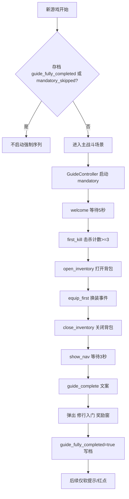
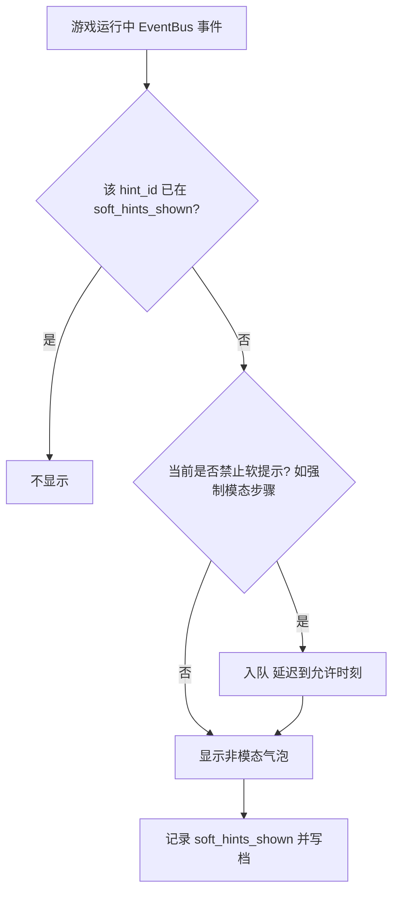

# 新手引导系统 — 开发需求案

> 本文档供实现侧（含其他 AI 代理）直接落地 Godot 4 / GDScript 新手引导系统使用。  
> 约定：步骤 ID、信号名、存档字段名以本文为准；与现有 `DemoManager` / `SaveManager` / `EventBus` 对齐处见 §8。

---

## §1 文档目的与适用范围

**目的**：将当前「几乎为零」的引导能力，升级为可持久化、可恢复、可跳过的分步引导体系，覆盖核心循环（战斗→掉落→背包→换装→数值反馈→导航扩展）。

**适用范围**：

- 客户端：Godot 4.x，2D 横版武侠挂机 RPG，主语言 GDScript。
- 不包含：服务端逻辑、付费引导、运营活动弹窗（可与本系统共用 UI 壳，但不在本需求内）。

**非目标**：

- 不替代游戏内帮助全文；强制序列仅覆盖「首 5 分钟修行闭环」。
- 不要求一次性实现所有进阶系统（百炼坊/秘境等）的深度教学，以软提示与红点为主。

---

## §2 项目背景与现状

### 2.1 项目背景

- 类型：武侠挂机 RPG，2D 横版。
- 引擎：Godot 4，脚本 GDScript。
- 核心玩法：自动战斗、玩家观战；装备驱动成长；多面板功能入口。

### 2.2 现有引导相关实现（基线）

| 能力 | 说明 |
|------|------|
| `DemoManager.has_seen_quick_start: bool` | 是否看过快速入门；持久化路径 `user://public_demo_settings.cfg`。 |
| `DemoManager.mark_quick_start_seen()` | 在「继续游戏 / 新建游戏」等入口调用，用于标记已展示过快速说明类内容。 |
| `DemoManager.should_show_quick_start()` | **当前未被引用**；新引导系统需决定：复用为「跳过软文案」、废弃、或映射到新状态机（见 §8）。 |
| `LaunchMenu` 中 `GuideText` | 静态「2 分钟上手」4 条：自动战斗、技能 K、背包 I、快捷存档 F5/F8。 |
| `SettingsPanel` 中 `GuideText` | 与主菜单类似的说明文案区域。 |

**缺口**：无步骤状态机、无遮罩高亮、无与战斗/掉落/背包事件绑定的完成条件、无存档内 `guide_state` 级持久化。

---

## §3 体验设计（L1–L5）与核心系统覆盖

### 3.1 L1–L5 体验设计

| 层级 | 设计要点 |
|------|----------|
| **L1 Fantasy** | 「师兄领路，五分钟入门修行之道」——叙事包装可为门派接引或系统指引，语气沉稳、武侠感。 |
| **L1 Emotion** | 主情绪：**安心**（始终知道下一步）；次情绪：**成就**（每步有明确完成反馈）。 |
| **L1 Payoff** | 跟引导 → 第一场战斗观感 → 获得第一件装备 → 打开背包换装 → DPS/战力提升可见 → 收尾：「你已学会修行基础」。 |
| **L2 时间尺度** | **秒**：每步操作即时反馈（高亮、文案、完成勾选）；**分**：完整强制序列 **3–5 分钟**（含等待类步骤）。 |
| **L3 覆盖** | 强制序列覆盖核心循环关键环节；进阶系统通过软提示 + 红点触达。 |
| **L4 学习曲线** | 强制序列 = L4 曲线前 **约 5 分钟** 的「手把手」段，之后交给系统解锁与自然发现。 |
| **L5 仪式感** | 引导结束弹窗：**「修行入门」** + 小额奖励（见 §5 奖励字段），强化闭环记忆。 |

### 3.2 项目核心系统（引导需覆盖/触达）

1. **战斗**：自动战斗，观战；步骤中可要求「观战时长」或「击杀数」。
2. **掉落**：品质分级 + 光柱表演；软提示绑定首次高品质/Boss 等。
3. **背包**：装备列表、选中、装备动作。
4. **装备系统**：品质对比、换装后 DPS 或战力变化（UI 上需可被引导检测到）。
5. **导航栏**：7 类入口（示例键位：**I** 背包、**K** 技能、**B** 百炼坊、**U** 成长中心、**O** 其他按项目实际、**P** 推演/秘境、**设置**）；高亮需支持键盘提示与点击。
6. **每日目标**：日常任务入口与完成感；软提示首次出现。
7. **进阶**：百炼坊 / 传承 / 秘境等——**不放入强制序列**，用软提示与红点。

---

## §4 引导脚本结构

### 4.1 三种引导类型与规则

| 类型 | 英文标识 | 行为规则 |
|------|-----------|----------|
| **强制序列** | `mandatory_sequence` | 新游戏首次进入主玩法场景后启动；**必须按顺序**完成；未完成前适用 §10 与面板的互斥规则。 |
| **软提示** | `soft_hint` | 条件首次满足时弹出**非模态**气泡；**不阻塞**战斗与移动；同一 `hint_id` 全局只展示一次（除非调试开关重置）。 |
| **红点引导** | `red_dot` | 对「未探索功能」在导航栏或子入口显示红点；点击后可选记录「已探索」以消除红点；与强制序列独立，但强制期间若互斥则隐藏或延迟（见 §10）。 |

**统一脚本字段模型（逻辑层）**：

每条引导逻辑（强制序列的一步，或软提示的一条）应能表达为：

| 字段 | 说明 |
|------|------|
| **步骤/提示 ID** | 全局唯一字符串，如 `welcome`、`first_legendary`。 |
| **类型** | `mandatory` / `soft_hint` / `red_dot`。 |
| **触发条件** | 进入场景、计时器、EventBus 信号、存档标记组合表达式（实现可用表驱动 + 小量代码）。 |
| **高亮目标** | `HUD` 控件路径、`Control` 名、或「虚拟锚点 ID」（由 HUD 注册矩形）。无高亮时记 `none`。 |
| **引导文案** | 主文案 + 可选标题；支持 `\n` 换行。 |
| **完成条件** | 与触发类似：信号、面板打开、装备变更、击杀计数等。 |
| **下一步** | 强制序列填下一 `step_id`；软提示无下一步；红点可填「探索后消除」的规则 ID。 |

### 4.2 强制序列步骤表（首次约 5 分钟）

| 步骤 ID | 触发条件 | 高亮目标 | 引导文案（可微调） | 完成条件 | 下一步 |
|---------|-----------|-----------|-------------------|----------|--------|
| `welcome` | 新游戏进入主战斗界面 | 战斗画面区域（全屏弱高亮或中央战斗区） | 「欢迎加入青云门，你的修行之路从此开始。观察你的弟子自动战斗……」 | 等待 **5** 秒 | `first_kill` |
| `first_kill` | `welcome` 已完成 | 掉落物/敌人区域（优先随当前焦点敌人） | 「击败敌人后会掉落装备和材料。看到光柱了吗？那是高品质掉落！」 | **累计击杀 3** 个敌人 | `open_inventory` |
| `open_inventory` | 击杀数 ≥ 3 | 导航栏 **背包** 按钮（+ 文案提示 **I**） | 「按 **I** 或点击「背包」查看你的装备」 | **背包面板**打开 | `equip_first` |
| `equip_first` | 背包已打开 | 背包中**当前最高品质**装备格子 | 「选择这件装备，点击「装备」穿上它」 | 发生一次**换装**（装备成功事件） | `close_inventory` |
| `close_inventory` | 换装完成 | 背包面板关闭按钮 / 「按 Esc」提示 | 「很好！按 **Esc** 关闭面板，继续战斗」 | 背包面板关闭 | `show_nav` |
| `show_nav` | 背包已关闭 | **整个导航栏**区域 | 「右下角是所有功能入口。技能（**K**）、百炼坊（**B**）、成长中心（**U**）等都在这里」 | 等待 **3** 秒 | `guide_complete` |
| `guide_complete` | `show_nav` 完成 | 无高亮（或全屏淡入） | 「修行入门完成！继续探索江湖吧。\n提示：**F5** 随时存档」 | 自动立即完成 | （序列结束） |

序列结束后：弹出 **「修行入门」** 完成窗 + 发奖 + 将 `guide_fully_completed` 置真（见 §5）。

### 4.3 软提示列表

| 提示 ID | 触发条件 | 文案 | 显示位置 |
|---------|-----------|------|-----------|
| `first_legendary` | 首次掉落**橙装/传奇**品质 | 「传奇装备！打开背包看看它的传奇特效」 | 掉落 Toast **下方**锚点 |
| `first_boss` | 首次进入 Boss 战或 Boss 单位生成 | 「Boss 出现了！击败它可以获得保底传奇掉落」 | `StageHeader` **下方** |
| `cube_unlock` | 首次获得**可萃取**装备 | 「你可以在百炼坊（**B**）中萃取这件装备的传奇特效」 | 导航栏 **百炼坊** 按钮旁 |
| `rift_unlock` | 首次获得**秘境钥石** | 「你获得了秘境钥石！按 **P** 打开推演面板挑战秘境」 | 导航栏 **推演** 按钮旁 |
| `daily_remind` | 首次渲染/可见 **每日目标** UI | 「每日修行任务在右上角，完成全部可获得额外奖励」 | `ObjectiveCard` 旁 |

### 4.4 完成状态持久化（总原则）

- **强制序列进度、软提示已展示集合、是否完全完成** 必须进入 **`SaveManager` 管理的存档**（与角色进度一致），以便「删档/多存档」行为正确。
- `DemoManager` 的 `user://public_demo_settings.cfg` 仅适合「跨存档的演示/宣传位」标记；**步骤级状态以存档为准**（见 §8 职责划分）。

---

## §5 引导步骤 JSON 定义与存档字段

### 5.1 运行时状态示例（存档内嵌或并列存储）

实现可选用 JSON 资源或 Dictionary 序列化；字段名建议固定：

```json
{
  "guide_state": {
    "mandatory_completed": ["welcome", "first_kill", "open_inventory"],
    "mandatory_current_step": "equip_first",
    "soft_hints_shown": ["first_legendary"],
    "red_dots_ack": ["nav_skill"],
    "guide_fully_completed": false,
    "mandatory_skipped": false,
    "mandatory_version": 1
  }
}
```

| 字段 | 类型 | 说明 |
|------|------|------|
| `mandatory_completed` | `Array[String]` | 已完成强制步骤 ID。 |
| `mandatory_current_step` | `String` | 当前进行中步骤；若为空且未完成序列则表示待启动第一步。 |
| `soft_hints_shown` | `Array[String]` | 已展示过的软提示 ID。 |
| `red_dots_ack` | `Array[String]` | 用户已「探索」而消除的红点逻辑 ID（可选）。 |
| `guide_fully_completed` | `bool` | 强制序列 + 收尾仪式完成后的总开关。 |
| `mandatory_skipped` | `bool` | 老玩家跳过强制序列时为真；跳过后仍可出现软提示与红点。 |
| `mandatory_version` | `int` | 脚本版本，用于大改版时重置或迁移。 |

### 5.2 与步骤表对齐的 JSON 片段（资源侧，可选）

可将 §4.2 制作为 `res://data/guide_mandatory.json`（示例结构）：

```json
{
  "version": 1,
  "steps": [
    {
      "id": "welcome",
      "trigger": { "type": "on_new_game_enter_combat" },
      "highlight": { "target": "combat_viewport" },
      "text": { "body": "欢迎加入青云门……" },
      "complete": { "type": "wait_seconds", "seconds": 5 },
      "next": "first_kill"
    }
  ]
}
```

具体 `trigger` / `complete` / `highlight` 的枚举名由实现与 `EventBus` 对齐（§8）。

### 5.3 引导完成奖励（建议字段）

存档位或发奖流水可记：

```json
"guide_rewards_claimed": {
  "mandatory_completion": true
}
```

奖励内容策划可调：例如绑定货币、小恢复道具、称号「入门弟子」等；**需幂等**：重复读档不重复发奖。

---

## §6 流程图

### 6.1 首次进入强制引导（主流程）



### 6.2 软提示触发流程



---

## §7 UI 线框图（ASCII）

### 7.1 引导遮罩 + 高亮 + 底部对话框

**方案说明**：使用全屏 `ColorRect`（半透明深色，约 alpha 0.45–0.6）作为遮罩层；用 **反向遮罩** 或 **Shader 挖洞** 在目标 `Control` 的屏幕矩形处透出「高亮洞」；洞边缘加 **2px 亮色描边**（金/青，与 UI 主题一致）。底部 **`PanelContainer` + `RichTextLabel`** 固定显示当前文案与「当前步骤」小标题；可选：右下角「跳过引导」仅当 `mandatory_skipped` 允许逻辑时出现。

```
+------------------------------------------------------------------+
|██████████████████████████████████████████████████████████████████|
|██                    [  高亮洞：战斗区域  ]                    ██|
|██                      +------------------+                    ██|
|██                      | 亮色矩形描边   |                    ██|
|██                      +------------------+                    ██|
|██████████████████████████████████████████████████████████████████|
|  [底部引导条 - 不透明或半透明底]                                 |
|  标题：修行指引                                                  |
|  正文：欢迎加入青云门……（多行）                                   |
|  [可选：跳过]                              [可选：不再提示调试]  |
+------------------------------------------------------------------+
```

### 7.2 对话气泡（软提示）

**方案说明**：气泡为**非模态**小面板，贴锚点控件外缘（`Popup` 或 `Control` 子节点），带小三角指向源；**3–5 秒**淡出或点击空白关闭；不抢焦点，不暂停战斗。

```
        +---------------------------+
        | 传奇装备！打开背包看看…… |
        +-------------△-------------+
                      |
               [掉落 Toast]
```

### 7.3 引导完成弹窗（「修行入门」）

**方案说明**：模态 `AcceptDialog` 或自定义面板，阻断点击到底层 **仅到确认前**；确认后关闭并写 `guide_fully_completed`。展示奖励图标 + 数量 + 一句祝贺。

```
+------------ 修行入门 ------------+
|                                   |
|   [图标]  你已获得：xxx x1        |
|                                   |
|   修行入门完成！继续探索江湖吧。   |
|                                   |
|          [ 踏入江湖（确定） ]      |
+-----------------------------------+
```

---

## §8 与现有模块的关联

### 8.1 DemoManager

- `has_seen_quick_start` / `mark_quick_start_seen()`：继续用于 **LaunchMenu / SettingsPanel** 的静态「2 分钟上手」曝光即可；**不建议**与强制步骤混为同一布尔。
- `should_show_quick_start()`：**由 Guide 系统或主菜单**在适当时机调用——例如「未开始强制序列且未标记快速说明」时，主菜单仍可显示 GuideText；开始强制序列后，以存档 `guide_state` 为准避免逻辑冲突。
- 原则：**Demo 级 cfg = 跨存档偏好；guide_state = 存档内进度。**

### 8.2 SaveManager

- 在存档序列化/反序列化路径中增加 `guide_state`（§5）。
- **写档时机**：每完成一步强制序列、每次新增 `soft_hints_shown`、跳过、发奖后。
- **读档后**：`GuideController` 根据 `mandatory_current_step` 恢复 UI（若当前场景匹配）。

### 8.3 EventBus（触发与完成条件信号示例）

实现需将下列事件（名称示例，与项目实际对齐）挂到 `EventBus`，供 JSON 或表驱动监听：

| 领域 | 信号示例 | 用途 |
|------|-----------|------|
| 战斗 | `enemy_killed(enemy_id, tier)` | `first_kill` 计数；Boss 检测。 |
| 掉落 | `loot_dropped(item, quality)` | `first_legendary`；装备获得。 |
| 背包 | `inventory_panel_opened` / `closed` | `open_inventory` / `close_inventory`。 |
| 装备 | `equipment_changed(slot, item)` | `equip_first` 完成。 |
| UI | `navigation_button_highlight_request` | 由 Guide 请求导航栏高亮。 |
| 日常 | `daily_objectives_visible` | `daily_remind`。 |
| 钥石/萃取 | `cube_recipe_unlocked` / `keystone_acquired` | `cube_unlock` / `rift_unlock`。 |

若当前无 `EventBus`，本需求**要求**新增轻量全局信号中心或等价观察者，避免 `GuideController` 与业务节点硬耦合。

### 8.4 HUD（高亮目标定位）

- HUD 在 `_ready` 或布局完成后向 `GuideAnchorRegistry` 注册：`anchor_id` → `Control` 或屏幕 `Rect2`。
- 强制步骤的 `highlight.target` 使用注册 ID（如 `combat_viewport`、`nav_inventory`）。
- 目标被隐藏或移出树时：引导层应 **暂停该步计时** 或 **降级为纯文案**，并在目标再次可见时恢复。

### 8.5 导航栏（按钮高亮）

- 导航按钮提供 `set_guide_highlight(bool)` 或在材质上切换 **外发光**。
- 键盘键位与 `GuideText` 一致：**I/K/B/U/O/P** 与项目实际键绑定表统一数据源（单一配置避免 LaunchMenu 与引导不一致）。

---

## §9 新游戏 → 强制引导 → 完成 → 软提示 完整链路

1. 玩家在启动流程选择 **新游戏** → 生成新存档，`guide_state` 初始化：`mandatory_completed=[]`，`mandatory_current_step="welcome"`（或空表示待触发），`guide_fully_completed=false`，`mandatory_skipped=false`。
2. 进入主玩法场景 → `GuideController` 检测到新存档且未完成 → 启动 **强制序列**（遮罩 + 第一步）。
3. 按 §4.2 顺序推进，每步完成即追加 `mandatory_completed`、更新 `mandatory_current_step`、**立即 SaveManager 写档**。
4. `guide_complete` 后展示 **修行入门** 弹窗并发奖 → `guide_fully_completed=true`。
5. 之后仅评估 **软提示** 与 **红点**：读档时根据 `soft_hints_shown` 与游戏事件决定是否展示。
6. **老玩家**：在强制序列开始前提供「跳过新手引导」→ `mandatory_skipped=true`，跳过发奖或发折半奖励由策划二选一并在 §5 记录标志。

---

## §10 引导中断恢复、跳过、面板互斥、离线收益

### 10.1 中断恢复

- 玩家 **退出到桌面或主菜单再回游戏**：从 `mandatory_current_step` **原样恢复**；若步骤要求背包打开而当前未打开，应 **自动保持步骤** 并在进入战斗场景后再次显示高亮（不自动替玩家打开背包，避免惊吓操作）。
- **崩溃**：依赖上次自动写档；若一步内未写档即崩溃，允许重复完成该步（实现上应在「进入步骤瞬间」写档）。

### 10.2 跳过引导（老玩家）

- 入口：强制序列第一步或设置中「重置/跳过新手」（需二次确认）。
- 结果：`mandatory_skipped=true`，`guide_fully_completed` 按策划定义（可为 true 以不再打扰，或 false 以保留软提示）；**红点与软提示仍可启用**。

### 10.3 引导与面板互斥

- **强制序列进行中**：禁止玩家随意打开与当前步骤无关的面板（用 `GuideController` 统一拦截打开请求，或降低其他按钮输入优先级）。**例外**：当前步骤要求打开背包时，仅允许 **背包** 与 **Esc 关闭**。
- **软提示期间**：不互斥，仅注意不要叠太多层（同时最多 1 个软提示气泡）。

### 10.4 引导与离线收益冲突

- **新游戏首局**：不应在强制序列进行时弹出 **离线收益结算** 等大块模态窗；离线收益应 **延迟到** `guide_fully_completed == true` 或 `mandatory_skipped == true` 之后首次合适时机再展示。
- **继续游戏老存档**：按现有逻辑；若回归玩家 `guide_state` 未完成，仍优先恢复强制序列再处理离线收益。

---

## §11 实现模块划分（供 AI 分任务）

| 模块 | 职责 |
|------|------|
| `GuideController` | 状态机、步骤迁移、写档、互斥、跳过。 |
| `GuideOverlay` | 遮罩、挖洞高亮、底部文案栏。 |
| `GuideSoftBubble` | 软提示气泡布局与生命周期。 |
| `GuideAnchorRegistry` | anchor_id → Control 绑定。 |
| `GuideData` | 加载 JSON/Resource，版本迁移。 |
| `EventBus` 扩展 | 文档所列信号接入。 |
| `SaveManager` | 序列化 `guide_state`。 |

---

## §12 测试验收标准

1. **步骤流转正确性**：新存档严格按 §4.2 顺序；每步仅在前序完成时激活；完成条件与信号一一对应且无竞态（击杀计数在 `welcome` 后才开始计）。
2. **跳过引导**：跳过后不再出现强制遮罩；`mandatory_skipped` 持久化正确。
3. **中断恢复**：任意两步之间杀进程重启，`mandatory_current_step` 与 UI 一致，不丢步、不重发已完成步骤奖励。
4. **软提示不重复**：各 `hint_id` 仅一次；写档后读档不重复。
5. **引导完成状态持久化**：`guide_fully_completed` 与奖励幂等；多存档槽互不影响。
6. **互斥**：强制序列期间无法打开无关面板；离线收益不遮挡强制序列（新游戏）。
7. **高亮**：窗口缩放、分辨率变化后高亮洞仍对齐目标控件。

---

## §13 红点引导（red_dot）补充规则

- **数据**：未探索功能列表可由 `guide_state.red_dots_ack` 与策划表驱动合并。
- **显示**：角标红点挂导航按钮右上角；进入对应面板一次后可记 `ack`。
- **与强制序列**：强制进行时 **不新增** 红点动画干扰；可缓存「待显示红点」在强制完成后批量刷新。

---

## §14 文案、本地化与无障碍

- 所有文案走统一 `tr()` 或 CSV，键名如 `guide.welcome.body`。
- 键位显示从输入映射读取，避免写死「I」与玩家改键不符。
- 色弱友好：高亮描边不仅依赖颜色，保留 **闪烁/虚线动画** 可选（默认关闭省电）。

---

## §15 附录

### 15.1 强制步骤 ID 索引

`welcome` → `first_kill` → `open_inventory` → `equip_first` → `close_inventory` → `show_nav` → `guide_complete`。

### 15.2 软提示 ID 索引

`first_legendary`，`first_boss`，`cube_unlock`，`rift_unlock`，`daily_remind`。

### 15.3 与旧 GuideText 的关系

- `LaunchMenu` / `SettingsPanel` 的静态 **4 条说明** 保留为「菜单层帮助」，与强制序列 **互补**；内容冲突时以 **强制序列文案** 为游戏中教学权威，菜单文案可简化为「详细说明见游戏内引导」。

---

**文档版本**：1.0  
**最后更新**：2026-04-18
