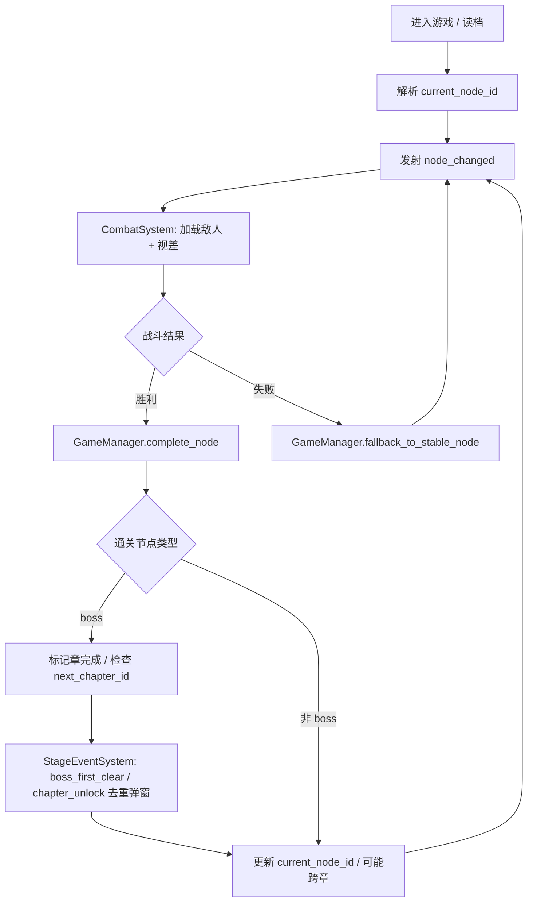

# 章节与关卡系统

> 作者：（待填写）  
> 创建日期：2026-04-18  
> 最后更新：2026-04-18  
> 状态：评审中  
> 主数据：`res://data/chapters/chapter_defs.json` · 关联 Autoload：`ConfigDB`（`res://scripts/autoload/config_db.gd`）、`GameManager`（`res://scripts/autoload/game_manager.gd`）、`StageEventSystem`（`res://scripts/autoload/stage_event_system.gd`） · 主实现：`res://scripts/systems/combat_system.gd`

---

## §1 概述

本系统是武侠题材 2D 横版挂机 RPG 的**章节与关卡（节点）中枢**：章节与节点决定**战斗发生的场所**——敌人列表、掉落表、视差背景与 HUD 文案。玩家以**线性自动推进**为主轴，辅以本需求案新增的**章节选择面板**与**手动回刷已通关节点**能力，形成「探索新境」与「效率农图」双循环。

技术栈为 **Godot 4 + GDScript**。当前工程已通过 `ConfigDB` 加载 `chapter_defs.json`，`GameManager` 维护 `current_chapter_id` / `current_node_id` / `stable_node_id` 与 `complete_node()` / `fallback_to_stable_node()`；`CombatSystem` 监听 `node_changed` 拉取节点与章节配置并切换敌人、视差；`StageEventSystem` 负责 Boss 首杀与章节解锁的里程碑弹窗去重。

本需求案 §1–§15 为**完整开发规格**，供其他 AI 或工程师直接实现、联调与验收。

---

## §2 体验设计 L1–L5 与产品目标

### L1 · 体验锚点

| 维度 | 内容 |
|------|------|
| **Fantasy** | 「踏遍江湖山河，一关更比一关险」——每一章是一幅可走入的画卷，节点是画卷中的险地。 |
| **Emotion（主）** | **探索 / 征服**：解锁新区域、新视差、新敌人模板。 |
| **Emotion（次）** | **成就感**：Boss 击杀里程碑与首通记忆。 |
| **Payoff** | 击败 Boss → **「首诛」**弹窗 → **「探境已开」** → 新章视差场景展开 → 新敌人出现 → 更好的掉落期待。 |

### L2 · 体验循环（时间尺度）

| 时间尺度 | 玩家在章节侧获得什么 |
|----------|----------------------|
| **秒** | 节点切换即时，背景与 HUD 同步刷新。 |
| **分** | 普通节点约 **45s** 完成一轮可感知战斗（与《战斗系统》波次配置对齐时可微调）。 |
| **时** | **1–2h** 量级可挑战首章 Boss（含成长曲线）。 |
| **日** | 每日推进 **1–2** 个新节点为舒适区。 |
| **周** | **每周**解锁新章节为长线节奏锚点（与内容产出绑定）。 |

### L3 · 节点类型差异化

| `node_type` | 体验角色 |
|-------------|----------|
| `normal` | 清图节奏、资源基础来源。 |
| `elite` | 压力与机制抬升、中高掉落期待。 |
| `boss` | 分段演出、门禁与章节解锁枢纽。 |

### L4 · 学习曲线里程碑

| 时长 | 目标 |
|------|------|
| **5 min** | 理解自动推进与 HUD 节点含义。 |
| **1 h** | 完成首次 Boss 挑战认知（机制 + 门禁）。 |
| **10 h** | 掌握回刷与效率农图节奏。 |
| **50 h** | 解锁**所有已配置章节**（随内容量扩展）。 |

### L5 · 情感反馈与仪式感

1. **Boss 首杀**：全屏暗角 → **「首诛」**书法大字 → 独立鼓点 → 稀有掉落慢镜（与 `StageEventSystem.boss_first_clear` 一致）。  
2. **新章解锁**：卷轴展开动效 → **「探境已开」**（`chapter_unlock`）→ 镜头横移切入新视差第一层。  
3. **场景切换**：视差层速度与色调对比上一章，强化「已进入新境」的感知。

### 产品目标（验收级）

1. **可读的江湖推图**：玩家始终能回答「我在哪一章、哪一类节点、离 Boss 还有几步」。  
2. **仪式化里程碑**：Boss 首杀、新章解锁与视差切换形成固定 Payoff 链。  
3. **数据驱动扩展**：新增章节/节点以 JSON 为主，尽量少改代码即可上架新内容。  
4. **推进与回退可证明正确**：胜利推进、失败回退、Boss 门禁、章节解锁链无死锁、无越权跳章。  
5. **补齐缺口**：章节选择 UI、回刷选项、末章循环与热更新对案（见 §7、§9、§10）。

---

## §3 范围

**范围内**

- 章节定义、节点类型（`normal` / `elite` / `boss`）、推进与回退规则、Boss 门禁、章节解锁链。
- `chapter_defs.json` 的 schema 与校验约定；运行时三 ID 状态与存档字段契约。
- 与 `CombatSystem`、`StageEventSystem`、HUD `StageHeader` 的接口与事件顺序。
- 新面板：章节列表、节点进度、当前位置、回刷选项；Boss 门禁提示。
- 末节点无限循环、Boss 失败安全网、跨章节视差加载、章节数据热更新（规格级）。

**范围外（需对齐但不展开）**

- 具体敌人 AI、技能数值、掉落表条目生成算法（见《战斗系统》《掉落系统》等）。
- 主菜单与多存档槽的 UI 细节（见《主菜单与存档系统》），但**章节进度必须随存档读写**。

---

## §4 章节与节点规则

### §4.1 章节结构定义

- **章节（Chapter）**：一条由多个**节点（Node）**组成的有向推进链；具有 `chapter_id`、`name`、`order`、入口节点引用、可选 `next_chapter_id`，以及用于视差与展示的扩展字段（如 `parallax_scene` 映射键）。
- **节点（Node）**：最小可玩关卡单位，具有 `node_id`、`name`、`chapter_id`、`node_type`、`enemies`、`next_node_id` 等；同一章节内节点通过 `next_node_id` 形成**单链**（不允许同一节点多个后继，避免分支状态爆炸；若未来要分支，需另开需求变更 §4）。
- **入口节点**：每章有且仅有一个逻辑入口；运行时通过 `ConfigDB.get_chapter_first_node(chapter_id)` 解析（与现有 API 一致）。

### §4.2 节点类型规则

| `node_type` | 体验定位 | 敌人/波次期望 | 掉落/里程碑 |
|-------------|----------|---------------|-------------|
| `normal` | 清图节奏、铺垫 | 常规波次，密度适中 | 标准掉落 |
| `elite` | 机制或生存压力抬升 | 更强模板或额外词缀位 | 高于普通节点的品质期望（与数值表对齐） |
| `boss` | 章节高潮与门禁 | 单 Boss 或多阶段 Boss | 首杀触发 `boss_first_clear`；通关后参与章节完成判定 |

**类型约束**：每章**恰好一个** `boss` 节点作为章节链的「章节完成锚点」（可与策划约定放在链尾）；`elite` 数量 ≥ 0；`normal` 填充其余链节。

### §4.3 推进规则 `complete_node()`

语义（与现有 `GameManager` 意图对齐，实现时可按函数名微调但**对外契约不变**）：

1. 当前战斗胜利且结算完成后调用。
2. 将**稳定进度**更新为当前通关节点：`stable_node_id = current_node_id`（表示「至少通关到此」）。
3. 读取 `next_node_id`：  
   - 若存在：将 `current_node_id` 推进到下一节点；若下一节点属于另一章，则同步更新 `current_chapter_id`（跨章推进）。  
   - 若不存在（链尾）：进入 **§10 末章末节点循环** 策略，不得把 `stable_node_id` 置空。
4. 若通关节点为 `boss`：  
   - 标记本章已完成（或等价标志位），用于解锁 `next_chapter_id`。  
   - 若存在 `next_chapter_id`：将「新章节已解锁」写入进度并发射 `chapter_unlock`（由 `StageEventSystem` 去重展示「探境已开」）。  
   - 视差与敌人配置在 `current_node_id` 变更后由 `CombatSystem` 于 `node_changed` 拉取。
5. `current_run_kills`、`current_run_clears` 等**本次出征统计**在「进入新节点」或「回退」时按产品规则清零或结转（建议：推进或回退到新战斗起点时清零，以免跨节点串表）。

### §4.4 回退规则 `fallback_to_stable_node()`

语义：

1. 当前节点战斗**失败**且允许继续挂机时调用。
2. `current_node_id` 回退为 `stable_node_id`（**不**回退 `stable_node_id` 本身）。  
3. 若 `stable_node_id` 无效（存档损坏）：回退到**当前章入口节点**或工程约定的安全默认（需在 `GameManager` 内兜底并打日志）。  
4. 发射 `node_changed`，`CombatSystem` 重新加载该节点敌人与背景。

**设计意图**：玩家可反复挑战「当前未稳定通关」的节点；一旦通关，稳定点前进，失败不再被扔到链的更前方。

### §4.5 Boss 门禁条件

- **定义**：在未满足条件前，不允许通过章节面板或作弊路径进入**本章 Boss 节点**之外的 Boss（若全游戏仅链尾 Boss，则即「未通关前置链不可挑战 Boss」）。
- **最低门禁**：`stable_node_id` 对应的链序必须**严格位于 Boss 节点之前**（即 Boss 前一节点已稳定通关），或等价判定「Boss 前驱 `next` 闭包均已通关」。  
- **UI**：在章节面板点击 Boss 节点时，若不满足门禁，展示 **§7.2 Boss 门禁提示线框图** 对应面板，文案说明「需先踏平前置险地」类武侠风（可配置 `gate_reason` 字段）。

### §4.6 章节解锁链

- 字段 `next_chapter_id` 构成**有向无环**解锁图；默认线性 `ch01 → ch02 → …`。  
- 仅当 **上一章 Boss 已首通（或本章已标记解锁）** 后，`ch02` 才在数据与 UI 中视为可进入。  
- `StageEventSystem.unlocked_chapter_ids` 与存档进度一致，用于弹窗去重与面板显示「新」章角标。

---

## §5 数据与运行时状态

### §5.1 `chapter_defs.json` Schema（逻辑）

以下为**逻辑 schema**；具体键名须与工程内 `ConfigDB` 解析保持一致（若已有字段名不同，以实现代码为准并回填本文档）。

**`chapters[chapter_id]`（示例字段）**

| 字段 | 类型 | 必填 | 说明 |
|------|------|------|------|
| `chapter_id` | string | 是 | 主键，如 `ch01` |
| `name` | string | 是 | 展示名，如「青云山外」 |
| `order` | int | 是 | 排序与默认显示顺序 |
| `first_node_id` | string | 是 | 章入口节点 |
| `next_chapter_id` | string \| null | 否 | 解锁链；末章为 null |
| `parallax_key` | string | 否 | 映射 `ConfigDB.parallax_scene_chapter_defaults` |
| `meta` | object | 否 | 版本、策划备注等 |

**`chapter_nodes[node_id]`**

| 字段 | 类型 | 必填 | 说明 |
|------|------|------|------|
| `node_id` | string | 是 | 主键 |
| `name` | string | 是 | 节点展示名 |
| `chapter_id` | string | 是 | 所属章 |
| `node_type` | string | 是 | `normal` \| `elite` \| `boss` |
| `enemies` | array / object | 是 | 与 `CombatSystem` 约定一致 |
| `next_node_id` | string \| null | 否 | 链尾 null；末章 Boss 后接循环桩（§10） |
| `drop_table_id` | string | 否 | 若掉落系统按表分轨 |

**校验（加载时）**

- 每章 `first_node_id` 可从头遍历覆盖所有声明属于该章的节点，且无环。  
- 每种 `node_type` 枚举合法。  
- Boss 节点每章至多一个（建议恰好一个）。  
- `next_chapter_id` 指向的章存在。

**示例数据（与当前产品一致方向）**

- **第一章「青云山外」`ch01`**：5 `normal` + 1 `elite` + 1 `boss`（铁面虬髯客）。  
- **第二章「落雁谷」`ch02`**：5 `normal` + 2 `elite` + 1 `boss`（枯骨剑客）。

### §5.2 运行时状态（`GameManager`）

| 字段 | 类型 | 含义 |
|------|------|------|
| `current_chapter_id` | String | 当前所在章（与 `current_node_id.chapter_id` 一致） |
| `current_node_id` | String | 正在挑战的节点 |
| `stable_node_id` | String | 已稳定通关的最远节点；失败回退目标 |
| `current_run_kills` | int | 本次节点/出征击杀统计 |
| `current_run_clears` | int | 本次清图/波次相关统计（与 HUD 对齐） |

**持久化**：以上字段除纯内存统计外均应纳入存档；读档后应触发一次 `node_changed` 或等价刷新，保证 `CombatSystem` 与 HUD 同步。

---

## §6 节点推进流程（Mermaid）



**顺序约束**：先完成数值结算与掉落，再改进度 ID，最后发事件刷新场景与 HUD，避免中间态被玩家看到。

---

## §7 UI 规格与线框图

### §7.1 章节选择面板（新）

**功能**：章节列表 + 每章节点进度 + 当前位置高亮 + **回刷**：可选择任一**已稳定通关**的节点作为「下一次战斗起点」（`current_node_id`，不改变 `stable_node_id` 除非该节点再次胜利推进）。

**边界补全**

- **仅一章解锁时**：列表只显示一章，其余章为剪影 + 锁图标，点击弹出解锁条件（上一章 Boss）。  
- **跨章回刷**：允许回到上一章已通关节点农图；`current_chapter_id` 随 `current_node_id` 更新。

```
+------------------------------------------------------------------+
|  [ X ]                    江湖行迹图                             |
+------------------------------------------------------------------+
| 章节列表        |  节点链（横向或纵向时间轴）                      |
|                 |                                                |
| > 第一章 青云   |   (1)---(2)---(3)---(4)---(5)---[E]---(B)      |
|   第二章 落雁   |    ^     ^     ^     ^     ^     ^     ^       |
|   第三章 锁     |   普    普    普    普    普   精英   Boss      |
|                 |                                                |
|                 |  当前位置: ● 节点4「碎石坡」                    |
|                 |  最远稳定: ■ 节点5「桃溪渡」（可回刷）           |
|                 |                                                |
|                 |  [ 前往选中节点 ]   [ 继续自动推进 ]           |
+------------------------------------------------------------------+
|  提示: 回刷不会降低稳定进度；战胜后可沿 next 再次向前推进。       |
+------------------------------------------------------------------+
```

**实现要点**：选节点后写入 `current_node_id` 并 `emit`/信号 `node_changed`；若选中节点等于 `stable_node_id` 之后未解锁节点，应禁止并提示门禁（§4.5）。

### §7.2 Boss 门禁提示（新）

**边界补全**

- **前置未清完**：禁用开始，列出最近一个未稳定节点名称。  
- **战力不足（可选 P2）**：仅警告不硬锁，避免与挂机定位冲突。

```
+------------------------------+
|        Boss 战未开启         |
+------------------------------+
|  需先踏平：                  |
|  · 节点「乱石岗」            |
|  · 精英「断崖哨」            |
+------------------------------+
|      [ 前往最近卡点 ]        |
+------------------------------+
```

### §7.3 HUD `StageHeader`（已有实现规格）

与现有 UI 对齐，供验收对照：

| 控件 | 内容示例 | 说明 |
|------|----------|------|
| `StageTitleLabel` | `第一章·桃溪外渡` | 章名 + 节点名或短副标题，中间分隔符风格统一 |
| `StageProgressLabel` | 节点进度 + 战斗状态 | 如「第 3/7 境·激战中」；状态来自 `CombatSystem` |
| `StageRunLabel` | `击杀 0 | 清图 0` | 绑定 `current_run_kills` / `current_run_clears` |
| `StageDotsLabel` | `●○○○○` | 当前节点内波次进度 |

**边界补全**

- **跨节点瞬间**：进度条与标题原子更新，避免一帧内章名与节点名不一致。  
- **回刷旧章**：标题应显示旧章名称，避免玩家误以为仍在最新章。

---

## §8 系统集成与文件契约

| 模块 | 路径 | 职责 |
|------|------|------|
| `ConfigDB` | `scripts/autoload/config_db.gd` | `chapters`、`chapter_nodes`、`get_chapter`、`get_chapter_node`、`get_chapter_first_node`、`parallax_scene_chapter_defaults` |
| `GameManager` | `scripts/autoload/game_manager.gd` | 三 ID 状态、`complete_node`、`fallback_to_stable_node`、读档写档 |
| `CombatSystem` | `scripts/systems/combat_system.gd` | 监听 `node_changed`；加载敌人、视差；胜/败调用 GM |
| `StageEventSystem` | `scripts/autoload/stage_event_system.gd` | `boss_first_clear`、`chapter_unlock`；`cleared_boss_node_ids`、`unlocked_chapter_ids` 去重 |
| 数据 | `data/chapters/chapter_defs.json` | 章节与节点权威源 |

**信号建议**：`node_changed(old_id, new_id)`、`chapter_unlocked(chapter_id)`、`boss_first_cleared(node_id)`，若工程已有同名信号则复用。

---

## §9 操作流

### §9.1 章节推进（自动，完整操作流）

1. 玩家从入口章 `first_node_id` 或读档位置开始。  
2. `CombatSystem` 展示战斗；HUD `StageHeader` 同步。  
3. 胜利 → 掉落表演 → `GameManager.complete_node()`。  
4. 若为 Boss 首通 → `StageEventSystem` 队列「首诛」→ 若有 `next_chapter_id` →「探境已开」→ 视差键切换新章默认或节点指定视差。  
5. 自动进入下一节点战斗准备态（挂机继续）。

### §9.2 手动选择回刷节点

1. 玩家打开 **§7.1 章节选择面板**。  
2. 在已解锁章内，点选 `stable_node_id` **及之前**的任一节点（或含精英已通关链上节点，规则与数据一致即可）。  
3. 确认「前往选中节点」→ 设置 `current_node_id`（可选确认对话框）。  
4. **不修改** `stable_node_id`；发射 `node_changed`。  
5. `CombatSystem` 重载该节点敌人与背景；下一胜利按 `complete_node()` 正常沿 `next_node_id` 推进，并可再次超过原 `stable` 深度。

**禁止**：选择未解锁章、未门禁通过的 Boss、或超过 `stable` 的「未来节点」。

---

## §10 边界与扩展策略

### §10.1 最后节点循环（末章末节点无限刷）

当 `next_node_id` 为空且设计为**终局农图**时：不推进 `current_node_id`，或将 `next_node_id` 指向自身形成自环；**每次胜利**仍结算掉落与任务计数，**不**错误调用章节解锁。  
**方案句**：自环时在 `complete_node` 内检测「链尾 + 无 next_chapter」分支，只刷新波次与 `current_run_*`，避免空指针。

### §10.2 Boss 回退安全网

若 Boss 战失败：`fallback_to_stable_node()` 必须回到 Boss 之前已稳定的节点，而非 Boss 半血存档点。  
**方案句**：不在 Boss 房内写入 `stable_node_id`，仅在 Boss 胜利结算后写入 Boss 节点 ID。

### §10.3 跨章节场景加载

当 `complete_node` 导致 `current_chapter_id` 变化：优先使用新章 `parallax_key` 查表得到 PackedScene 路径，异步加载失败时回退上一章默认并记录错误。  
**方案句**：加载期间显示全屏淡入或保留旧背景直至新场景 `ready`，避免白屏。

### §10.4 章节数据热更新

支持开发期与运营期 `chapter_defs.json` 替换：在菜单或 Debug 提供「重载章节表」动作，调用 `ConfigDB.reload_chapters()`（若不存在则新增），并对当前三 ID 做**再校验**（无效节点则回退 `first_node_id`）。  
**方案句**：热更新后广播 `config_reloaded`，`CombatSystem` 与章节面板刷新缓存。

---

## §11 节点难度缩放与 L2 节奏对齐

**目标**：使「普通节点约 45s」「1–2h 首章 Boss」「每日 1–2 新节点」「每周新章」可落地（与《战斗系统》波次时间对齐时可微调系数）。

| 节点类型 | 建议缩放维度 | 与 L2 对齐 |
|----------|--------------|------------|
| `normal` | 血量系数 1.0，波次 3 | 单节点总时长约 **45s**（与战斗文档 90–240s 上限中取中值挂钩） |
| `elite` | 血量 1.4–1.8，可加 1 波或词缀 | **分**级压力，明显长于普通 |
| `boss` | 分段血条与阶段技 | **时**级目标，首章 **1–2h** 首次击杀允许通过全局成长系数调节 |

**配置化**：在 `chapter_nodes` 增加 `difficulty_tier` 或引用外部数值表 ID，避免硬编码在 GDScript。

---

## §12 测试与验收标准

| 编号 | 场景 | 期望 |
|------|------|------|
| T1 | 普通链连续胜利 | `stable` 与 `current` 同步推进，`next` 正确 |
| T2 | 精英胜利后失败于 Boss | `fallback` 回到精英已通后稳定点，不丢章进度 |
| T3 | Boss 首通 | 仅一次「首诛」；`cleared_boss_node_ids` 去重 |
| T4 | 解锁下一章 | 「探境已开」一次；`unlocked_chapter_ids` 含新章 |
| T5 | 跨章推进 | 视差键切换；敌人表切换；HUD 章名正确 |
| T6 | 回刷旧节点再推进 | 可重新打到超越原 `stable`；数据一致 |
| T7 | Boss 门禁 | 不可从 UI 进入未满足条件的 Boss |
| T8 | 末章链尾 | 无限农图不崩溃、不重复解锁空章 |
| T9 | 热更新 JSON | 重载后无效 ID 安全回退 |

---

## §13 风险与依赖

- **单链限制**：若策划要分支图，需改 schema 与 GM 状态机，本需求不覆盖。  
- **与掉落强耦合**：节点若引用不存在 `drop_table_id` 须在加载期报错并拒绝启动战斗。  
- **本地化**：章节名、节点名走统一 CSV 或 Godot 翻译键，避免写死在 JSON 多语言难维护。

---

## §14 术语表

| 术语 | 含义 |
|------|------|
| 稳定节点 | `stable_node_id`，已通关确认的最远进度 |
| 当前节点 | `current_node_id`，正在打或可立即开战的位置 |
| 门禁 | 未满足条件不可挑战 Boss 或不可见未解锁章 |
| 回刷 | 将 `current_node_id` 移回已通节点农资源，不降低 `stable` |

---

## §15 开放问题与路线图

1. **P1**：实现 §7.1 章节选择面板 + §9.2 回刷逻辑 + §4.5 门禁 UI。  
2. **P1**：末章循环 §10.1 与 JSON 链尾约定文档化到 `chapter_defs` 样例。  
3. **P2**：可选战力警告、节点星级评价、章节内小地图。  
4. **内容**：在仅 `ch01`/`ch02` 基础上扩展 `ch03+`，每章沿用「5 普 + 精英 + Boss」模板可加速配置。

---

*文档结束。*
