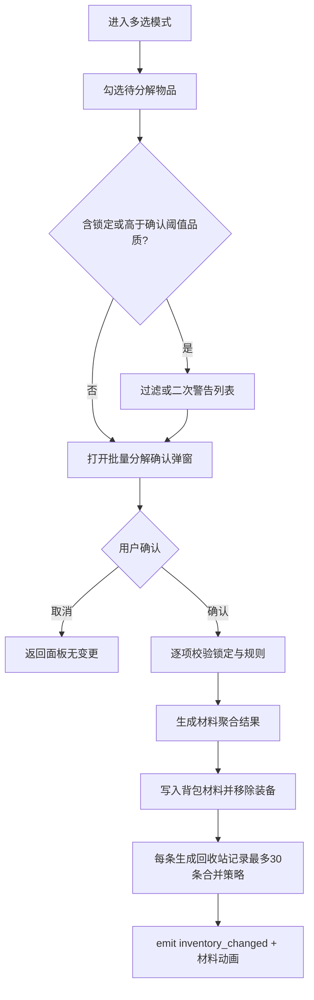

# 背包与仓库系统 — 开发需求案

> **适用范围**：武侠挂机 RPG，2D 横版，Godot 4，GDScript。本文供其他 AI 或开发者直接按章节实现「背包（inventory）」与「仓库（stash）」及关联 UX/数据/性能/测试要求。  
> **主脚本**：`scripts/ui/inventory_panel_controller.gd`、`scripts/utils/inventory_view_model_service.gd`、`scripts/utils/item_presentation_service.gd`  
> **数据承载**：`GameManager.inventory`（`Array`）、`GameManager.equipped_items`（`Dictionary`，9 槽）；仓库为新增或扩展字段（见 §5）。

---

## §1 目标与范围

### 1.1 目标

- **背包**：作为所有未装备物品的数据承载与 UI 操作中枢；支持筛选、排序、分页、锁定、分解、换装、容量与满载策略。
- **仓库**：作为背包的溢出与长期归档空间；与背包共享物品字典 schema，支持存取、检索、与百炼坊等系统的安全交互。
- **一致性**：掉落 → 背包/仓库 → 对比 → 换装 → 百炼坊 的链路数据一致、焦点可恢复、误操作可挽回（回收站）。

### 1.2 范围（In Scope）

- 背包主面板、装备对比弹窗、批量分解确认弹窗、仓库面板（或背包内 Tab）、容量与警告、回收站、跨系统跳转聚焦。
- 与现有 `EventBus.inventory_changed`、`GameManager` API 的衔接与扩展。

### 1.3 非范围（Out of Scope）

- 具体数值平衡（材料产出倍率等）由策划表驱动，本文只定义字段与校验点。
- 美术资源规格（仅线框与交互层级）。

---

## §2 名词与约定

| 名词 | 含义 |
|------|------|
| 背包 / inventory | `GameManager.inventory`，未装备物品数组 |
| 仓库 / stash | 独立于背包的存储数组（建议 `GameManager.stash` 或等价），schema 与背包一致 |
| 装备槽 | `equipped_items` 9 槽：weapon, helm, chest, gloves, legs, boots, belt, amulet_1, amulet_2 |
| 视图模型 | `InventoryViewModelService.build_screen_state()` 输出，供 UI 绑定 |
| 展示文案 | `ItemPresentationService.build_toolbar_summary(...)` |
| 自动分解阈值 | `GameManager.auto_salvage_below_rarity` |

---

## §3 玩家体验（L1–L5）

### L1 Fantasy

「翻开乾坤袋，一览身家宝物，择其精华」—— 背包是行走江湖的资财总览；仓库是深柜藏锋，二者一体两面。

### L1 Emotion

- **主情绪**：整理与掌控（清楚自己有什么、能换什么、敢分什么）。
- **次情绪**：发现（被排序/筛选「捞」出的隐藏强装）。

### L1 Payoff（心流闭环）

打开背包 → 按 DPS 排序 → 发现更强装备 → 一键换装 → DPS 跳字反馈 → 满足。

### L2 时间尺度

- **秒级**：单击格子即时选中与高亮；对比栏关键属性（DPS）即时刷新。
- **分级**：30 秒内完成一轮「筛选 + 排序 + 处理 1–3 件装备」（换装或分解）。
- **时级**：每次「高光掉落」或关卡节点后，引导玩家整理 1 次（轻提示，非强制打断）。
- **日级**：每日任务或签到链路中，至少设计 1 次「打开背包」的弱目标（可与其他系统合并计数）。

### L3 能力深度

多种排序（品质、DPS、部位、获取时间等）与筛选（品质、部位、锁定、是否含传奇特效等）组合，适应「清包」「找件」「比价」「批量拆」四类意图。

### L4 学习曲线

- **约 5 分钟**：认识背包主界面四区（筛选排序 / 网格 / 详情 / 操作）。
- **约 1 小时**：掌握筛选 + 排序联动与对比栏读法。
- **约 10 小时**：熟练使用批量分解、仓库腾挪、满载策略与回收站恢复。

### L5 感官强化（实现优先级可分期）

- 换装后 **DPS 跳字**（或等效战力条短动画）强化反馈。
- **批量分解** 时材料条目以「瀑布」或队列滚动动画呈现（数量大时可合并显示 + 数字滚动）。

---

## §4 功能需求详述

### 4.1 背包容量上限

- **现状**：无上限 → **目标**：引入可配置上限（默认 **200 件** 未装备物品计入背包容量）。
- **策略**：
  - 新掉落若使 `len(inventory) > CAP`，优先尝试 **自动入仓库**（若仓库未满）；仓库满则 **阻止拾取** 或 **弹出「强制整理」**（见 §10）。
  - `CAP` 从 `GameManager` 或 `ProjectSettings`/资源表读取，便于 QA 调小压测。
- **边界**：分解、换装、移入仓库瞬间释放容量，需在同一帧或事务内更新 UI 与 `EventBus`。

### 4.2 物品分类（用于筛选与图标）

- **装备类**：按 `slot`（与 9 槽及扩展部位一致）。
- **材料/消耗**：若有非装备条目，使用 `category` 字段区分（equipment / material / consumable / quest 等）；仓库与背包共用枚举。

### 4.3 排序规则（稳定排序建议）

| 排序键 | 方向 | 次级键（建议） |
|--------|------|----------------|
| 品质 | desc | DPS desc → `item_id` 字典序 |
| DPS | desc | 品质 desc → 获取时间 desc |
| 部位 | asc（预定义顺序表） | 品质 desc → DPS desc |
| 获取时间 | desc | 品质 desc → DPS desc |

- **稳定排序**：同等主键时次序不随机抖动，避免 UI 「闪烁换位」。
- **DPS**：来自统一计算服务（与装备面板一致），缺失时视为 0 并打日志（Debug）。

### 4.4 筛选维度

- **品质**：多选或单选，与现有 rarity 枚举对齐（凡品 → … → 绝世真意）。
- **部位**：与 `slot` 对齐。
- **锁定状态**：仅锁定 / 仅未锁定 / 全部。
- **有传奇特效**：布尔；判定依赖 `affixes` 或 `legendary_power_id` 等字段是否存在（见 §5）。
- **组合逻辑**：同一维度内 OR，不同维度间 AND（文档化，避免实现歧义）。

### 4.5 分页逻辑

- 分页大小由 `InventoryViewModelService` 配置（常量或导出变量）。
- **当前页**由控制器持有；筛选/排序变更时重置为第 1 页（或保持页码若该页仍合法，二选一：**推荐重置为第 1 页**，行为简单）。
- 总页数 = `ceil(筛选后条目数 / page_size)`；空结果时显示空态（§10）。

### 4.6 自动分解规则

- 读取 `auto_salvage_below_rarity`：低于等于该品质阈值的掉落，在进入 `inventory` 前转化为材料（与现有掉落系统衔接）。
- **锁定物品**不得被自动分解；若规则冲突，以锁定为更高优先级。
- 转化结果写审计日志（可选 Debug）以便排查「装备消失」工单。

### 4.7 仓库特有规则（摘要）

- 仓库容量单独配置（如 **300**），与背包 CAP 独立。
- **百炼坊** 从背包或仓库选装时，统一走「选取句柄」（背包索引 / 仓库索引 + 来源枚举），避免双写同一件物品。

---

## §5 数据模型与接口

### 5.1 单个物品 Dictionary（`inventory` / `stash` 元素）

以下为 **逻辑 schema**；实现可增减键名，但需保持序列化兼容与默认值。

| 键 | 类型 | 说明 |
|----|------|------|
| `item_id` | String | 模板/配置 ID |
| `instance_id` | String | 唯一实例 ID（推荐 UUID） |
| `slot` | String | 装备部位，与 `equipped_items` 键兼容 |
| `rarity` | String | common / magic / rare / legendary / set / ancient / primal |
| `affixes` | Array | 词缀列表；元素可为 Dictionary（id, tier, rolled_value） |
| `legendary_power_id` | String | 可选；有则视为「含传奇特效」 |
| `locked` | bool | 锁定防分解/误卖 |
| `acquired_at` | int | Unix 时间戳或单调 tick，用于排序 |
| `dps_cached` | float | 可选缓存；以重算服务为准时可省略 |
| `category` | String | equipment / material / … |
| `stash_only` | bool | 可选；标记仅允许在仓库侧出现的任务物（少用） |

**装备槽位与 `slot` 枚举**须与 `equip_inventory_item`、`equipped_items` 键一致，新增部位需同步表驱动 UI。

### 5.2 `GameManager` 扩展建议

- `stash: Array` — 与 `inventory` 同元素结构。
- `get_stash_count()`、`move_inventory_to_stash(inv_index)`、`move_stash_to_inventory(stash_index)` 等（命名以项目风格为准）。
- 回收站：`salvage_history: Array`（最多 30 条，元素含快照 Dictionary + 时间 + 来源索引）。

### 5.3 `build_screen_state()` 返回结构（逻辑约定）

返回 `Dictionary`，至少包含：

```gdscript
{
  "page_index": int,
  "page_size": int,
  "total_filtered": int,
  "total_pages": int,
  "items_page": Array,           # 每项: { "source": "inventory"|"stash", "source_index": int, "presentation": Dictionary }
  "filters": Dictionary,        # 当前筛选状态镜像
  "sort": Dictionary,           # 主键、方向
  "capacity": { "inventory_used": int, "inventory_cap": int, "stash_used": int, "stash_cap": int },
  "warnings": Array,            # 如 ["inventory_near_full"] 字符串码
  "selected": Variant,          # null 或当前选中描述 Dictionary
}
```

`presentation` 子结构由 `ItemPresentationService` 或视图模型填充（名称、颜色、图标路径、DPS 文本等），与 UI 解耦。

### 5.4 现有 API 衔接

- `get_inventory_count()`、`get_inventory_items()`、`equip_inventory_item(item_index)`、`toggle_inventory_lock(item_index)`、`salvage_inventory_item(item_index)`、`get_inventory_screen_state()` 保持行为；**索引语义**为「背包原始数组索引」时，若 UI 显示筛选后列表，必须维护 **原始索引映射**（建议在 `items_page` 中显式携带 `inventory_index`）。

---

## §6 关键流程

### 6.1 装备对比流程

1. 玩家在网格 **选中** 一件装备。
2. 右栏 **对比区** 显示：当前部位已装备 vs 选中件；列出 **DPS 差值**、主属性差、关键词缀差（简版可先 DPS + 两条核心）。
3. 操作：**换装**（调用 `equip_inventory_item` 或扩展为支持仓库来源）、**保留**（关闭对比或取消）、**分解**（若未锁定，二次确认）。
4. 换装成功后：发射战力/DPS 反馈事件，供飘字系统订阅。

### 6.2 批量分解流程



**合并策略说明**：若一次分解超过 30 件，回收站保留最近 30 次「操作批次」而非 30 单件；单批次内可提供「整批撤销」（推荐）以满足「30 条历史可恢复」的产品表述。

---

## §7 线框图（ASCII）

### 7.1 背包主面板（四区）

**方案说明**：顶栏承载全局意图（筛选/排序）；左侧高密度网格适合拇指与鼠标；右侧固定详情降低扫视成本；底栏大按钮承载高风险操作（分解/批量）。

```
+================================================================================+
| [品质v] [部位v] [锁定v] [传奇特效口]     排序:[品质v] [^/v]    背包 200/200    |
+----------+---------------------------------------------------------------------+
|          |  [图标] [图标] [图标] [图标]   |  名称: xxx  品质色条                  |
|  分页    |  [图标] [图标] [图标] [图标]   |  DPS: 12345  (对比 +320)              |
|  < 1/5 > |  [图标] [图标] [图标] [图标]   |  词缀摘要...                         |
|          |  [图标] [图标] [图标] [图标]   |  [对比装备] [锁定] [分解]             |
|          |  ...                           |  仓库入口 / Tab                     |
+----------+--------------------------------+-------------------------------------+
|            [装备] [下一页] [批量分解] [关闭]                                      |
+================================================================================+
```

### 7.2 装备对比弹窗

**方案说明**：左右分栏对齐同类属性行，差值列固定宽度用绿色/红色表示增减，减少心算负担。

```
+--------------------------- 装备对比 ---------------------------+
|  [当前装备]                         [选中装备]                  |
|  部位: Chest                        部位: Chest                |
|  DPS: 10000                         DPS: 10320   ( +320 )      |
|  主属性: ...                        主属性: ...                |
|  传奇: 有/无                        传奇: 有/无                |
|----------------------------------------------------------------|
|              [ 换装 ]          [ 保留当前 ]                     |
+----------------------------------------------------------------+
```

### 7.3 批量分解确认弹窗

**方案说明**：列表区展示将分解的装备名与品质色；底部汇总材料种类与数量，避免玩家只看件数忽略收益。

```
+------------------------- 批量分解确认 -------------------------+
| 将分解以下 n 件装备（锁定已自动排除）：                         |
|  [x] 凡品 剑A    [x] 精良 戒B   ...                             |
|----------------------------------------------------------------|
| 预计获得材料:  玄铁 x12  灵髓 x3 ...                            |
| [ ] 我已知晓不可自动恢复（若未启用批次撤销时勾选）              |
|----------------------------------------------------------------|
|            [ 取消 ]                    [ 确认分解 ]            |
+----------------------------------------------------------------+
```

---

## §8 仓库 UI 与交互（与背包对齐）

- 推荐 **Tab：背包 | 仓库** 同屏切换，复用网格与详情组件，`source` 切换时重置选中。
- 从仓库 **装备** 到身上：等价于「先移入背包再 equip」或 **原子**「仓库 equip」接口（推荐后者减少中间态）。
- 拖拽可选：Phase 2；MVP 用「选中 + 移动到背包/仓库」按钮即可。

---

## §9 跨系统操作流（掉落 → 背包 → 对比 → 换装 → 百炼坊）

1. **掉落系统** 产生物品 → 校验自动分解 → 尝试入 `inventory`；若满则入 `stash` 或触发满载流程（§10）。
2. 玩家打开背包，`InventoryPanelController.open_panel()` → `_refresh()` → `build_screen_state()`。
3. 选中装备 → 对比栏拉取 `equipped_items` 同部位 → 显示 DPS 差。
4. **换装**：更新 `equipped_items` 与原槽位物品回到 `inventory`（或指定规则）→ `EventBus.inventory_changed`。
5. **百炼坊**：从背包或仓库选择同 schema 装备 → 加工后写回对应数组 → 统一 `inventory_changed`（或专用 `items_reforged` 视架构而定）。
6. **焦点**：其他系统 `consume_ui_focus_request("inventory")` 时，滚动到目标 `source_index` 并选中，保证返回闭环。

---

## §10 边界、风险与容错

### 10.1 满载处理

- **≥ 90% 容量**：顶栏或容量旁 **黄色警告**；首次达到时可选一次性 toast。
- **≥ 100%**：禁止继续拾取到背包；弹 **强制整理**（分解/移仓库/换装）面板，列可选操作。

### 10.2 误分解回收站

- 保留 **最近 30 条** 可恢复记录（推荐按「批次」）；每条含物品快照与材料是否已消耗标志。
- **恢复**：从回收站还原物品到背包（若满则拒绝并提示）；材料已从背包支出的情况需定义是否允许「付费/免费」回滚或禁止恢复（**推荐**：若材料已被其他消耗使用则禁止整批恢复或部分恢复）。

### 10.3 跨系统跳转聚焦

- 统一走 `GameManager.consume_ui_focus_request("inventory")`（及仓库等价 token），控制器内解析目标 id/index 后 **滚动定位 + 选中 + 高亮动画 1 次**。

### 10.4 锁定物品防误操作

- `locked == true`：分解、批量分解、作为材料吞噬、自动分解均 **硬拦截**；UI 上分解按钮置灰并提示原因。

### 10.5 空背包引导

- `total_filtered == 0` 且筛选为默认：展示插画/文案「江湖路远，宝物自会来」+ 引导至关卡或挂机入口；若有筛选无结果：提示「调整筛选条件」。

---

## §11 性能与可扩展性

### 11.1 背包容量与分页

- UI 只绑定当前页 `items_page`，避免一次实例化数百 `Control`。
- 数据层变更时 **增量刷新**：仅当筛选/排序/页码变化时重建 VM。

### 11.2 排序算法复杂度

- 对 `inventory`（n ≤ 建议 CAP 200 + 仓库 300）采用 `O(n log n)` 全量排序可接受；若未来上万级，改为 **索引数组排序** 或缓存排序键 + 脏标记。
- DPS 计算：排序前批量预计算并缓存到临时数组，避免比较器内重复重算词缀。

---

## §12 测试要点（验收清单）

| 编号 | 场景 | 期望 |
|------|------|------|
| T1 | 增删改查 | 入包、移仓库、换装、分解后 `inventory`/`stash`/`equipped_items` 数量与实例一致 |
| T2 | 排序 | 品质/DPS/部位/时间各排序下次序符合 §4.3 次级键规则且稳定 |
| T3 | 筛选 | 多维度 AND 组合结果与手工 SQL/脚本对照一致 |
| T4 | 分解转化 | 材料数量与配置表一致；传奇/套装特殊规则若有则单测覆盖 |
| T5 | 锁定保护 | 锁定项所有禁止路径均失败并 UI 提示 |
| T6 | 回收站 | 30 批次边界、恢复后快照一致、材料冲突时行为符合 §10.2 |
| T7 | 满载 | 90% 警告、100% 阻止与弹窗路径可测 |
| T8 | 焦点 | `consume_ui_focus_request` 后选中项可见且在视口内 |

---

## §13 事件与本地化

- **事件**：`inventory_changed` 必发；可选 `stash_changed`、`equipment_power_changed`。
- **文案**：所有提示走翻译表；含占位符 `{current}/{cap}`。

---

## §14 分期交付建议

| 阶段 | 内容 |
|------|------|
| P0 | 容量上限、分页、筛选排序、对比栏、锁定、单件分解、EventBus |
| P1 | 批量分解 + 确认弹窗 + 回收站批次恢复 |
| P2 | 仓库 Tab、拖拽、材料瀑布动画、DPS 飘字联动 |
| P3 | 性能优化（脏标记排序、对象池） |

---

## §15 开放问题（需策划/程序联审）

1. 仓库与背包是否 **共享自动分解** 阈值，还是仅对掉落进背包生效？  
2. 换装时原装备 **必定回背包** 还是背包满时 **直接进仓库**？  
3. 回收站 **30 条** 按批次还是按单件，是否需 UI「撤销上一步」？  
4. 多角色存档若未来引入，仓库是否 **角色私有** 还是 **账号共享**？

---

**文档版本**：v1.0  
**依赖代码路径**：`scripts/ui/inventory_panel_controller.gd`、`scripts/utils/inventory_view_model_service.gd`、`scripts/utils/item_presentation_service.gd`、`GameManager` 相关字段与 API。
