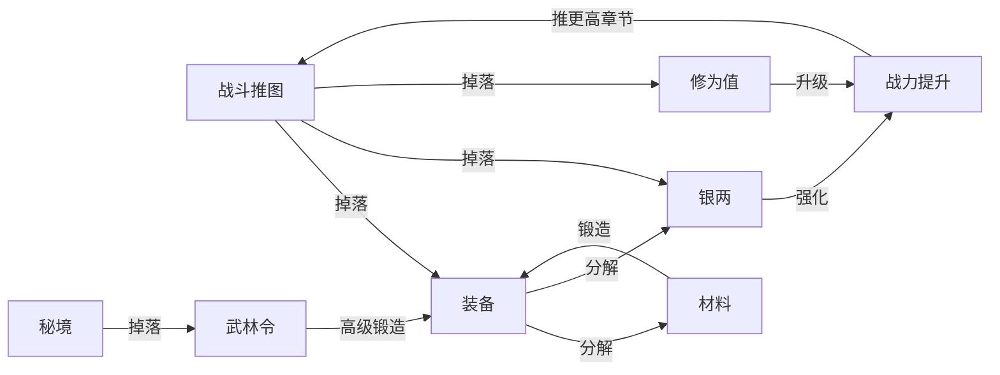

# 数值框架

> 定义本项目的全局数值体系：经济循环、成长曲线、品质概率、保底机制、DPS 公式总览。  
> 所有系统的 S5（数值规划）阶段必须与本框架对齐。

**管线位置**：[研发流程总览](../00_项目总纲/研发流程总览.md) S5 阶段的全局约束  
**关联体验循环**：本框架的所有节奏参数必须支撑 [体验分析框架](../00_项目总纲/体验分析框架.md) L2 层的节奏承诺

---

## 一、全局经济体系

### 1.1 资源分类

| 资源类型 | 名称 | 获取途径（入口） | 消耗途径（出口） | 通胀风险 |
|---------|------|---------------|---------------|---------|
| **基础货币** | 银两 | 推图掉落、离线收益、分解装备 | 强化、锻造、购买 | 中（随推图章节膨胀） |
| **高级货币** | 武林令 | 秘境掉落、每日目标、成就 | 高级锻造、洗炼、重置 | 低（产出受限） |
| **装备** | 各品质装备 | 战斗掉落、锻造产出 | 穿戴、分解、萃取 | 中（掉率曲线控制） |
| **材料** | 锻造材料 | 分解装备、特定关卡 | 百炼坊锻造、升级 | 低 |
| **经验** | 修为值 | 战斗、任务、离线 | 等级提升（自动消耗） | 无（直接转化） |

### 1.2 经济循环图



### 1.3 通胀控制原则

| 原则 | 具体约束 |
|------|---------|
| **入口随出口增长** | 高章节的银两掉落增加，但高章节的强化消耗也同步增加 |
| **高级货币产出封顶** | 武林令每日产出有上限，不随推图进度线性增长 |
| **装备出口多元化** | 低品质装备分解为材料/银两；中品质可萃取特效；高品质直接穿戴 |
| **版本调节窗口** | 预留全局掉率倍率参数，可通过配置热更 |

---

## 二、成长曲线设计

### 2.1 曲线类型选择

| 曲线类型 | 适用场景 | 本项目使用 |
|---------|---------|-----------|
| **线性** | 早期教学阶段，体验均匀 | 1-10 级修为 |
| **对数** | 越到后期越慢，自然减速 | 10-50 级修为 |
| **S 型** | 中段最快，两头慢 | 装备品质提升体感 |
| **分段线性** | 在特定节点有跳跃 | 宗师修为（每 10 级一个"关卡"） |

### 2.2 修为等级曲线

> 玩家从 1 级到满级的经验需求曲线。

**设计约束（与 L2 体验循环对齐）**：

| 里程碑 | 对应 L2 时间尺度 | 约束 |
|--------|----------------|------|
| 1 → 10 级 | 时循环（1 小时内） | 新手必须在 1 小时内升到 10 级 |
| 10 → 30 级 | 日循环（每天 20 分钟推图） | 3-5 天到达 30 级 |
| 30 → 50 级 | 周循环 | 2 周到达 50 级（解锁大部分系统） |
| 50 → 100 级 | 月循环 | 1-2 月到达满级 |

**公式框架**：

```
exp_required(level) = base_exp × level^growth_factor
```

| 参数 | 说明 | 参考值 |
|------|------|--------|
| `base_exp` | 基础经验值 | 100 |
| `growth_factor` | 增长指数 | 1.5（对数区）/ 2.0（减速区） |

### 2.3 战力（DPS）成长曲线

> 总战力 = f(等级, 装备, 技能, 套装, 宗师修为)

**设计约束**：

- 新手（1h）到中期（10h）的 DPS 增长 ≈ 10 倍
- 中期（10h）到终局（100h）的 DPS 增长 ≈ 100 倍
- 终局（100h+）增长趋于平缓但不完全停止

---

## 三、品质概率与保底机制

### 3.1 品质概率分布

| 品质 | 叙事名称 | 基础掉率 | 章节修正 | 说明 |
|------|---------|---------|---------|------|
| 凡品 | 灰白 | 45% | 递减 | 随章节推进逐渐减少 |
| 精良 | 蓝 | 30% | 稳定 | 主力中间品质 |
| 玄品 | 黄 | 18% | 微增 | 中期主力 |
| 真意 | 橙 | 5% | 微增 | 传奇级，核心 Build 组件 |
| 传承 | 绿 | 1.5% | 特殊 | 套装件，特定来源 |
| 上古真意 | 暗金 | 0.4% | 特殊 | 终局追求 |
| 绝世真意 | 红 | 0.1% | 特殊 | 极稀有，炫耀级 |

### 3.2 保底机制

| 保底类型 | 触发条件 | 保底内容 | 设计理由 |
|---------|---------|---------|---------|
| **首章 Boss 保底** | 击杀铁面虬髯客 | 100% 掉落 1 件真意 + 1 条传奇特效 | 与 L2 里程碑绑定，"首次 Boss = 首件橙" |
| **坏运气保护** | 连续 N 次未掉落 ≥ 玄品 | 第 N+1 次保底掉落玄品 | 避免长时间无进展的挫败感 |
| **每日保底** | 每日首次登录推图 30 分钟 | 至少 1 件玄品 | 支撑日循环"20 分钟有意义" |
| **套装保底** | 已拥有 4 件同套装 | 后续掉落该套装概率 +50% | 避免"差最后一件"的永久卡顿 |

### 3.3 与 L2 体验循环的映射

| L2 时间尺度 | 品质节奏承诺 | 实现方式 |
|------------|-----------|---------|
| 秒循环 | 每次击杀都有掉落物 | 凡品/材料保底 |
| 分循环 | 每 1-3 分钟至少 1 件蓝装 | 精良掉率 30% + 击杀频率 |
| 时循环 | 首章 Boss（90-150min）首件橙装 | 首章 Boss 100% 保底 |
| 日循环 | 每日推图 20min 至少 1 件黄装 | 每日保底机制 |
| 周循环 | 3 天凑齐传承 2 件套 | 套装概率提升 |
| 月循环 | 14 天凑齐传承 6 件套 | 套装保底 + 概率递增 |

---

## 四、DPS 公式总览

### 4.1 核心伤害公式

> 详细推导见 [装备·数值·Build系统](../01_系统设计/装备·数值·Build系统.md)

```
最终伤害 = 基础攻击力 × (1 + 技能加成) × (1 + 暴击加成) × (1 + 装备加成) × (1 + 套装加成) × (1 + 宗师加成) × 怪物抗性系数
```

### 4.2 乘区框架

| 乘区 | 来源 | 说明 |
|------|------|------|
| A · 基础攻击力 | 等级 + 武器基础属性 | 线性增长，地基 |
| B · 技能加成 | 主动/被动技能 | 玩家可通过技能配置调整 |
| C · 暴击加成 | 暴击率 × 暴击伤害 | 高波动性，核心爽感来源 |
| D · 装备加成 | 词缀总和 | 最大决策空间，Build 核心 |
| E · 套装加成 | 传承件套装效果 | 质变跳跃，L5 仪式感来源 |
| F · 宗师加成 | 宗师修为被动 | 终局线性增长 |

### 4.3 乘区平衡约束

| 约束 | 具体值 | 理由 |
|------|--------|------|
| 最弱流派 DPS ≥ 最强的 70% | 见 L3 决策空间 | 避免唯一最优解 |
| 单一乘区贡献 ≤ 总 DPS 的 40% | — | 避免"只堆一个属性"的极端 Build |
| 暴击期望 DPS ≈ 非暴击的 1.5-2 倍 | — | 保证暴击有感但不过度依赖 |

---

## 五、数值验证方法

### 5.1 验证类型

| 验证类型 | 方法 | 要求 |
|---------|------|------|
| **公式验证** | 手算 / 表格推演 | 极端参数（全 0 / 全满 / 上限）不产生异常值 |
| **节奏验证** | 模拟 N 小时游玩 | 品质掉落时间节点与 L2 承诺一致 |
| **平衡验证** | 三流派同条件对比 | DPS 差距在 30% 以内 |
| **经济验证** | 模拟 30 天资源收支 | 无通胀失控（银两存量不超过 7 天消耗量） |

### 5.2 验证数据模板

```markdown
### 验证：[验证名称]

**验证类型**：公式 / 节奏 / 平衡 / 经济  
**输入参数**：（列出关键参数和取值）  
**预期结果**：（与 L2 节奏承诺 / 平衡约束的对应关系）  
**实际结果**：（填入计算/模拟结果）  
**结论**：通过 / 不通过（原因 + 调整建议）
```

---

## 六、与其他文档的关系

| 文档 | 关系 |
|------|------|
| [体验分析框架](../00_项目总纲/体验分析框架.md) | L2 节奏承诺是数值验证的基准线 |
| [核心战斗与系统循环](../01_系统设计/核心战斗与系统循环.md) | 提供伤害公式、技能乘区、战斗节奏的数值需求 |
| [装备·数值·Build系统](../01_系统设计/装备·数值·Build系统.md) | 提供词缀/品质/乘区的详细数值设计 |
| [配置表字段说明](配置表字段说明.md) | 数值方案的配置落地规格 |
| [配置示例与测试用例](配置示例与测试用例.md) | 数值验证的具体用例 |

---

*本文档最后更新：2026-03-19*
