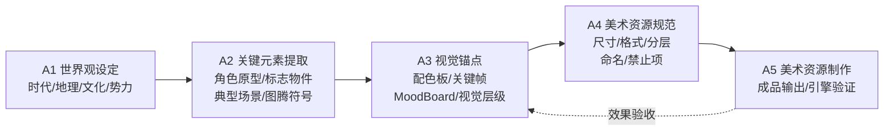
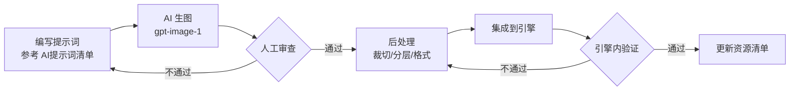
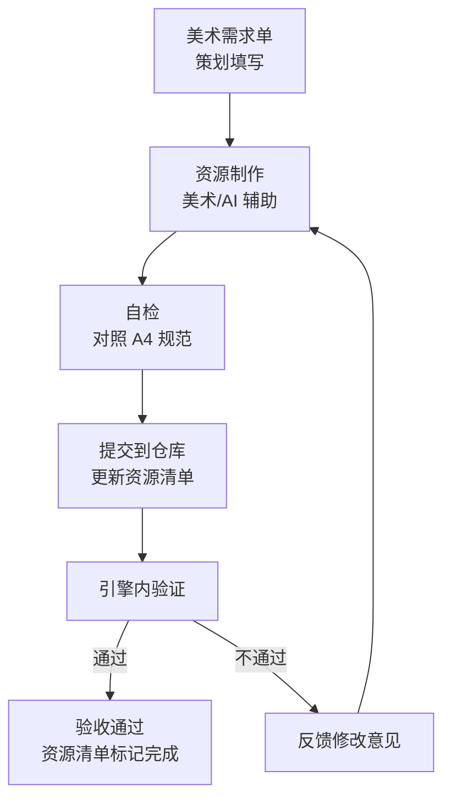

# 美术管线总览

> 定义本项目从世界观到成品资源的完整美术制作流程。  
> 所有美术资源的产出必须沿管线推进，每个阶段有明确的交付物和审查门禁。

**管线位置**：[研发流程总览](../00_项目总纲/研发流程总览.md) 管线 B（A1-A5）

---

## 一、管线概览



---

## 二、各阶段定义

### A1 · 世界观设定

| 项目 | 内容 |
|------|------|
| **交付物** | [世界观与题材包装](../00_项目总纲/世界观与题材包装.md) |
| **已完成** | 是 |
| **门禁** | 题材方向（武侠非修仙）明确；5 章场景有文字描述；三大流派有叙事包装 |

---

### A2 · 关键元素提取

| 项目 | 内容 |
|------|------|
| **目标** | 从世界观中萃取可视觉化的核心元素 |
| **输入物** | A1 世界观 + 管线 A 的 L1 Fantasy |
| **交付物** | [关键元素与视觉锚点](关键元素与视觉锚点.md) 上半部分 |
| **门禁** | 4 类元素各 ≥ 3 条；每条有文字描述 + 视觉参考方向 |

**4 类关键元素**：

| 类型 | 定义 | 萃取来源 |
|------|------|---------|
| **角色原型** | 玩家/NPC/Boss 的视觉原型 | 世界观 §3.2（玩家身份）+ §3.4（势力） |
| **标志性物件** | 代表系统/功能的图标级物品 | 世界观 §9（系统叙事包装）+ 系统设计文档 |
| **典型场景** | 每个章节的场景基调 | 世界观 §5（章节世界观） |
| **图腾符号** | 反复出现的视觉符号 | 世界观 §4（流派映射）+ §6（品质包装） |

---

### A3 · 视觉锚点

| 项目 | 内容 |
|------|------|
| **目标** | 把关键元素转化为可执行的视觉规范 |
| **输入物** | A2 关键元素 + 管线 A 的 L5 仪式感清单 |
| **交付物** | [关键元素与视觉锚点](关键元素与视觉锚点.md) 下半部分 |
| **门禁** | 每个关键元素有对应配色方案；与 L1 体验锚点有显式对齐；有 Mood Board 参考方向 |

**与管线 A 的交叉点**：

- L1 Fantasy → 决定角色原型的"气质"（武侠侠客感 vs 修仙飘逸感）
- L5 仪式感清单 → 决定哪些瞬间需要特别的视觉表现（光柱、慢镜、特写）
- L2 秒循环 → 决定战斗即时反馈的视觉强度（暴击/击杀/掉落）

---

### A4 · 美术资源规范

| 项目 | 内容 |
|------|------|
| **交付物** | [美术风格规范](美术风格规范.md)（已有，持续更新） |
| **已完成** | 是（v1 版已定稿） |
| **门禁** | 以下规格全部明确 |

**A4 必须覆盖的规格清单**：

| 规格项 | 当前状态 | 说明 |
|--------|---------|------|
| 角色比例 | ✅ 已定义（2.2-2.5 头身） | 见美术风格规范 §3.1 |
| 角色气质 | ✅ 已定义 | 见美术风格规范 §3.2 |
| 流派视觉 | ✅ 已定义（三流派配色+图形语言） | 见美术风格规范 §4 |
| 场景构图 | ✅ 已定义 | 见美术风格规范 §5.3 |
| 场景分层 | ✅ 已定义（far/mid/near 三层） | 见美术风格规范 §5.5 |
| 颜色规范 | ✅ 已定义（8 色色板） | 见美术风格规范 §5.4 |
| UI 方向 | ✅ 已定义 | 见美术风格规范 §6 |
| 特效规范 | ✅ 已定义 | 见美术风格规范 §7 |
| 禁止项 | ✅ 已定义 | 见美术风格规范 §8 |
| 帧动画规格 | ❌ 待补充 | 角色动画帧数/尺寸/帧率 |
| UI 切图规格 | ❌ 待补充 | 九宫格规则/最小尺寸/格式 |
| 图标尺寸标准 | ❌ 待补充 | 32/48/64/96 各场景使用规则 |

---

### A5 · 美术资源制作

| 项目 | 内容 |
|------|------|
| **目标** | 按规范产出成品资源并集成到项目 |
| **输入物** | A4 规范 + 美术需求单 |
| **交付物** | 成品资源文件 + [美术资源清单](美术资源清单.md) 更新 |
| **门禁** | 资源符合 A4 规范；命名符合规则；在引擎中验证效果 |

---

## 三、AI 辅助生图的定位

| 阶段 | AI 辅助方式 | 限制 |
|------|-----------|------|
| A2 | ❌ 不使用 | 关键元素提取是人工决策，不能由 AI 代替 |
| A3 | ✅ 可用于 Mood Board 快速验证 | 生成的参考图不作为最终视觉锚点 |
| A4 | ❌ 不使用 | 规范制定是人工决策 |
| A5 | ✅ 可用于量产辅助 | 必须符合 A4 规范；需人工审查和调整 |

**AI 生图工作流**（用于 A5 量产）：



---

## 四、资源命名规则

### 4.1 目录结构

```
assets/
├── characters/       # 角色资源
│   ├── player/        # 玩家角色
│   └── enemies/       # 敌人
├── backgrounds/       # 背景资源
│   ├── ch01/          # 第一章
│   └── ch02/          # 第二章
├── ui/                # UI 资源
│   ├── icons/         # 图标
│   ├── panels/        # 面板
│   └── common/        # 通用元素
├── effects/           # 特效资源
└── audio/             # 音频资源
```

### 4.2 文件命名格式

```
[类别]_[对象]_[变体]_[状态].[格式]
```

| 示例 | 说明 |
|------|------|
| `char_player_yufeng_idle.png` | 角色_玩家_御风_待机 |
| `bg_ch01_far.png` | 背景_第一章_远景层 |
| `icon_equip_sword_orange.png` | 图标_装备_剑_橙品质 |
| `ui_panel_inventory_bg.png` | UI_面板_背包_背景 |
| `fx_crit_slash_01.png` | 特效_暴击_斩击_序号1 |

---

## 五、资源交付流程



---

*本文档最后更新：2026-03-19*
