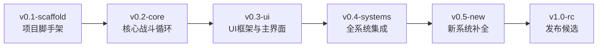

# 版本记录

> 武侠挂机 RPG — 项目重构版本管理

## 版本约定

- 采用 **语义化版本**：`vMAJOR.MINOR-tag`
- `v0.x` 系列为重构阶段，每个里程碑对应一个 minor 版本
- `v1.0-rc` 为首个发布候选，标志重构完成
- 每个版本发版后在本目录产出对应的 `vX.Y-tag_发版说明.md`

## 版本路线图

## 文档索引

| 文档 | 内容概述 |
|------|----------|
| [重构总览与迁移策略](重构总览与迁移策略.md) | GDScript→C# 策略、像素资源策略、文档对齐策略、旧文件处理 |
| [v0.1-scaffold 发版说明](v0.1-scaffold_发版说明.md) | C# 项目初始化、像素占位资源、场景骨架、48 文件归档 |
| [v0.2-core 发版说明](v0.2-core_发版说明.md) | 核心战斗循环（战斗/掉落/装备 8 个 C# 文件） |
| [v0.3-ui 发版说明](v0.3-ui_发版说明.md) | UI 框架、HUD、导航栏、主菜单、存档管理 |
| [v0.4-systems 发版说明](v0.4-systems_发版说明.md) | 18 个系统全部集成（UI 面板 + 游戏系统 + 辅助系统） |
| [v0.5-new 发版说明](v0.5-new_发版说明.md) | 章节选关、背包升级、新手引导、成就与称号 |
| [v1.0-rc 发版说明](v1.0-rc_发版说明.md) | 桌面端导出、集成测试、性能基线 |
| [重构进度看板](重构进度看板.md) | 48 文件迁移 + 338 资源替换 Checklist |

## 重构决策记录

| 日期 | 决策 | 理由 |
|------|------|------|
| 2026-04-18 | GDScript → C# 从零重写 | 利用强类型提升可维护性，按新文档重新架构 |
| 2026-04-18 | 放弃 Web 导出，改为桌面端 | Godot 4.x C# 对 Web 导出支持有限 |
| 2026-04-18 | 美术资源替换为像素占位 | 解耦美术依赖，专注系统功能验证 |
| 2026-04-18 | 旧文件移入 `_legacy/` 归档 | 保留参考但不污染新代码树 |
