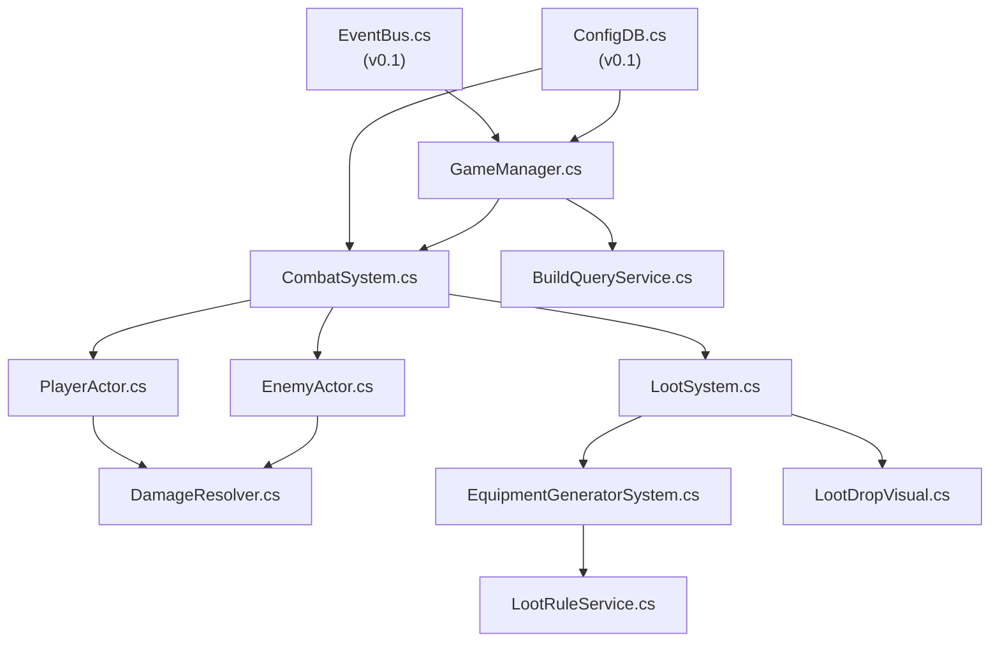

# v0.2-core 发版说明

> 核心战斗循环 — 自动战斗、掉落生成、装备穿戴

---

## 版本信息

| 字段 | 值 |
|------|-----|
| 版本号 | v0.2-core |
| 计划日期 | TBD |
| 目标 | 实现最小可玩核心循环：战斗→掉落→换装 |
| 前置版本 | v0.1-scaffold |
| 下一版本 | v0.3-ui |

---

## 一、目标摘要

1. 实现 `GameManager.cs` 核心状态容器
2. 实现自动战斗引擎（CombatSystem + PlayerActor + EnemyActor + DamageResolver）
3. 实现 7 品质掉落生成（LootSystem + EquipmentGeneratorSystem）
4. 实现掉落视觉表演（LootDropVisual）
5. 实现 DPS/属性计算服务（LootRuleService + BuildQueryService）

---

## 二、对应需求文档

| 文档 | 覆盖章节 |
|------|---------|
| [战斗系统](../01_系统设计/战斗系统.md) | §4 战斗引擎、§5 数据结构、§6 战斗流程、§12 验收 |
| [掉落系统](../01_系统设计/掉落系统.md) | §4 品质规则、§5 掉落表结构、§6 掉落流程、§12 验收 |
| [装备与Build系统](../01_系统设计/装备与Build系统.md) | §4 装备生成、§5 词缀结构、§11 DPS公式、§12 验收 |

---

## 三、新增 C# 文件清单

| 文件路径 | 命名空间 | 行数(估) | 说明 |
|----------|---------|---------|------|
| `scripts/Autoload/GameManager.cs` | `DesktopIdle.Autoload` | ~800 | 核心状态：chapter/node/inventory/equipped/kills/clears |
| `scripts/Combat/DamageResolver.cs` | `DesktopIdle.Combat` | ~60 | 伤害计算：基础DPS × 武器速度 × 暴击 × 多乘区 |
| `scripts/Entities/PlayerActor.cs` | `DesktopIdle.Entities` | ~500 | 玩家实体：像素精灵、AnimatedSprite2D、4技能槽 |
| `scripts/Entities/EnemyActor.cs` | `DesktopIdle.Entities` | ~200 | 敌人实体：生命/攻击/类型(normal/elite/boss) |
| `scripts/Systems/CombatSystem.cs` | `DesktopIdle.Systems` | ~400 | 自动战斗：波次管理、节点推进、精英/Boss逻辑 |
| `scripts/Systems/LootSystem.cs` | `DesktopIdle.Systems` | ~300 | 掉落生成：品质概率、保底机制、材料掉落 |
| `scripts/Systems/EquipmentGeneratorSystem.cs` | `DesktopIdle.Systems` | ~500 | 装备生成：基底选择、词缀滚动、品质升阶 |
| `scripts/Effects/LootDropVisual.cs` | `DesktopIdle.Effects` | ~150 | 掉落视觉：光柱颜色、拾取动画、飞向背包 |
| `scripts/Utils/LootRuleService.cs` | `DesktopIdle.Utils` | ~400 | 掉落规则：品质权重、bucket分配、保底计算 |
| `scripts/Utils/BuildQueryService.cs` | `DesktopIdle.Utils` | ~450 | DPS查询：多乘区公式、装备评分、Build诊断 |

### 场景文件

| 文件路径 | 说明 |
|----------|------|
| `scenes/entities/player.tscn` | 重建：挂载 PlayerActor.cs，像素精灵 |
| `scenes/entities/enemy.tscn` | 重建：挂载 EnemyActor.cs，像素精灵 |
| `scenes/effects/loot_drop_visual.tscn` | 重建：掉落物视觉节点 |

### 归档（移入 `_legacy/scenes/`）

| 文件 | 说明 |
|------|------|
| `scenes/entities/player.tscn` (旧) | GDScript 版玩家场景 |
| `scenes/entities/enemy.tscn` (旧) | GDScript 版敌人场景 |
| `scenes/effects/loot_drop_visual.tscn` (旧) | GDScript 版掉落视觉 |

---

## 四、数据文件（复用，不修改）

| 文件 | 用途 |
|------|------|
| `data/chapters/chapter_defs.json` | 章节/节点定义 |
| `data/enemies/enemy_defs.json` | 敌人属性 |
| `data/equipment/equipment_bases.json` | 装备基底 |
| `data/equipment/affixes.json` | 普通词缀 |
| `data/equipment/legendary_affixes.json` | 传奇词缀 |
| `data/drops/drop_tables.json` | 掉落表 |
| `data/skills/core_skills.json` | 核心技能 |
| `data/skills/active_skills.json` | 主动技能 |
| `data/skills/passive_skills.json` | 被动技能 |

---

## 五、核心依赖关系

---

## 六、品质系统（7 级）

| 品质 | 代码键 | 颜色 | 词缀数 |
|------|--------|------|--------|
| 凡品 | `common` | 灰 | 0 |
| 精良 | `magic` | 蓝 | 1-2 |
| 玄品 | `rare` | 黄 | 3-4 |
| 真意 | `legendary` | 橙 | 4 + 传奇特效 |
| 传承 | `set` | 绿 | 4 + 套装效果 |
| 上古真意 | `ancient` | 暗金 | 5 + 传奇特效(强化) |
| 绝世真意 | `primal` | 红 | 6 + 全满词缀 |

---

## 七、验收用例

| ID | 用例 | 预期结果 | 对应文档 |
|----|------|---------|---------|
| C-01 | 启动游戏，观察战斗画面 | 玩家像素精灵自动攻击敌人像素精灵 | 战斗§12 |
| C-02 | 敌人被击杀 | 死亡动画 → 掉落物光柱出现 | 掉落§12 |
| C-03 | 掉落物自动拾取 | 拾取飞行动画 → inventory 数组增加 | 掉落§12 |
| C-04 | 检查掉落品质 | 7 品质按概率分布生成 | 掉落§12 |
| C-05 | 装备穿戴 | GameManager.equipped_items 更新 → DPS 变化 | 装备§12 |
| C-06 | 击杀精英/Boss | 精英=更高掉落品质，Boss=保底传奇 | 战斗§12 |
| C-07 | 通关节点 | 自动推进到下一节点 → 新敌人配置 | 战斗§12 |
| C-08 | DPS 计算 | 多乘区公式：基础×(1+增伤)×(1+暴击×暴伤)×速度 | 装备§11 |

---

## 八、已知限制

- 无 HUD 显示（v0.3 实现）
- 无存档（v0.3 实现）
- 无背包 UI（v0.4 实现）
- 战斗状态仅通过控制台日志观察
- 装备穿戴通过代码调用，无 UI 交互

---

## 九、像素资源需求

本版本需要以下像素占位资源可辨识：

| 资源 | 要求 |
|------|------|
| 玩家 idle 帧 | 32×32，蓝色调，站立姿态 |
| 玩家 attack 帧×4 | 32×32，攻击动画序列 |
| 普通敌人 | 32×32，红色调 |
| 精英敌人 | 32×32，紫色调 |
| Boss | 64×64，暗红调，体型更大 |
| 掉落光柱 | 8×32，品质对应颜色 |
