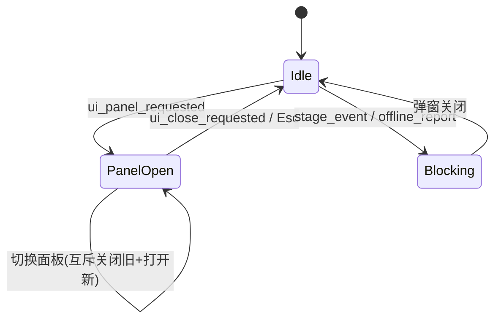

# v0.3-ui 发版说明

> UI 框架与主界面 — HUD、导航栏、主菜单、存档管理

---

## 版本信息

| 字段 | 值 |
|------|-----|
| 版本号 | v0.3-ui |
| 计划日期 | TBD |
| 目标 | 完整 HUD + 导航栏 + 面板管理 + 主菜单 + 存档 |
| 前置版本 | v0.2-core |
| 下一版本 | v0.4-systems |

---

## 一、目标摘要

1. 实现全局 UI 样式系统（UIStyle）
2. 实现 HUD 7 区域布局（PlayerHeader / StageHeader / BattleSafeFrame / ObjectiveCard / LootCard / DropToast / CombatHighlight）
3. 实现导航栏 7 按钮 + 快捷键映射
4. 实现面板互斥管理 + UI 状态机（UIOverlayManager）
5. 实现启动菜单 + 3 槽位存档管理（LaunchMenu + SaveManager）
6. 实现设置面板（音量/存读档/debug）
7. 实现运行时纹理加载器

---

## 二、对应需求文档

| 文档 | 覆盖章节 |
|------|---------|
| [主界面与导航系统](../01_系统设计/主界面与导航系统.md) | §4 HUD架构、§5 数据结构、§6 信号链、§7 线框图、§10 边界、§12 验收 |
| [主菜单与存档系统](../01_系统设计/主菜单与存档系统.md) | §4 状态机、§5 存档结构、§7 线框图、§10 边界、§12 验收 |

---

## 三、新增 C# 文件清单

| 文件路径 | 命名空间 | 说明 |
|----------|---------|------|
| `scripts/UI/UIStyle.cs` | `DesktopIdle.UI` | 全局颜色/字体/StyleBox 常量 |
| `scripts/Utils/RuntimeTextureLoader.cs` | `DesktopIdle.Utils` | 运行时纹理加载（支持像素资源） |
| `scripts/UI/UIOverlayManager.cs` | `DesktopIdle.UI` | 面板互斥、UI 状态机、快捷键分发 |
| `scripts/UI/HudController.cs` | `DesktopIdle.UI` | HUD 7 区域控制器 |
| `scripts/UI/MainNavBarController.cs` | `DesktopIdle.UI` | 导航栏 7 按钮 + 红点 |
| `scripts/UI/LaunchMenuController.cs` | `DesktopIdle.UI` | 启动菜单 + 存档槽选择 |
| `scripts/Autoload/SaveManager.cs` | `DesktopIdle.Autoload` | 多槽位 JSON 序列化/反序列化 |
| `scripts/UI/SettingsPanelController.cs` | `DesktopIdle.UI` | 音量×3 / 存读档 / debug 入口 |
| `scripts/Autoload/DemoManager.cs` | `DesktopIdle.Autoload` | 版本号 / 配置 / 快速开始标记 |

### 场景文件

| 文件路径 | 说明 |
|----------|------|
| `scenes/ui/hud.tscn` | 重建：7 区域 HUD |
| `scenes/ui/main_nav_bar.tscn` | 重建：7 按钮导航栏 |
| `scenes/ui/launch_menu.tscn` | 重建：启动菜单 + 设置面板 |
| `scenes/ui/settings_panel.tscn` | 重建：设置面板 |

### 归档

| 文件 | 说明 |
|------|------|
| `scenes/ui/hud.tscn` (旧) | GDScript 版 HUD |
| `scenes/ui/main_nav_bar.tscn` (旧) | GDScript 版导航栏 |
| `scenes/ui/launch_menu.tscn` (旧) | GDScript 版启动菜单 |
| `scenes/ui/settings_panel.tscn` (旧) | GDScript 版设置 |

---

## 四、HUD 布局规格

| 区域 | 位置 | 尺寸 | 内容 |
|------|------|------|------|
| PlayerHeader | 左上 (18, 18) | 436×122 | 立绘 + 名字 + 流派 + 生命 + 资源 |
| StageHeader | 右上 (vw-338, 18) | 320×90 | 章节名 + 节点进度 + 击杀/清图 + 波次点 |
| CombatHighlight | 顶部居中 (y=86) | 自适应 | 精英/Boss 击杀高光横幅 |
| ObjectiveCard | 右侧 (vw-338, 148) | 320×122 | 目标/进度/奖励/下一步 |
| LootCard | 左侧 (18, 244) | 304×114 | 掉落高光 + 摘要 |
| BattleSafeFrame | 底部居中 | 600×168 | 战斗条 + 双球 + Buff + 技能栏 |
| DropToast | 顶部居中弹出 | 自适应 | 高价值掉落通知(2秒消失) |

---

## 五、导航栏按钮映射

| 按钮 | 快捷键 | panel_id | 颜色 |
|------|--------|---------|------|
| 背包 | I | `inventory` | 蓝 |
| 技能 | K | `skills` | 绿 |
| 百炼坊 | B | `cube` | 桃 |
| 成长中心 | U | `research` | 金 |
| 异闻录 | O | `codex` | 青 |
| 推演/秘境 | P | `drop_stats` | 桃 |
| 设置 | — | `settings` | 灰 |

---

## 六、存档系统规格

| 参数 | 值 |
|------|-----|
| 槽位数 | 3 (`SAVE_SLOT_COUNT`) |
| 默认槽位 | 1 (`DEFAULT_SAVE_SLOT`) |
| 存档路径 | `user://desktop_idle_save_{slot}.json` |
| 版本号 | 4 (`CURRENT_SAVE_VERSION`，从 3 升级) |
| 快捷存档 | F5 (→ 当前活动槽位) |
| 快捷读档 | F8 (→ 当前活动槽位) |
| 退出自动存档 | `WM_CLOSE_REQUEST` 通知 |

---

## 七、UI 状态机

---

## 八、验收用例

| ID | 用例 | 预期结果 | 对应文档 |
|----|------|---------|---------|
| U-01 | 启动游戏 | 主菜单显示，3 槽位可选 | 主菜单§12 |
| U-02 | 点击"继续" | 读档 → 暂停解除 → HUD 显示 | 主菜单§12 |
| U-03 | 点击"新开始" | 清空槽位 → 进入游戏 | 主菜单§12 |
| U-04 | 点击"删除存档" | 槽位清空 → 刷新显示 | 主菜单§12 |
| U-05 | HUD PlayerHeader | 显示名字/流派/生命/资源 | 主界面§12 |
| U-06 | HUD StageHeader | 显示章节/节点/击杀/波次点 | 主界面§12 |
| U-07 | HUD BattleSafeFrame | 双球显示生命%/真气 + 技能槽 | 主界面§12 |
| U-08 | 导航栏按钮 | 点击/快捷键打开对应面板 | 主界面§12 |
| U-09 | 面板互斥 | 打开新面板自动关闭旧面板 | 主界面§12 |
| U-10 | F5 存档 + F8 读档 | 存档/读档成功，状态恢复 | 主菜单§12 |
| U-11 | 关闭窗口 | 自动存档到活动槽位 | 主菜单§10 |
| U-12 | 设置面板 | 音量滑条可调，存读档按钮可用 | 主菜单§12 |

---

## 九、已知限制

- 导航栏的各功能面板为空壳（v0.4 实现）
- ObjectiveCard 和 LootCard 显示静态占位内容
- 红点策略未实现（v0.5 引导系统实现）
