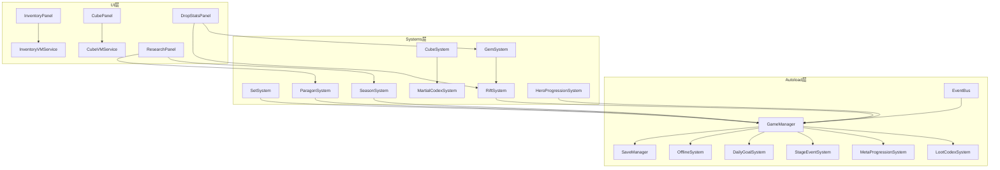

# v0.4-systems 发版说明

> 全系统集成 — 18 个系统全部可用

---

## 版本信息

| 字段 | 值 |
|------|-----|
| 版本号 | v0.4-systems |
| 计划日期 | 2026-03-19 |
| 目标 | 所有 18 个系统全部可用，面板可交互 |
| 前置版本 | v0.3-ui |
| 下一版本 | v0.5-new |

---

## 一、目标摘要

1. 实现全部 8 个 UI 面板控制器
2. 实现 8 个游戏子系统（传承/百炼坊/秘录/秘境/宝石/宗师/重入/弟子）
3. 实现 6 个辅助 Autoload 系统
4. 实现 5 个 ViewModel/Presentation 服务
5. 重建剩余 10 个 `.tscn` 场景

---

## 二、对应需求文档

| 文档 | 版本中覆盖内容 |
|------|---------------|
| [传承系统](../01_系统设计/传承系统.md) | 4 套传承 2/4/6 件效果 |
| [百炼坊系统](../01_系统设计/百炼坊系统.md) | 萃取/精钢化真/回炉/互转/淬火 |
| [武学秘录系统](../01_系统设计/武学秘录系统.md) | 3 栏激活、萃取解锁、图鉴 |
| [离线收益系统](../01_系统设计/离线收益系统.md) | 离线战斗模拟、出关所得 |
| [每日目标系统](../01_系统设计/每日目标系统.md) | 每日机缘、全勤奖励 |
| [秘境系统](../01_系统设计/秘境系统.md) | 无限推层、限时、钥石 |
| [传奇宝石系统](../01_系统设计/传奇宝石系统.md) | 6 颗宝石、镶嵌、升级 |
| [宗师修为系统](../01_系统设计/宗师修为系统.md) | 4 面板属性分配 |
| [重入江湖系统](../01_系统设计/重入江湖系统.md) | 赛季重置、永久加成 |
| [背包与仓库系统](../01_系统设计/背包与仓库系统.md) | 基础背包面板（排序/筛选/换装） |
| [装备与Build系统](../01_系统设计/装备与Build系统.md) | 装备详情面板 |
| [掉落系统](../01_系统设计/掉落系统.md) | 图鉴面板 |

---

## 三、新增 C# 文件清单

### 批次 1 — UI 面板（8 个控制器 + 5 个服务）

| 文件路径 | 说明 |
|----------|------|
| `scripts/UI/InventoryPanelController.cs` | 背包面板：网格 + 详情 + 操作栏 |
| `scripts/UI/SkillPanelController.cs` | 技能面板：4 技能位 + 符文 + 被动 |
| `scripts/UI/CubePanelController.cs` | 百炼坊面板：5 大功能 Tab |
| `scripts/UI/ResearchPanelController.cs` | 成长中心：参悟 + 宗师 + 赛季 |
| `scripts/UI/CodexPanelController.cs` | 异闻录：图鉴 + 追踪 + 统计 |
| `scripts/UI/DropStatsPanelController.cs` | 推演面板：掉落分析 + 秘境 + 宝石 |
| `scripts/UI/OfflineReportPopupController.cs` | 离线报告弹窗 |
| `scripts/UI/GmPanelController.cs` | GM 调试面板 |
| `scripts/UI/Components/ItemCardButton.cs` | 物品卡片组件（品质框 + 图标 + 属性） |
| `scripts/Utils/InventoryViewModelService.cs` | 背包 ViewModel（分页/排序/筛选） |
| `scripts/Utils/EquipmentViewModelService.cs` | 装备对比 ViewModel |
| `scripts/Utils/CubeViewModelService.cs` | 百炼坊 ViewModel |
| `scripts/Utils/ItemPresentationService.cs` | 物品展示文本生成 |

### 批次 2 — 游戏系统（8 个）

| 文件路径 | 说明 |
|----------|------|
| `scripts/Systems/SetSystem.cs` | 传承：套装件数检测 → 效果激活 |
| `scripts/Systems/CubeSystem.cs` | 百炼坊：萃取/精钢化真/回炉/互转/淬火 |
| `scripts/Systems/MartialCodexSystem.cs` | 武学秘录：传奇特效提取 → 3 栏激活 |
| `scripts/Systems/RiftSystem.cs` | 秘境：推层/限时/钥石/里程碑 |
| `scripts/Systems/GemSystem.cs` | 传奇宝石：镶嵌/升级/效果 |
| `scripts/Systems/ParagonSystem.cs` | 宗师修为：4 面板属性分配 |
| `scripts/Systems/SeasonSystem.cs` | 重入江湖：赛季重置/永久加成 |
| `scripts/Systems/HeroProgressionSystem.cs` | 弟子成长：经验/等级/解锁 |

### 批次 3 — 辅助 Autoload（4 个，DemoManager/SaveManager 已在 v0.3）

| 文件路径 | 说明 |
|----------|------|
| `scripts/Autoload/OfflineSystem.cs` | 离线收益计算 + 时间戳处理 |
| `scripts/Autoload/DailyGoalSystem.cs` | 每日目标生成 + 完成追踪 |
| `scripts/Autoload/StageEventSystem.cs` | 里程碑弹窗（Boss首杀/章节解锁/传奇首获） |
| `scripts/Autoload/MetaProgressionSystem.cs` | 元进度（跨系统进度汇总） |
| `scripts/Autoload/LootCodexSystem.cs` | 图鉴收集 + 掉落统计 + 机缘追踪 |

### 场景文件（10 个重建）

| 文件路径 | 说明 |
|----------|------|
| `scenes/ui/inventory_panel.tscn` | 背包面板 |
| `scenes/ui/skill_panel.tscn` | 技能面板 |
| `scenes/ui/cube_panel.tscn` | 百炼坊面板 |
| `scenes/ui/research_panel.tscn` | 成长中心 |
| `scenes/ui/codex_panel.tscn` | 异闻录 |
| `scenes/ui/drop_stats_panel.tscn` | 推演面板 |
| `scenes/ui/offline_report_popup.tscn` | 离线报告 |
| `scenes/ui/gm_panel.tscn` | GM 面板 |
| `scenes/ui/item_card_button.tscn` | 物品卡片 |
| `scenes/main/game_root.tscn` | 更新：挂载全部面板 + 系统 |

---

## 四、系统依赖关系

---

## 五、验收用例

| ID | 用例 | 预期结果 |
|----|------|---------|
| S-01 | 打开背包(I) | 显示物品网格 + 筛选排序 + 详情 |
| S-02 | 背包换装 | 选中装备 → 对比 → 穿戴 → DPS 更新 |
| S-03 | 打开技能(K) | 4 技能位 + 符文选择 + 被动装配 |
| S-04 | 打开百炼坊(B) | 5 功能 Tab 可切换可操作 |
| S-05 | 萃取传奇特效 | 选择传奇装备 → 萃取 → 秘录更新 |
| S-06 | 打开成长中心(U) | 参悟树 + 宗师面板 + 赛季信息 |
| S-07 | 宗师属性分配 | 选择面板 → 分配点数 → 属性生效 |
| S-08 | 打开异闻录(O) | 图鉴列表 + 收集进度 + 追踪目标 |
| S-09 | 打开推演(P) | 掉落统计 + 秘境入口 + 宝石面板 |
| S-10 | 开启秘境 | 消耗钥石 → 限时战斗 → 结果奖励 |
| S-11 | 离线收益 | 关闭后重开 → 弹出离线报告 |
| S-12 | 每日目标 | ObjectiveCard 显示当前目标 + 进度 |
| S-13 | 重入江湖 | 触发重置 → 永久加成 → 重新开始 |
| S-14 | GM 面板 | debug 功能可用 |

---

## 六、已知限制

- 背包无回收站、无批量分解（v0.5 升级）
- 无章节选关面板（v0.5 实现）
- 无新手引导（v0.5 实现）
- 无成就系统（v0.5 实现）
