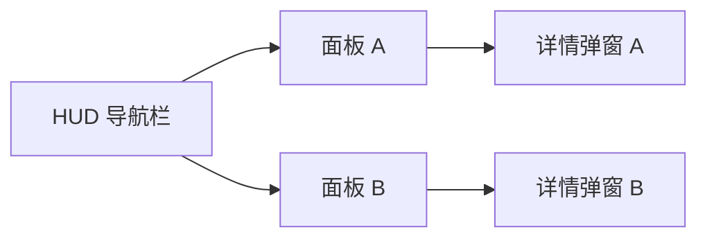

# 【系统名称】交互原型

> 作者：  
> 创建日期：YYYY-MM-DD  
> 最后更新：YYYY-MM-DD  
> 状态：草稿 / 评审中 / 已定稿  
> 关联系统设计：`01_系统设计/[系统名].md`

**管线位置**：[研发流程总览](../00_项目总纲/研发流程总览.md) S3 阶段

---

## 1. 概述

简要说明本系统的交互范围、涉及的面板数量和核心操作链路。

- 涉及面板：（列出所有面板名称）
- 核心操作链路数：（N 条）
- 预计交互复杂度：低 / 中 / 高

---

## 2. 面板总览



---

## 3. 面板线框图

### 3.1 面板 A

**层级**：L2（系统面板）  
**入口**：HUD 底部导航栏 → [Tab名称]

```
┌──────────────────────────────────┐
│  [面板标题]              [关闭 X] │
├──────────┬───────────────────────┤
│          │                       │
│  列表区   │     详情/操作区        │
│          │                       │
│  [项目1]  │  [名称]               │
│  [项目2]  │  [属性信息]            │
│  [项目3]  │  [操作按钮A] [按钮B]   │
│          │                       │
├──────────┴───────────────────────┤
│  [底部操作栏]                     │
└──────────────────────────────────┘
```

**可交互元素状态枚举**：

| 元素 | 默认态 | 选中态 | 禁用态 | 空态 |
|------|--------|--------|--------|------|
| 列表项 | 正常显示 | 高亮边框 | — | "暂无内容" |
| 操作按钮A | 可点击 | 按下缩放 | 灰化+原因提示 | — |
| 操作按钮B | 可点击 | 按下缩放 | 灰化+原因提示 | — |

---

## 4. 核心操作流

### 4.1 操作流：【核心操作名称】

**入口**：[从哪个面板/按钮进入]  
**前置条件**：[需要满足什么条件]

1. 玩家点击 [元素A] → 系统反馈 [反馈描述]
2. 玩家看到 [信息B] → 做出选择
3. 玩家点击 [确认] → 系统执行操作 → [结果反馈]
4. 操作完成 → 返回 [目标面板]

**异常路径**：

- 若条件不满足 → 按钮灰化 + 提示"[原因]"
- 若中途退出 → 未确认的操作丢弃，返回上一稳定状态

---

## 5. 跨系统跳转

| 跳转方向 | 触发条件 | 跳转目标 | 返回行为 |
|---------|---------|---------|---------|
| 本系统 → 系统B | 点击[某个链接/按钮] | 系统B 的 [具体面板] | 返回时保持本系统的滚动位置和选中项 |

---

## 6. 边界补全检查单

> 参照 [交互设计规范](交互设计规范.md) 第四节 · 8 类标准边界

- [ ] **首次使用**：首次打开有引导覆盖层；引导可跳过
- [ ] **空状态**：空列表有占位插画+引导文案
- [ ] **满载状态**：满载时有提示+快捷处理入口
- [ ] **错误与异常**：配置缺失不崩溃，显示占位信息
- [ ] **中断恢复**：已确认操作持久化，未确认操作丢弃
- [ ] **跨系统跳转**：跳转路径和返回行为明确
- [ ] **红点策略**：红点触发/消除条件明确，优先级明确
- [ ] **新手引导**：引导时机与 L4 学习曲线对齐

---

## 7. 变更记录

| 日期 | 变更内容 | 负责人 |
|------|----------|--------|
| YYYY-MM-DD | 初稿 | xxx |
