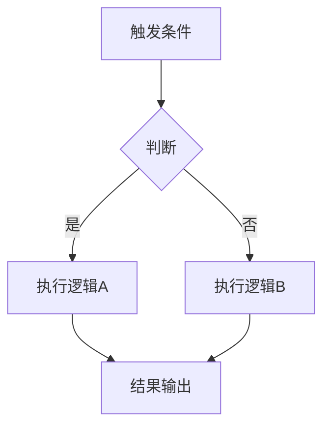

# 【系统名称】设计文档

> 作者：  
> 创建日期：YYYY-MM-DD  
> 最后更新：YYYY-MM-DD  
> 状态：草稿 / 评审中 / 已定稿

---

## 1. 概述

简要描述本系统的定位、核心目标和在整体游戏中的角色。

> 本节只写 2-3 段，说清"这个系统是什么、为什么需要、它和项目总愿景怎么衔接"。具体规格留到后续章节。

---

## 2. 体验设计（必填 · 前置于机制规格）

> 本节依据 [体验分析框架](../00_项目总纲/体验分析框架.md) 的 L1-L5 方法论填写。  
> **未通过 L1-L5 自检的文档不接受 PR 合入。**

### 2.1 体验锚点（L1）

#### 2.1.1 核心幻想（Fantasy）

> 玩家在这个系统里**想成为谁**？

- （填写：玩家脑补自己是什么形象，一句话）

#### 2.1.2 核心情绪（Emotion）

> 最希望玩家产生什么情绪？**必须是具体情绪词，不能是"爽 / 好玩"**。

- 主情绪：（期待 / 惊喜 / 征服感 / 秩序感 / 收集欲 / 创造感 / 归属感 / 自豪 / 紧张 / 释然……）
- 次情绪：（可选）

#### 2.1.3 核心爽点（Payoff）

> 整段体验的**最高光瞬间**是什么样的？必须能被**截图或片段化**，且**可反复经历**。

- （描述一段具体画面：从什么开始 → 中间发生什么 → 以什么结束）

### 2.2 体验循环（L2）

> 把 L1 的体验在六层时间尺度上分配兑现节奏。秒 / 分 / 时 / 日是底线，周 / 月可后续补。

| 时间尺度 | 玩家在这个尺度上获得什么 |
|---------|------------------------|
| 秒循环（< 3 秒） | （即时反馈：攻击命中 / 拾取 / 击杀） |
| 分循环（1-3 分钟） | （每 1-3 分钟获得的新鲜事） |
| 时循环（30-60 分钟） | （换装 / 解锁 / 过章大事件） |
| 日循环（一次登录周期） | （5 分钟能做什么、20 分钟能做什么） |
| 周循环（7 天） | （一周的成长里程碑） |
| 月循环（30 天+） | （终局目标 / 赛季 / 深渊） |

### 2.3 决策空间（L3）

#### 2.3.1 有意义的选择

> 列出系统中玩家能做的**差异化选择**。至少 3 个方向，且每个方向**讲得出三个以上差异**。

- 方向 A：
- 方向 B：
- 方向 C：

#### 2.3.2 最优解风险

> 是否存在一个"所有人都会选的最强解"？如何规避？

- （填写：是否有单一最优解风险，如何通过数值平衡 / 场景差异化 / 版本调整规避）

#### 2.3.3 可逆性

> 玩家选错了能否改？代价多大？

| 选择 | 可逆性 | 改变代价 |
|------|--------|---------|
| （如：流派切换） | 高代价可逆 | 需要重新凑传奇装备 |

### 2.4 学习曲线（L4）

| 里程碑 | 玩家应理解 / 掌握 / 解锁什么 |
|--------|----------------------------|
| 5 分钟 | （最核心的 1-2 个概念） |
| 1 小时 | （首次解锁的新机制） |
| 10 小时 | （进入 Build 构筑深度） |
| 100 小时 | （终局天花板 / 可分享成就） |

### 2.5 情感反馈（L5）

#### 2.5.1 仪式感清单（≥ 3 条，含视听描述）

1. **时刻 A**：（视 + 听 + 动效描述）
2. **时刻 B**：（视 + 听 + 动效描述）
3. **时刻 C**：（视 + 听 + 动效描述）

#### 2.5.2 挫败缓冲（≥ 2 条）

| 玩家可能的挫败时刻 | 兜底 / 缓冲设计 |
|------------------|----------------|
| （情境 1） | （兜底方案） |
| （情境 2） | （兜底方案） |

#### 2.5.3 可分享锚点（≥ 1 条）

- 可分享内容：（什么装备截图 / 什么数字 / 什么成就）
- 分享形式：（截图 / 数字 / 动画 / 文字）

### 2.6 L1-L5 自检清单

提交 PR 前在此打勾（对应 [体验分析框架 附录 A](../00_项目总纲/体验分析框架.md)）：

- [ ] L1 Fantasy / Emotion / Payoff 三项达成
- [ ] L2 至少 4 层时间尺度已填写
- [ ] L3 至少 3 个差异化方向 + 无最优解风险 + 可逆性明确
- [ ] L4 四个里程碑都有具体内容
- [ ] L5 仪式感 ≥ 3 条 + 挫败缓冲 ≥ 2 条 + 可分享锚点 ≥ 1 条

**自检未通过不得进入第 3 节及之后。**

---

## 3. 设计目标

- 目标 1：
- 目标 2：
- 目标 3：

> 本节是 L1-L5 的**工程化翻译**。例如 L1 Payoff 是"橙字掉落的高光瞬间"，对应的设计目标是"每 15-20 分钟保底掉落一次紫装以上品质"。

---

## 4. 核心机制

> **管线进度标记**：写完本节 = 完成 S2 阶段。

### 4.1 机制 A

详细描述机制 A 的规则、流程和玩家交互方式。

### 4.2 机制 B

详细描述机制 B。

---

## 5. 数据结构

描述本系统涉及的核心数据定义，可附 JSON schema 或表格。

```json
{
  "id": "example_001",
  "name": "示例",
  "type": "...",
  "params": {}
}
```

---

## 6. 系统流程

描述主要流程，可使用流程图：



---

## 7. UI/UX 需求

描述本系统需要的界面、交互方式和信息展示。

> 此处的 UI 需求应**呼应 L5 仪式感清单** —— 每个仪式时刻对应的 UI 表现要在这里落地。

---

## 8. 与其他系统的关联

| 关联系统 | 交互方式 | 说明 |
|----------|----------|------|
| 战斗系统 | 读取数据 | ... |
| 装备系统 | 双向依赖 | ... |

---

## 9. 交互原型摘要（S3 阶段）

> 完整交互原型文档位于 `02_交互与原型/[系统名]_交互原型.md`。  
> 本节为摘要，列出核心面板和关键操作流。

### 9.1 涉及面板

| 面板 | 层级 | 入口 |
|------|------|------|
| （面板名） | L2 系统面板 | HUD 底部导航栏 → [Tab] |

### 9.2 关键操作流（摘要）

1. 玩家从 [入口] 进入 → 看到 [面板]
2. 点击 [核心操作] → 得到 [反馈]
3. ...

> 完整操作流、线框图和状态枚举见交互原型文档。

---

## 10. 边界补全检查单（S4 阶段）

> 参照 [交互设计规范](../02_交互与原型/交互设计规范.md) 第四节 · 8 类标准边界。  
> 如有独立的边界补全文档，此处可标注引用。

- [ ] **首次使用**：（简述引导方案）
- [ ] **空状态**：（简述空状态展示）
- [ ] **满载状态**：（简述满载处理）
- [ ] **错误与异常**：（简述容错方案）
- [ ] **中断恢复**：（简述恢复策略）
- [ ] **跨系统跳转**：（简述跳转路径）
- [ ] **红点策略**：（简述红点规则）
- [ ] **新手引导**：（简述引导时机和形式）

**门禁**：8 类中 ≥ 6 类打勾 → 通过

---

## 11. 数值映射（S5 阶段）

> 本节列出本系统涉及的核心数值点，与 [数值框架](../03_数值设计/数值框架.md) 的对齐关系。  
> 完整数值规划文档位于 `03_数值设计/[系统名]_数值规划.md`。

### 11.1 涉及的乘区

| 乘区 | 本系统的贡献 | 数值来源 |
|------|-----------|---------|
| （乘区名） | （描述本系统对该乘区的影响） | （配置表/公式引用） |

### 11.2 核心公式引用

```
（引用或简述本系统涉及的核心公式）
```

### 11.3 与 L2 节奏承诺的对齐

| L2 时间尺度 | 节奏承诺 | 数值实现方式 |
|------------|---------|-----------|
| （时间尺度） | （承诺内容） | （通过什么参数/配置实现） |

---

## 12. 测试用例

### 用例 1：基本功能验证

- **前置条件**：
- **操作步骤**：
- **预期结果**：

### 用例 2：边界条件

- **前置条件**：
- **操作步骤**：
- **预期结果**：

### 用例 3：体验验证（对应 L2 节奏 / L5 仪式）

- **前置条件**：（新账号首次进入 / 已通关前 10 分钟）
- **操作步骤**：
- **预期体验**：（时间节奏是否符合 L2 / 仪式感是否触发 L5）

### 用例 4：边界条件验证（对应 S4 边界补全）

- **前置条件**：（空背包 / 满背包 / 首次使用 / 跨系统跳转）
- **操作步骤**：
- **预期结果**：（对应边界补全检查单的处理方案）

---

## 13. 待讨论 / 开放问题

- [ ] 问题 1
- [ ] 问题 2

---

## 14. 管线进度追踪

| 管线阶段 | 状态 | 交付物 | 完成日期 |
|---------|------|--------|---------|
| S1 体验定义 | ☐ 待完成 / ☑ 已完成 | 本文档 §2 | — |
| S2 功能开发案 | ☐ 待完成 / ☑ 已完成 | 本文档 §3-§8 | — |
| S3 交互原型 | ☐ 待完成 / ☑ 已完成 | `02_交互与原型/[系统名]_交互原型.md` | — |
| S4 边界补全 | ☐ 待完成 / ☑ 已完成 | 本文档 §10 或独立文档 | — |
| S5 数值规划 | ☐ 待完成 / ☑ 已完成 | `03_数值设计/[系统名]_数值规划.md` | — |
| S6 数据配置 | ☐ 待完成 / ☑ 已完成 | `data/` + 配置表字段说明 | — |

---

## 15. 变更记录

| 日期 | 变更内容 | 负责人 |
|------|----------|--------|
| YYYY-MM-DD | 初稿 | xxx |
