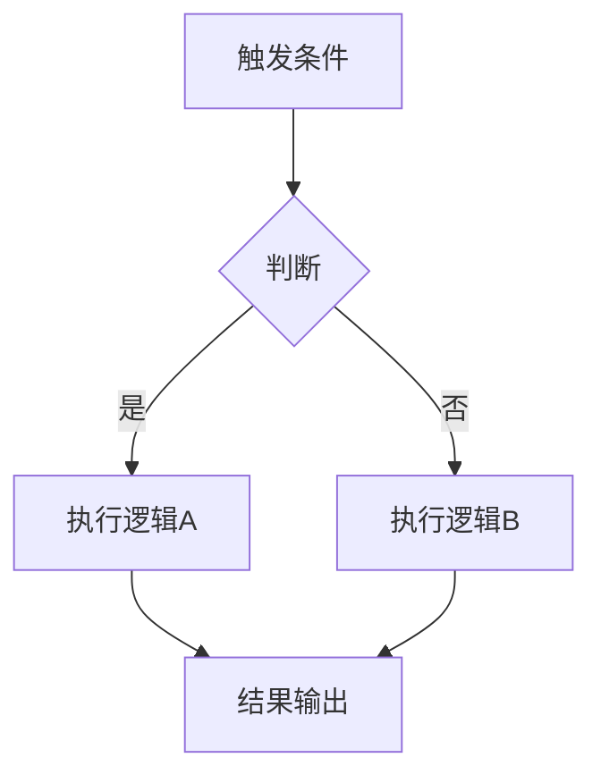

# 【系统名称】设计文档

> 作者：  
> 创建日期：YYYY-MM-DD  
> 最后更新：YYYY-MM-DD  
> 状态：草稿 / 评审中 / 已定稿

---

## 1. 概述

简要描述本系统的定位、核心目标和在整体游戏中的角色。

## 2. 设计目标

- 目标 1：
- 目标 2：
- 目标 3：

## 3. 核心机制

### 3.1 机制 A

详细描述机制 A 的规则、流程和玩家交互方式。

### 3.2 机制 B

详细描述机制 B。

## 4. 数据结构

描述本系统涉及的核心数据定义，可附 JSON schema 或表格。

```json
{
  "id": "example_001",
  "name": "示例",
  "type": "...",
  "params": {}
}
```

## 5. 系统流程

描述主要流程，可使用流程图：



## 6. UI/UX 需求

描述本系统需要的界面、交互方式和信息展示。

## 7. 与其他系统的关联

| 关联系统 | 交互方式 | 说明 |
|----------|----------|------|
| 战斗系统 | 读取数据 | ... |
| 装备系统 | 双向依赖 | ... |

## 8. 测试用例

### 用例 1：基本功能验证

- **前置条件**：
- **操作步骤**：
- **预期结果**：

### 用例 2：边界条件

- **前置条件**：
- **操作步骤**：
- **预期结果**：

## 9. 待讨论 / 开放问题

- [ ] 问题 1
- [ ] 问题 2

## 10. 变更记录

| 日期 | 变更内容 | 负责人 |
|------|----------|--------|
| YYYY-MM-DD | 初稿 | xxx |
